## Windows OS

=> Developed by Microsoft (Bill Gates)

=> It is GUI based OS (Graphical User Interface)

=> It is single user based OS

=> It is commercial OS (paid)

=> Security features are less (Anti-virus is required)

=> Windows OS is recommended for personal use

Ex: Play Games, Watch Movies, Internet Browsing, Store data, Online Classes...

>Note: Windows is not recommended for business use (servers, application deployment..)	

## Linux Operating System

=> Linux is a community based OS

=> Linux is free & Open Source

=> Linux is Multi User OS

=> Linux Provides High Security

=> Linux is highly recommended for project operations

=> Linux is CLI based OS (Command Line Interface)

> Note: In real-time we will use Linux machines to setup our infrastructure such as server like jenkins server ,nexus server ,k8 server etc.

### History

=> Developed by Linus Torvalds

=> Initially Linus Torvalds was using Unix OS and found some challenges in that and informed to that company but they did not accept his suggestions.

=> Linus started doing research and he found Minux OS is similar to his ideas.

=> He has taken Minux OS and made few changes to that and released into market as Linux OS.

		(Lin)us   + Min(ux) = Linux

### Distributions

- Linus Tarvalds given Linux os as free and open source

- Many companies downloaded Linux OS code and modified according to their requirement and released into market with different names. Those are called as Linux Distributions.

    - Ex: Amazon Linux, Red Hat Linux, Ubuntu Linux, Cent OS Linux, SuSe linux....

> Note: We have 200+ linux distributions

till now we have seen how to connect to a linux machine using aws!!

### Linux Machine Setup

1) Login into AWS cloud account

2) Create Linux Virtual Machine using AWS Ec2 service

3) Connect with Linux VM using MobaXterm / Putty using public ip

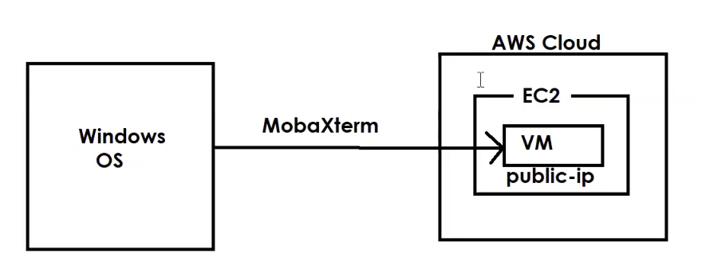

Connection with MobaXterm : https://youtu.be/uI2iDk8iTps?si=ZuZs0lQTxoRpbRMk

Connection with putty : https://youtu.be/GXc_bxmP0AA?si=HgSydrP89mPxv23s

### how to connect
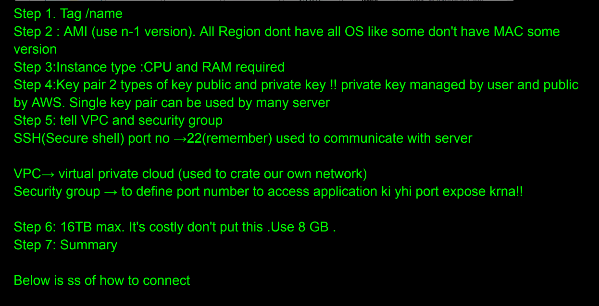

to connect to mobaxterm
#### using public ip
click on session then SSH

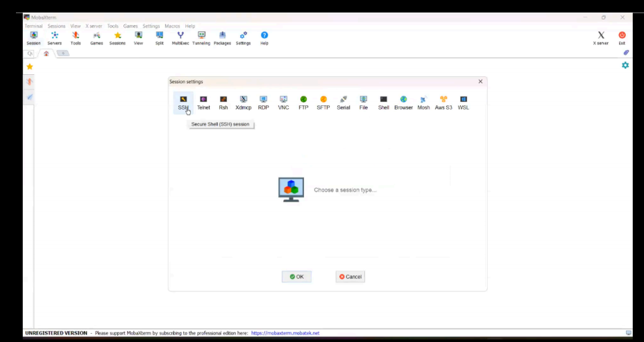

you need to put public ip which you get here in aws

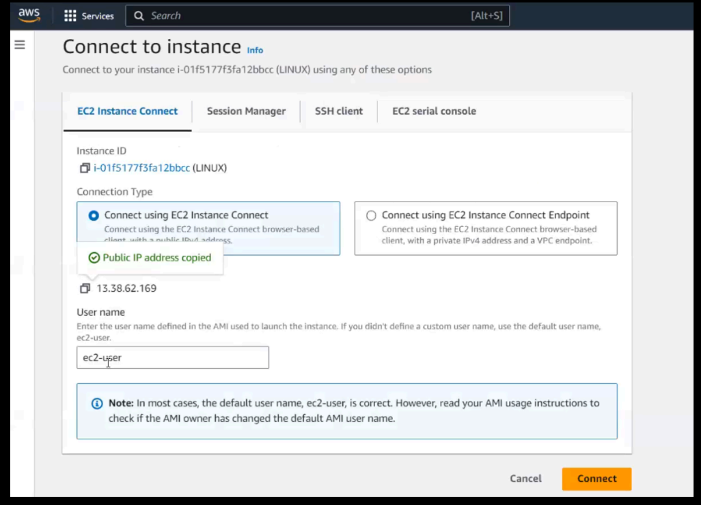

put username and ip (default username is ec2-user)
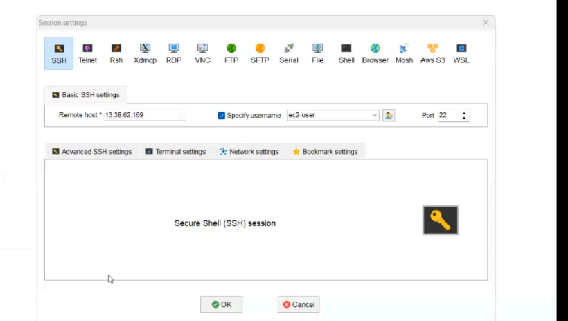

now need to put key pair

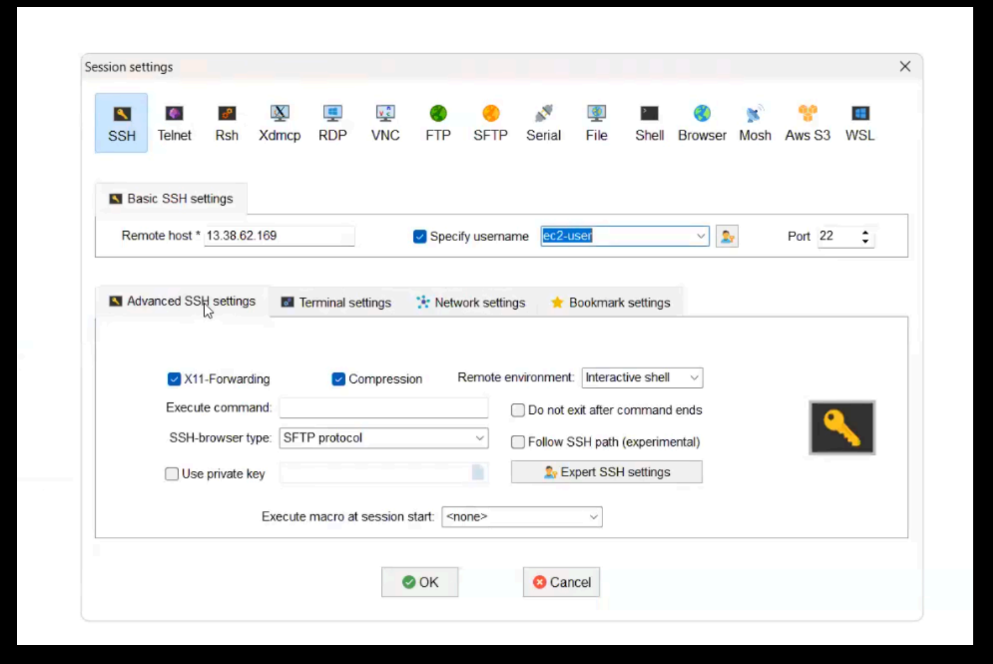

go to advanced ssh settings and tick private key
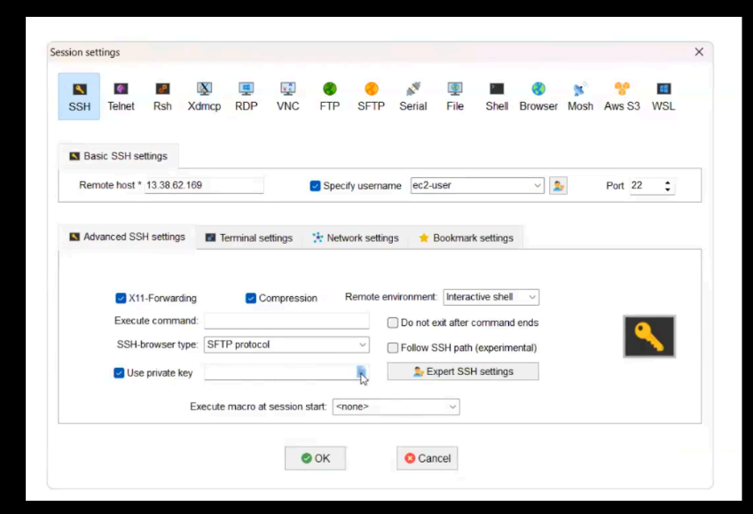

now tell private key(.pem file),now your server be running

#### using ssh command

go to folder having key pair and run ssh command you get on aws

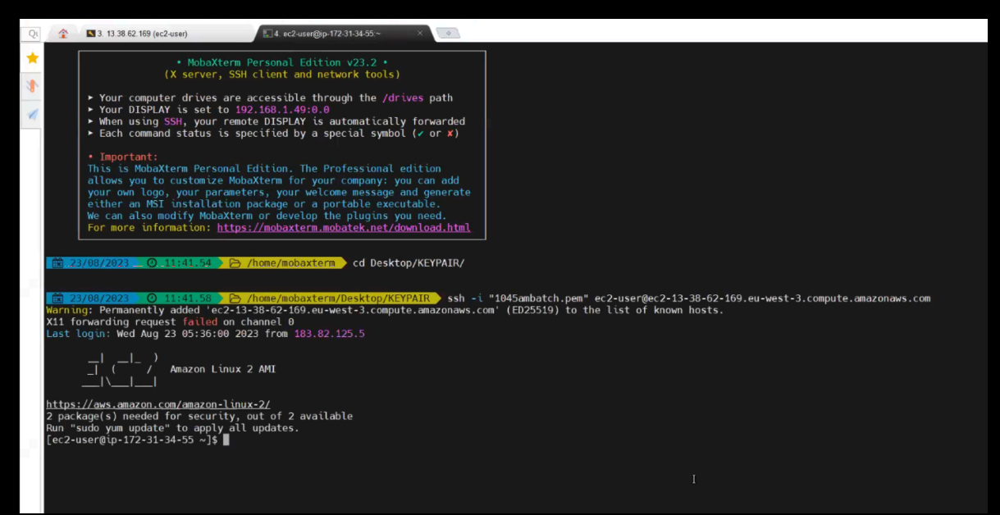

#### using aws online
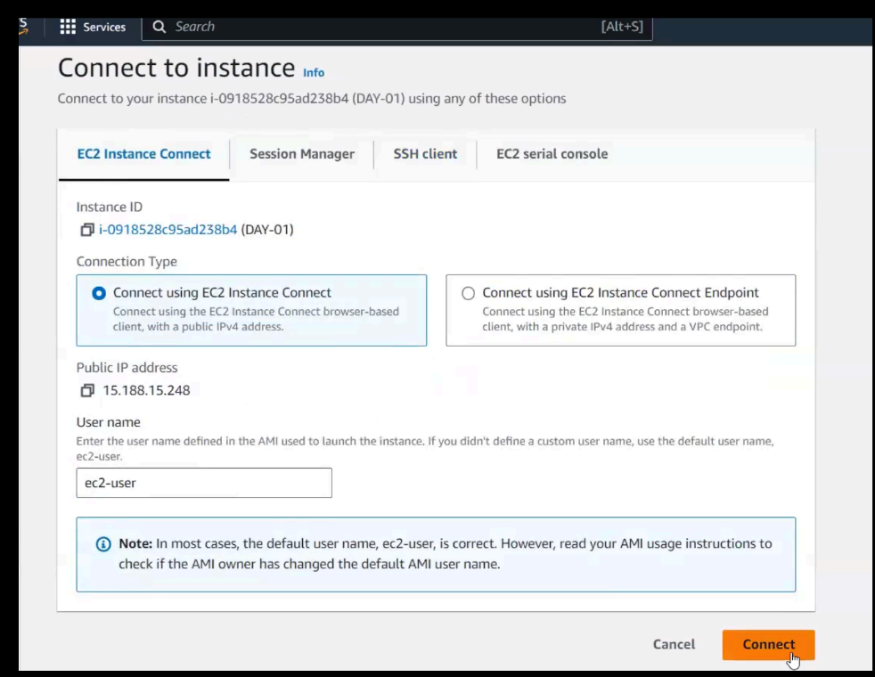

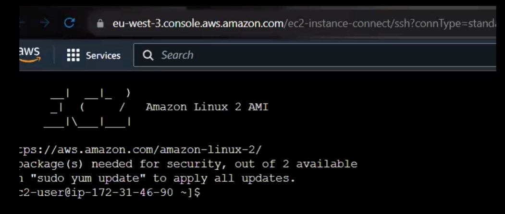

---
### Linux File System

=> Everything is represented as a file

=> 3 types of files

1) Ordinary file / Normal file (starts with -)

2) Directory file (Folder) (starts with d)

3) Link File (starts with l)

---
### basic commands
- date : tells current date

- cal : shows calendar

- whoami : tells current user

- pwd : present working directory (shows the path where you are) 

default path is /home/ec2-user

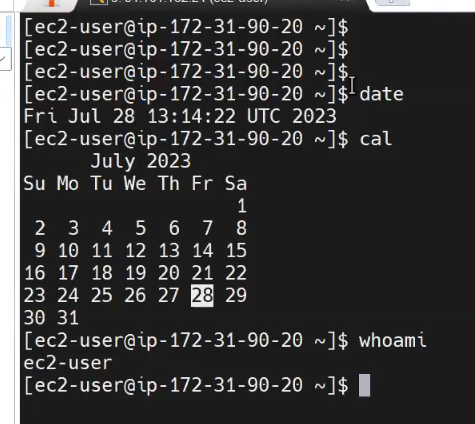

- clear : to clear the screen 
---

### Linux commands

ls : list content

- $ ls    (display files in present working directory)

- $ ls -l (display files in alphabetical order)
        
- $ ls -lr (display files in reverse of alphabetical order)

- $ ls -lt (display latest files on top)

- $ ls -ltr (display old files on top)

- $ ls -la (display hidden files)

---

mkdir (amke directory): To create directory (folder)

---
rmdir (remove empty directory): To delete empty directory

---
cd : change directory

- cd <dir-name> : To go inside directory

- cd .. : come out from directory

---
touch : To create empty files

- $ touch f1.txt f2.txt f3.txt : create f1.txt f2.txt f3.txt	

---
rm : To delete file & directories

- $ rm <file-name>

- $ rm *.txt : delete all .txt file

- $ rm a*.txt : delete all .txt file starting with a

- $ rm -rf <dir-name> : delete directory and files inside it

---

mv : To rename & to move

- $ mv  <present-name> <new-name> : to rename

- $ mv  <present-location>  <new-location>

----

cat : To create __file with data__ + append data to existing file + view file data

touch create empty file and cat create files with data

- $ cat > f1.txt :now it will ask for data to enter after entering data press ctrl+D to get out. The command cat > file.txt is used to create or overwrite a file named file.txt . >  operator redirects the output to a file. If the file already exists, it will be overwritten; if it doesn't exist, it will be created.

- $ cat >> f1.txt : >> operator redirects the output to a file, appending to it instead of overwriting it. If the file doesn’t exist, it will be created.

- $ cat f1.txt : print content of file

- $ cat -n f1.txt : The command cat -n file.txt is used to display the contents of file.txt with line numbers.

-----

cp : To copy one file data into another file

- $ cp f1.txt f2.txt

--- 
 > Note: To copy more than one file data into another file we will use cat command

- $ cat f1.txt f2.txt > f3.txt

---
tac : To print file content from bottom to top

- $ tac f1.txt

---

rev : To reverse each line of data

- $ rev f1.txt

---

head : To display file data from top (default 10 lines)

-  $ head f1.txt

- $ head -n 5 f1.txt   (print first 5 lines only)

- $ head -n 25 f1.txt (print first 25 lines only)

---

tail : To display file data from bottom (default 10 lines)

- $ tail f1.txt

-  $ tail -n 20 f1.txt  (print last 20 lines of file)

- $ tail -n 100 f1.txt (print last 100 lines of file)

-  $ tail -f f1.txt (to get live data)

---

grep : grep stands for global regular expression print

- $ grep 'aws' f1.txt   (print lines having aws keyword)

- $ grep -i 'AWS' f1.txt (ignore case sensitive)

- $ grep -n 'aws' f1.txt (print lines having aws with line number)

- $ grep -v 'aws' f1.txt (pring lines which doesn't have aws keyword)

- $ grep 'java' * (search for java keyword in all the files of pwd)

---

wc : word count command

-  $ wc f1.txt  (no.of lines, no.of words, no.of chars)

---

diff : To see difference between 2 files

- $ diff f1.txt f2.txt    

---

###  Text Editors in Linux

### Vi
=> vi (visual editor) it is default editor in linux machines

=> Using 'vi' we can create new files and we can modify existing file data

=> vi command is having 3 modes

1) command mode  (just to open the file)  ($ vi <filename>)

2) insert mode (to edit the file ) ---> press 'i' in keyboard

3) esc mode (to comeout from insert mode) --> press 'esc' in keyboard

- Save changes & close the file =>  :wq
    
- Without saving changes close the file => :q!

Note: vi command will open the file if it avilable otherwise it will create new file and it will open that file.

### file creation commands in linux

touch : to create empty file

cat  : create file with data

cp : copy one file into another file (cp f1.txt f2.txt)

vi : create and open fle for editing (vi f3.txt)

### Reading file data commands in linux

cat : print file data from top to bottom

tac  : print file data from bottom to top

rev : print each line in reverse order

head : print first 10 lines of file data

tail : print last 10 lines of file data

vi : open the file 

# SED command

=> SED stands for stream editor

=> SED is used to process the data (substitute,delete,insert)

=> Using SED command we can perform operations on the file without opening the file.

=> SED is very powerful command in linux

- ### Replace first occurance of 'java' with 'python' in every line
    $ sed 's/java/python/' f1.txt

- ### Replace second occurance of 'java' with 'python' in every line
    $ sed 's/java/python/2' f1.txt

- ### Replace all occurances of 'java' with 'python' in every line
    $ sed 's/java/python/g' f1.txt

-  ### Substitute and save changes in original file
    $ sed -i 's/java/python/g' f1.txt

- ### Delete 4th line in file
    $ sed -i '4d' f1.txt

- ### Delete last line of file
    $ sed -i '$d' f1.txt

-  ### Delete from nth line to till last line
    $ sed -i 'n,$d' f1.txt

-  ### Delete from 2nd line to 10th line
    $ sed '2,10d' java.txt

-   ### print all lines which contains 'python' keyword
    $ sed '/python/p' ashokit.txt

-   ### delete all lines which contains 'python' keyword
    $ sed '/python/d' ashokit.txt

-   ### print data from 3rd line to 6th line
    $ sed -n '3,6p' ashokit.txt

-   ### insert data before 4th line
    $ sed '4i\i am from ashokit' ashokit.txt

-   ### Add given text after last line
    $ sed '$a\i love linux' ashokit.txt

