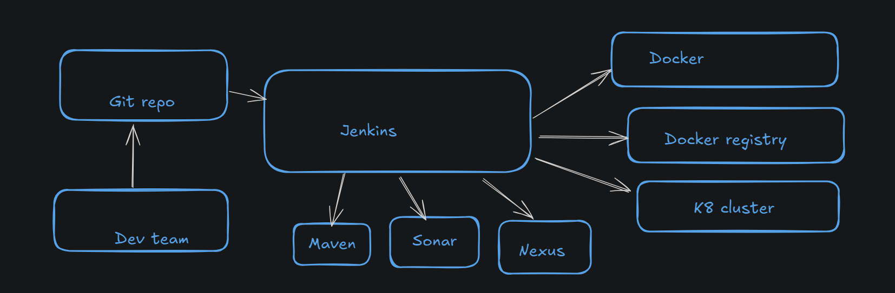

# Introduction
We do containerization by docker and orchestration by kubernetes!! we will define both (containerization,orchestration) later !  

We use git repo to store code and build using maven to generate war/jar  and then reviewed  by sonarcube!!Sonarcube is code review software!! and then artifact is deployed on Nexus server!!

Then docker comes into picture!! we create docker image which stored in docker registry! then we deploy image in k8 cluster!!

we take latest code from github ,we build and deploy by Jenkins!! Jenkins is heart of Devops!! Jenkins take out code from github repo and using maven jenkins will build and deploy automatically!!

Then jenkins is integrated with sonarcube to do code review!! then jenkins is integrated with nexus to upload artifact!! Then jenkins integrated with docker to make image!!
then jenkins push image to docker registry! then jenkins deploy on k8 cluster!!

