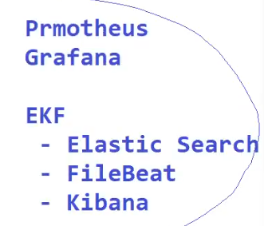
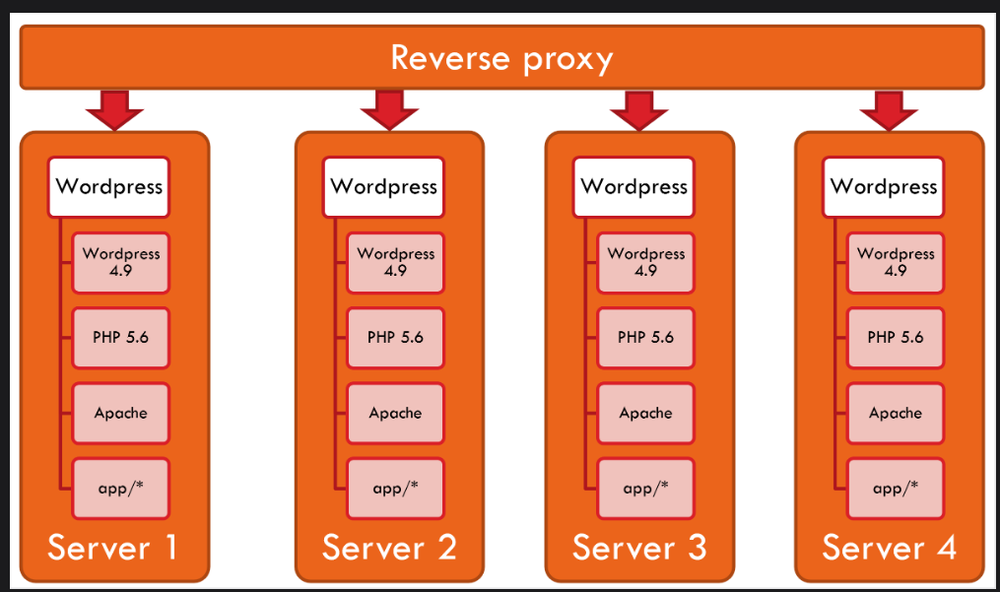
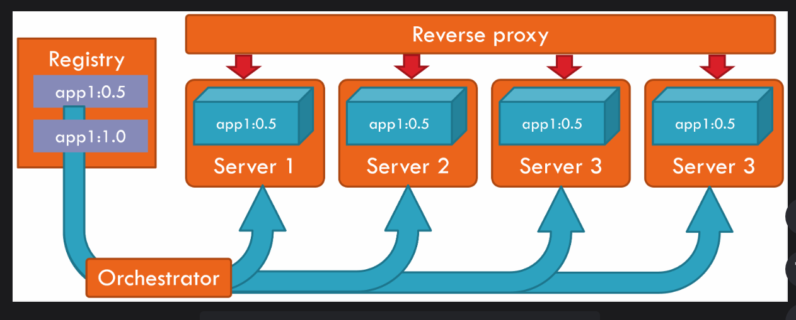

# Introduction
We do containerization by docker and orchestration by kubernetes!! we will define both (containerization,orchestration) later !  

We use git repo to store code and build using maven to generate war/jar  and then reviewed  by sonarcube!!Sonarcube is code review software!! and then artifact is deployed on Nexus server!!

Then docker comes into picture!! we create docker image which stored in docker registry! then we deploy image in k8 cluster!!

we take latest code from github ,we build and deploy by Jenkins!! Jenkins is heart of Devops!! Jenkins take out code from github repo and using maven jenkins will build and deploy automatically!!

Then jenkins is integrated with sonarcube to do code review!! then jenkins is integrated with nexus to upload artifact!! Then jenkins integrated with docker to make image!!
then jenkins push image to docker registry! then jenkins deploy on k8 cluster!!

Every tool will be integrated with jenkins!!

To work with k8 docker image is mandatory!!Docker image has application + application dependency!! Without docker you cannot learn k8!!k8 is used to manage docker containers!!

with k8 we will learn following:

## Application Environments

In Realtime, our application will be deployed into Multiple Environments for Testing Purpose

1. DEV Env  --> Developers Testing

2. SIT Env   ---> Testing Team (QA) - System Integration
		
3. UAT Env   ---> Client Side Testing - User Acceptance Testing

4. PILOT Env (Pre-Production)  ---> Testing with Live Data

 Once testing completed in all above environments then it will be deployed into PRODUCTION Env.

 Production env means live environment.

End users will access application from Production env!!

From one environment to other we need to install the same version of software in all environment!! thats headache!!if java11 in dev than java 11 is needed in SIT!! so these dependency needs too be installed on all environment with same version!!Different version may cause code not working !!

## Life without Docker

- We need to install all the required softwares in all environments to run our application.

- We need to make sure we are using same versions of softwares in all machines.

-  If any software version is not matched then application execution may fail

Ex :   Raja installed Java 11 v  in Dev Env
    , Sunil installed Java 8 v in SIT Env

-  If we want to run our application in multiple machines then we have to install required softwares in all those machines with same version which is hectic task.

## Life with Docker

-  Docker is a containerization platform

-  Docker is used to build and deploy our application into any machine without bothering about dependencies.

-  Dependencies means the softwares which are required to run our application.

	Dependencies = OS / Angular / React / Java / DB / Tomcat etc...

- Docker will reduce the gap between Development and Deployment

- Allows Easy Scaling Up
    1. In this lesson, you will learn how Docker containers help in scaling when a single server isn't enough to handle a single application.

    2. When a server application needs to handle a higher usage than what a single server can handle, the solution is well-known, place a reverse proxy in front of it, and duplicate the server as many times as needed. In our previous Wordpress application example, this meant duplicating the server together with all of its dependencies:

  

3. That is only going to make things worse when upgrading: we’ll need to upgrade each server’s dependencies together with all of the conflicts that may induce.Again, containers have a solution for this   

4. Better yet: when using an orchestrator, you merely need to state how many containers you want and the image name and the orchestrator creates that many containers on all of your Docker servers. We’ll see this in the orchestrators part of this course. This is how it looks:

## Docker Architecture

1) Dockerfile   : It contains instructions to build docker image

2) Docker Image  : It is a package which contains code + dependencies

3) Docker Registry : It is  a repository to store docker images

4) Docker Container : It is a runtime process which runs our application

Note: Once Docker image is created then we can pull that image and we can run that image in any machine.

 