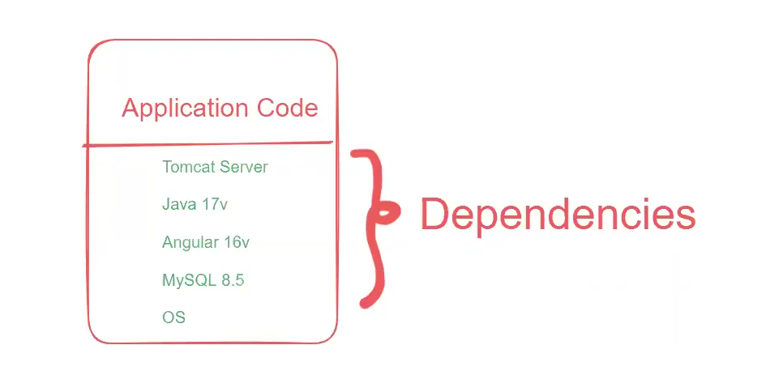

# Docker k8 jenkins ashok 
Docker --> containerization software

Kubernetes--> orchestration software

Jenkins--> CI CD software

these 3 are used to automate project build and deployment process!!

=> In realtime we will use several environments to test our application.

1) DEV
2) SIT
3) UAT (user acceptance testing)
4) PILOT (pre prod)
5) PROD (final delivery)

=> Dev env used by developers for code integration testing

=> SIT env used by Testers for system integration testing

=> UAT env used by client side team for acceptance testing (Go or No Go)

=> Pilot env used for pre-production testing

=> Prod env used for live deployment (end users can access our app)

=> As a devops engineer we are responsible to setup infrastructure to run our application

=> We need to install all required softwares (dependencies) to run our application

Note: We need to setup dependencies in all environments to run our application.

Note: There is a chance of doing mistakes in dependencies installation process (version compatibility issues can occur)

=> To simplify application execution in any machine we can use Docker. Docker takes software as well as dependency and we can put it on any machine!!

Dependencies are software required to run the software !!so to run the application we must maintain proper those softwares with the versions!! Version compatibility is very important!! Docker help to maintain those dependencies!

we not deploy code directly to client !! we first test it so we put in stg environment!!

so we need to install software and dependencies in all environment docker helps in that!! 

## What is docker
=> Docker is a free & open source software

=> Docker is used for containerization

=> With the help of docker, we can run our application in any machine.

Container = package (app code + app dependencies)

=> Docker will take care of dependencies installation required for app execution.

=> We can make our application portable using Docker.

## Docker Architecture

1) Dockerfile
2) Docker Image
3) Docker Registry
4) Docker Container

=> Dockerfile is used to specify where is app code and what dependencies are required for our application execution.

Note: Dockerfile is required to build docker image.

=> Docker Image is a package which contains code + dependencies

=> Docker Registry/Docker Hub is used to store Docker Images.

Note: When we run docker image then Docker container will be created. Docker container is a linux virtual machine.

=> Docker Container is used to run our application.And that container we can run on any machine!!

just have docker software pull image have that image ,run container no need to install all dependency !!

## Installation

Step-1 : Create EC2 VM (amazon linux) & connect with that vm using ssh client

Step-2 : Execute below commands

### Install Docker
sudo yum update -y

sudo yum install docker -y

sudo service docker start

### Add ec2-user user to docker group
sudo usermod -aG docker ec2-user

### Exit from terminal and Connect again
exit

#### Verify Docker installation
docker -v

## Commands

docker images : To display docker images available in our system

docker ps : To display running docker containers

docker logs \<container-id\> : To display container logs

docker ps -a : To display running + stopped containers

docker pull <image-id/name> : To download docker image from docker hub

docker rmi <image-id/name> : To delete docker image

docker run <image-id/name> : To create/run docker container

docker stop \<container-id\> : To stop running docker container

docker start \<container-id\> : To start docker container which is in stopped state

docker rm \<container-id\> : To delete docker container

> delete stopped containers + unused images + build cache

    docker system prune -a

## Running real world application using docker image
docker pull ashokit/spring-boot-rest-api

docker run -d ashokit/spring-boot-rest-api

docker run -d -p 9090:9090 ashokit/spring-boot-rest-api

URL : http://public-ip:host-port/welcome/{name}

docker pull ashokit/python-flask-app

docker run -d ashokit/python-flask-app

docker run -d -p 5000:5000 ashokit/python-flask-app

>Note: Here -d represents detached mode.

>Note: Here -p represents port mapping. (host-port:container-port)

>Note: host port and container port no need to be same.

>Note: In one machine we can use 65k port numbers.

> Note: To access application running in the container we will use below URL

	URL : http://host-vm-public-ip:host-port/

> Note: Host port number we need to enable in ec2-vm security group inbound rules to allow the traffic.

## DockerFile

=> Dockerfile contains set of instructions to build docker image

Filename : Dockerfile

=> To write dockerfile we will use below keywords

	1) FROM
	2) MAINTAINER
	3) RUN
	4) CMD
	5) COPY
	6) ADD
	7) WORKDIR
	8) EXPOSE
	9) ENTRYPOINT
	10) USER