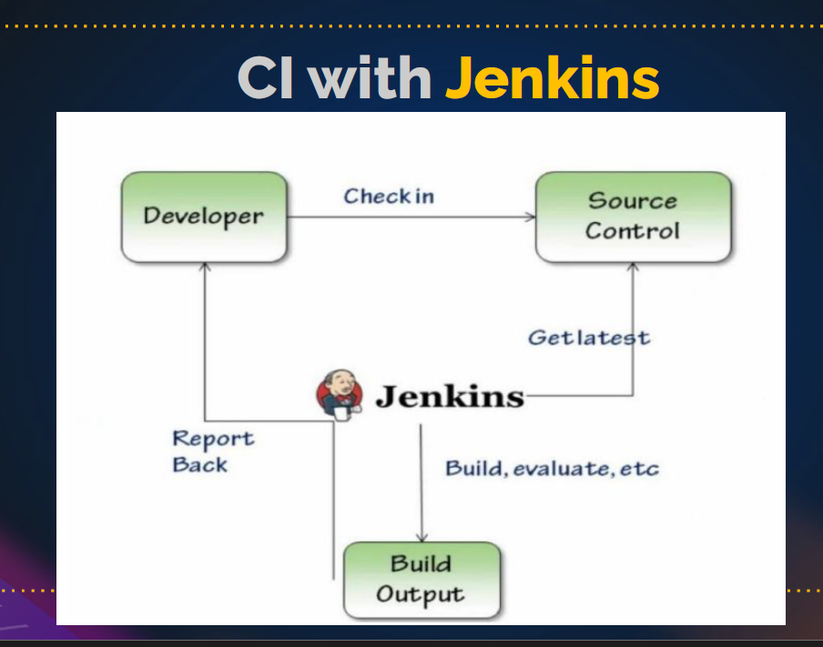

# Jenkins

jenkins is CI/CD tool as definition but in reality jenkins is only CI tool!!

CI means continuous integration : continuous build + continuous test (old code with new code)

why needed?

- developer d1 gives code on day1 ,developer d2 gives code on day 2, developer 3 gives code on day3, now day4 we do integration and on day 5 we test and we found bug and give reply to d1 that you code is buggy ,this would be helpful if d1 got reply on day1 only!!

- also here everything is manual , we need everything to be automatic!!

ci : continuous integration : continuous build + continuous test  old code with new code
- before ci we have time waste and every thing is manual work.
- after ci everything is automated.

cd : continuous delivery : deployment manually to prod env
cd : continuous deployment : deployment automatically to prod env

### PIPELINE:
STEP BY STEP EXECUTION OF A PARTICULAR PROCESS.
SERIES OF EVENTS INTERLINKED WITH EACH OTHER.

CODE -- > BUILD -- > TEST -- >  DEPLOY

to build pipeline ww can use jenkins!!

### ENV:
- DEV	: DEVELOPERS
- QA	: TESTERS
- UAT	: CLIENT

THE ABOVE ENVS ARE CALLED AS PRE-PROD OR NON-PROD

- PROD	: USER

PROD ENV IS ALSO CALLED AS LIVE ENV

### JENKINS:
- its a free and open source tool.
- its platform independent.
- it is built on java-11/17.
- koshuke kawaguchui invented jenkins in sun micro systems 2004.
- initial name was hudson -- > paid -- > oracle -- > free 
- it consist lot of plugins.
- port number for jenkins is 8080.
- default path - /var/lib/jenkins

### SETUP: CREATE EC2 WITH ALL TRAFFIC (8080)

#STEP-1: INSTALLING GIT JAVA-1.8.0 MAVEN 
yum install git java-1.8.0-openjdk maven -y

#STEP-2: GETTING THE REPO (jenkins.io --> download -- > redhat)
sudo wget -O /etc/yum.repos.d/jenkins.repo https://pkg.jenkins.io/redhat-stable/jenkins.repo
sudo rpm --import https://pkg.jenkins.io/redhat-stable/jenkins.io-2023.key

#STEP-3: DOWNLOAD JAVA11 AND JENKINS
amazon-linux-extras install java-openjdk11 -y
yum install jenkins -y
update-alternatives --config java

#STEP-4: RESTARTING JENKINS (when we download service it will on stopped state)
systemctl start jenkins.service
systemctl status jenkins.service

copy public ip and paste on browser like this
public-ip:8080
cat /var/lib/jenkins/secrets/initialAdminPassword
install plugins and create user for login.

INTEGRATION OF GIT AND MAVEN WITH JENKINS:
NEW ITEM -- > NAME: NETFLIX JOB -- > FREE STYLE -- > OK 
Source Code Management -- > GIT -- > https://github.com/devopsbyraham/jenkins-java-project.git
Build Steps -- > add setp -- > Execute shell -- > save
