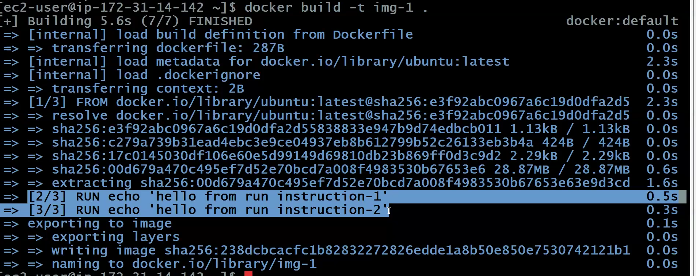
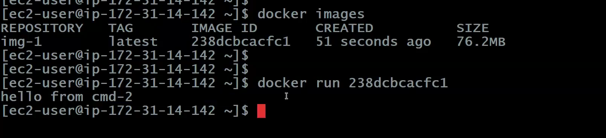
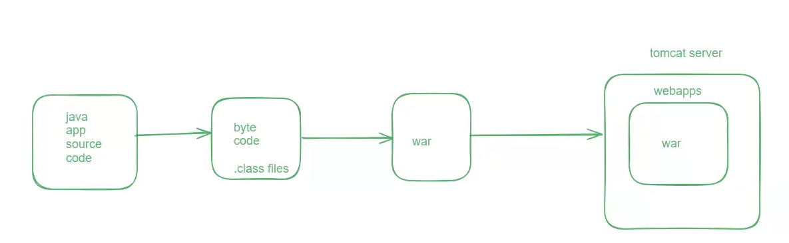
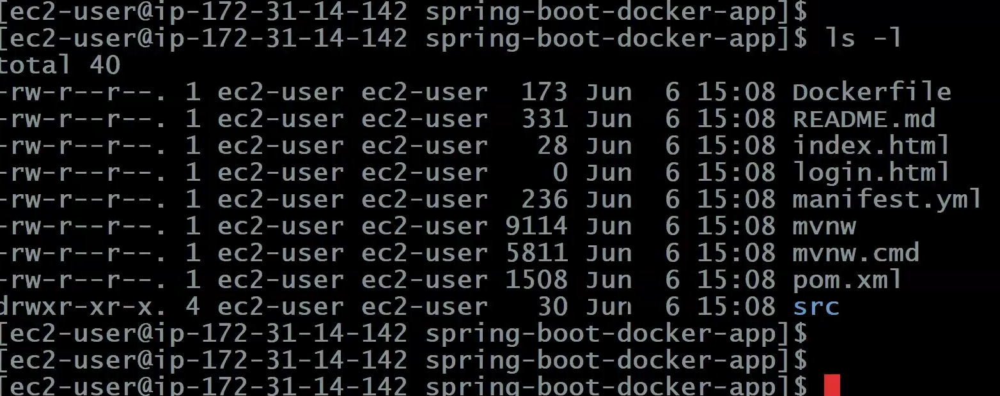
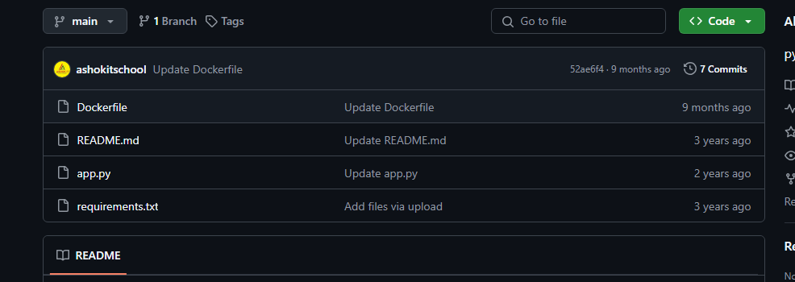
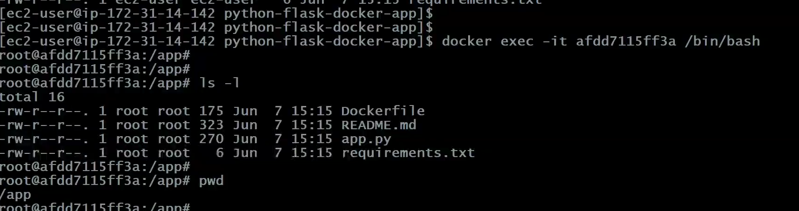

# Notes-3
we have previously seen the commands used in docker!!

open Docker VM ec2 instance!!
 
we use DockerFile name only 

so first command
- vi DockerFile

### DockerFile

```text
FROM ubuntu

MAINTAINER mohit<mohitkr@samsung.com>

RUN echo 'hello from run instruction-1'
RUN echo 'hello from run instruction-2'

CMD echo 'hi from cmd-1'
CMD echo 'hi from cmd-2'

```

no logic here just basic keywords! echo is used to print message!!

RUN all will execute from top to bottom!!

CMD last instruction will execute!!

Now we want to create Docker Image from DockerFile

so use

- docker build -t img-1 .

img-1 is the image name you can give anything , -t means tag 

while creating image you see RUN instruction being executed .



now we create docker container by docker run!!

- docker run \<image-name\> or \<image id\>



on docker images you see all images we can see img-1 

we run by image id 

then you see last CMD is executed

---

### How to push docker image into docker hub account

Create account in DockerHub, you must have docker account to store docker images!!

first login into docker hub account

    $ docker login

On login it will ask username and password after successful login it will say successful login!!

then tag docker image

    $ docker tag <image-name> <tag-name>

Ex1 : docker tag img-1 ashokit/img-1:latest

Ex2 : docker tag img-1 ashokit/img-1:v1

v1, latest tell versions 

>Note: tag name must have your user name , if not tell username then docker hub deny push!

now when you do docker images you see your image with tag

then push docker image to docker hub

    $ docker push <tag-name>

---

### Dockerizing java web app


=> Java web app will be packaged as war file

Note: war file will be created inside target directory

=> To deploy war file we need web server (Ex: tomcat)

=> Inside tomcat server webapps directory we need to place our war file to run the application.



DockerFile

```text
FROM tomcat:latest

MAINTAINER Ashok

EXPOSE 8080

COPY target/app.war /usr/local/tomcat/webapps/
``` 
FROM tells the dependency !! from tomcat java will come automatically that can run that tomcat version!!

> To get tomcat images with tags you can search on dockerHUb

> From last copy instruction we copied war we put in target folder in below instruction to tomcat/webapps,
from host machine to docker image!!

> EXPOSE to tell tomcat uses port 8080

> Here MAINTAINER and EXPOSE are optional

>No need to specify ubuntu here as by default every container is linux machine only!!


Java Web App Git Repo : https://github.com/ashokitschool/maven-web-app.git

$ sudo yum install git 

>After installing git install maven! maven installed then java is installed with it!!

$ sudo yum install maven 

$ git clone https://github.com/ashokitschool/maven-web-app.git

$ cd maven-web-app

> now generate target

$ mvn clean package

$ ls -l target

> Write dockerFile we have discussed above in project directory only we create dockerFile

> copying war from target to webapps is called deployment 4th line of dockerFile

$ vi DockerFile  

> build image

$ docker build -t \ .

$ docker images

> To create container

$ docker run -d -p \<host-port:container-port\> \

$ docker run -d -p 9090:8080 \

> tomcat running on port 8080 in container but on ec2 machine it is mapped to port 9090 ,just to see difference i have put this!! enable port 9090 in inbound rules in security group of ec2!!

=> Enable host port number in security group inbound rules and access our application

		URL : http://public-ip:host-port/war-file-name/

> This not used for springboot application!! just for normal java application!


>Too see logs use docker logs command

- docker logs \<container-id\> : To display container logs

---

### Dockerizing Java Spring Boot Application


=> Every SpringBoot application will be packaged as jar file only whether standalone or web application!! No war file concept in springboot!!

=> To run spring boot application we need to execute jar file.

	Syntax : java -jar <jar-file-name>

>Note: When we run springboot application jar file then springboot will start tomcat server with 8080 port number (embedded tomcat server) so no need to install tomcat .

Dockerfile for Spring Boot Application 
```text

FROM openjdk:17
 
MAINTAINER Ashok

COPY target/app.jar /usr/app/

WORKDIR /usr/app/

EXPOSE 8080

ENTRYPOINT ["java", "-jar", "app.jar"]
```
the above dockerfile is quite understandable!!

>jar needs to be pasted in /usr/app and to execute  first go to /usr/app by WORKDIR
then to execute jar you can use CMD or ENTRYPOINT (both used to run command when container is created)

Java Spring Boot App Git Repo : https://github.com/ashokitschool/spring-boot-docker-app.git

$ git clone https://github.com/ashokitschool/spring-boot-docker-app.git

$ cd spring-boot-docker-app



> here you see src ,pom.xml and DockerFile but no target so we need to create that by using below command

$ mvn clean package

$ ls -l target

> Now you will be able to see jar file in target

$ docker build -t sb-app .

$ docker run -d -p 9080:8080 sb-app


> on ec2 port 9080 it will run so in inbound rules open 9080 port !! in container running on port 8080


>Note: Once container created check logs of container

$ docker logs \<container-id\>

> Note: Access our application using host-vm public and host port for us host port no is 9080

		URL : http://localhost:host-port/

---

### Dockerize Python Flask Application

=> Python is a scripting language

=> We don't need any build tool for python app

=> Directly we can run python programs

	Ex : python app.py

=> Flask is a python library which is to develop rest apis in python.	

=> To download flask library we will use 'python pip software'

>Note: We will configure dependencies in "requirements.txt" like we have pom.xml in java in pom.xml
we tell we need springboot likewise we tell flask is needed in requirements.txt

> maven can build as well as download dependencies but as python is scripting language we no 
need to build so pip just download dependencies!!

Dockerfile for Python Flask App 
```text
FROM python:3.6

MAINTAINER Ashok

COPY . /usr/app/

WORKDIR /usr/app/

RUN pip install -r requirements.txt

EXPOSE 5000

ENTRYPOINT ["python", "app.py"]
```

requirements.txt
```text
flask
```
COPY . /usr/app/ Copy current directory entirely to /usr/app

RUN pip install -r requirements.txt -r tells recursive



Python App Git Repo : https://github.com/ashokitschool/python-flask-docker-app.git

$ git clone https://github.com/ashokitschool/python-flask-docker-app.git

$ cd python-flask-docker-app

$ docker build -t \ .

>Note : we can give any image-name in build command 

$ docker run -d -p 5000:5000 

$ docker ps

>Note: Enable 5000 port in security group inbound rules.

=> Access application with URL

			URL : http://public-ip:host-port/

---

### Can we get into docker container machine ?	


Yes, using below commands

-  display running docker containers info
    
        $ docker ps

-  get into container using container id

        $ docker exec -it <container-id> /bin/bash

- check files in pwd
        
        $ ls -l

-  come out from container vm to host vm
        
        $ exit



> Note : here we are using t2.micro so we need to delete previous image and containers 
so that we can run!!In real time we use large systems!!
---

### Tasks

Task-1: Run jenkins server using docker

Task-2: setup mysql db using docker

Task-3: Write docker file to execute react js app

## Mostly used command

docker system prune -a --> delete stopped containers + unused images + build cache

Now not that much imp

--> Docker network

--> Docker Volumes

--> Docker compose

--> Docker swarm

In realtime we use orchestration tools like k8s!!although we will see them in next classes!! In real time we never create containers manually we use k8s!!