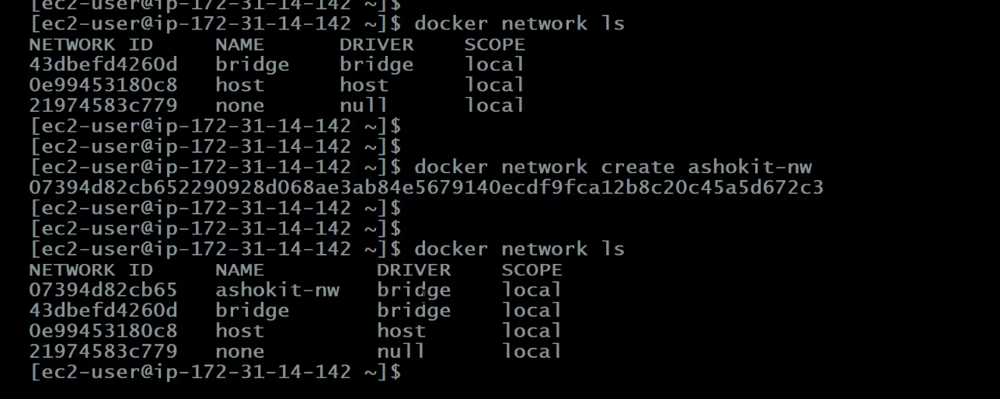
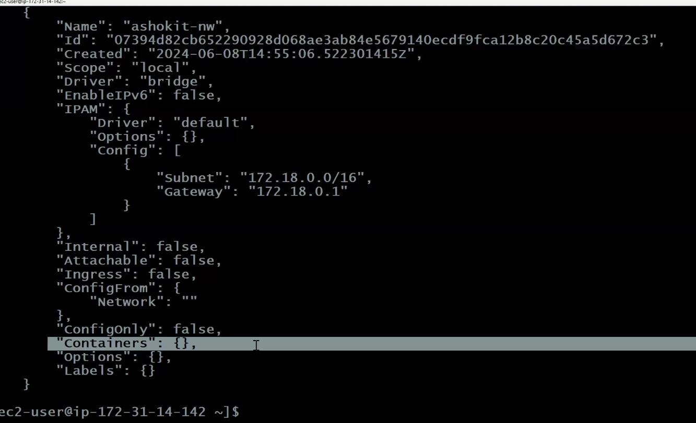
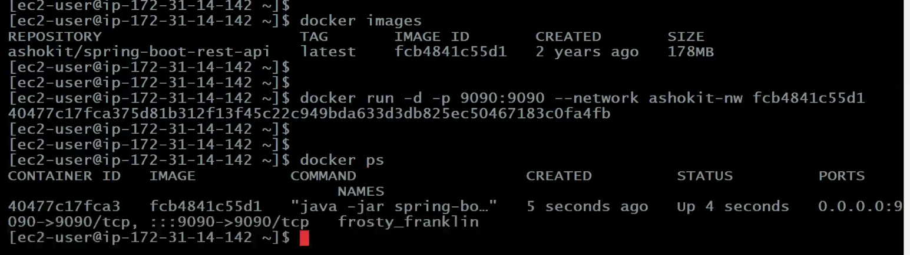
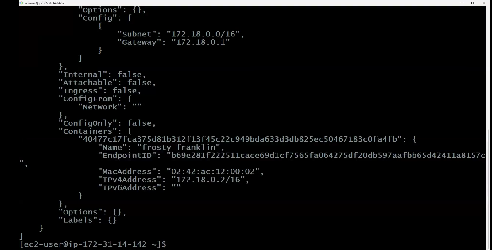
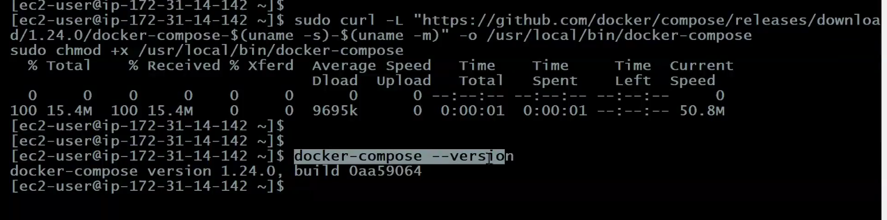
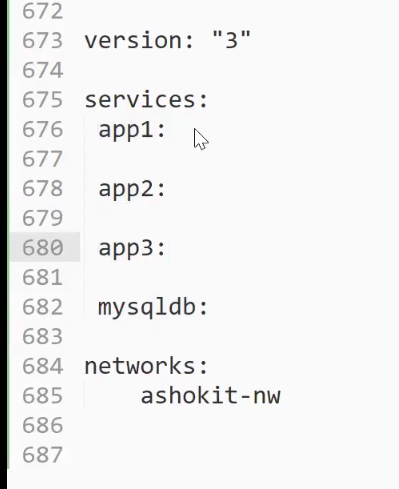
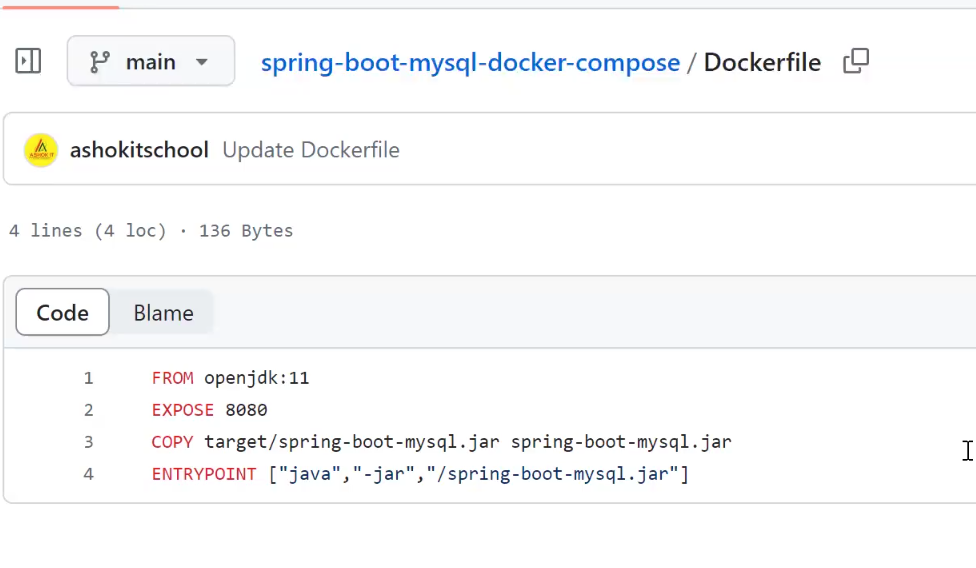
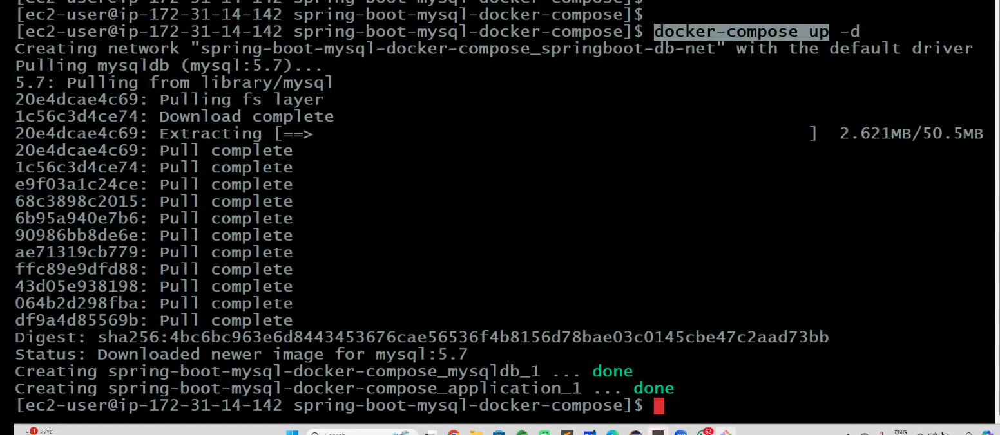

# Notes

Developers only write dockerFile as need to tell what environment is needed!!
If using k8s no need of these

## Docker Network

As of now we run independent containers, so we need communication between container so for that we need Docker Network

=> Network is all about communication

=> Docker network is used to provide isolated network for containers

=> If we run 2 containers under same network then one contianer can communicate with another container.

=> By default we have 3 networks in Docker

	1) bridge(default)
	2) host
	3) none

=> Bridge network is used to run standalone containers. It will assign one IP for container. It is the default network for docker container.

=> Host network is also used to run standalone containers. This will not assign any ip for our container.	

=> None means no network will be available.

=> We can use 2 other networks also in docker

				1) Overlay
				2) MacvLan

=> Overlay network is used for Orchestration purpose (Docker Swarm)	

=> Macvlan network will assign physical Ip for our container.	

>Note: we do not use this concept in real time , we do not create docker containers directly , we use k8s!!

- display docker networks
        
        $ docker network ls

-  create docker network
        
        $ docker network create ashokit-nw

-  inspect docker network( to check container running in a network)
        
        $ docker network inspect ashokit-nw

- create docker container with custom network
        
        $ docker run -d -p 8080:8080 --network <network-name> 

- delete docker network
        
        $ docker network rm ashokit-nw



On inspect you see no containers



lets run a container


let us see now inspect


You can assign name to container if you do not assign it assign itself!!

Now you can stop and remove container!! and then the network!!

## Docker Compose

=> Earlier ppl developed projects using Monolithic Architecture (everthing in single app)

=> Now a days projects are developing based on Microservices architecture.

=> Microservices means multiple backend apis will be avialable

	Ex: 
			hotels-api
			flights-api
			trains-api
			cabs-api...

=> For every API we need to create seperate container.

Note: When we have multiple containers like this management will become very 
difficult (create / stop / start)

=> To overcome these problems we will use Docker Compose.

=> Docker Compose is used to manage Multi - Container Based applications.

=> In docker compose, using single command we can create / stop / start multiple containers at a time.

## What is docker-compose.yml file ?

=> docker-compose.yml file is used to specify containers information.

=> The default file name is docker-compose.yml (we can change it).

=> docker-compose.yml file contains below 4 sections

    version : It represents compose yml version

    services: It represents containers information (image-name, port-mapping etc..)

    networks: Represents docker network to run our containers

    volumes: Represents containers storage location

## Docker Compose Setup

-  install docker compose
        
        sudo curl -L "https://github.com/docker/compose/releases/download/1.24.0/docker-compose-$(uname -s)-$(uname -m)" -o /usr/local/bin/docker-compose

        sudo chmod +x /usr/local/bin/docker-compose

-   Check docker compose is installed or not
    
        $ docker-compose --version



## Spring Boot with MySQL DB using Docker-Compose

```yml
version: "3"
services:/* two services used here*/
  application:
    image: spring-boot-mysql-app
    ports:
      - "8080:8080"
    networks:
      - springboot-db-net
    depends_on:
      - mysqldb
    volumes:
      - /data/springboot-app

  mysqldb:
    image: mysql:5.7
    networks:
      - springboot-db-net
    environment: /* credentails*/
      - MYSQL_ROOT_PASSWORD=root
      - MYSQL_DATABASE=sbms
    volumes:
      - /data/mysql
networks:
  springboot-db-net

```

we are running two services(containers) here. One is Mysql and another one is application!!

if 4 application then can write as 


## DockerFile vs DockerCompose File

DockerFile is used to create image and DockerCompose for orchestration!!

##  Application Execution Process

- clone git repo
        
        $ git clone https://github.com/ashokitschool/spring-boot-mysql-docker-compose.git

- go inside project directory
        
        $ cd spring-boot-mysql-docker-compose

-  build project using maven
        
        $ mvn clean package



- build docker image (using DockerFIle)
        
        $ docker build -t spring-boot-mysql-app .

- check docker images
        
        $ docker images

- create docker containers using docker-compose( see no manual creation of containers)
        
        $ docker-compose up -d



- check docker containers running
        
        $ docker-compose ps

- stop docker containers running
        
        $ docker-compose stop

- start docker containers running
        
        $ docker-compose start

- delete docker containers using docker-compose
        
        $ docker-compose down

## Stateful Vs Stateless Containers

Stateless Container : Data will be deleted after container deletion.

Statefull Container : Data will be available permanently

>Note: Docker containers are stateless by default.

>Note: In spring-boot-mysql app, we are using mysqldb as docker container to store application data. When we re-create containers db also got recreated hence we lost data (this is not accepted in realtime).

=> To maintain data permanently, we need to make docker container as statefull.

=> To make container as statefull, we need to use Docker volumes concept.
