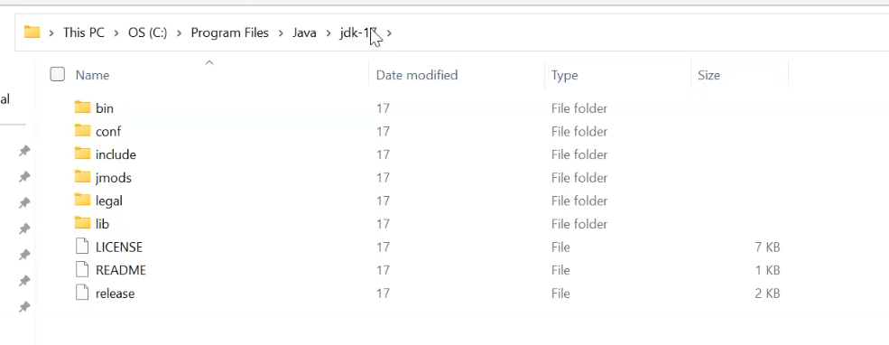
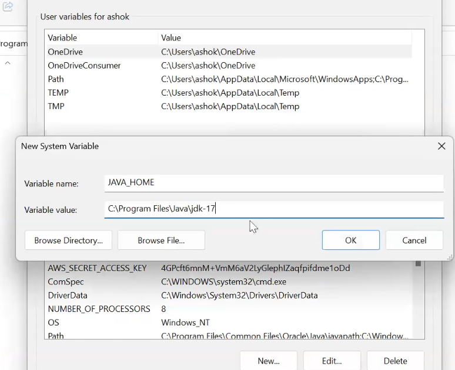
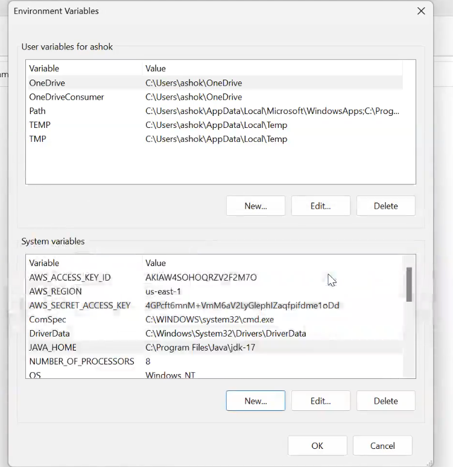
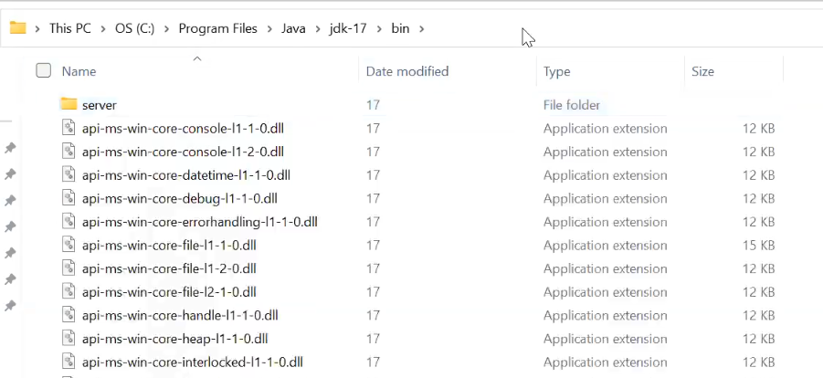
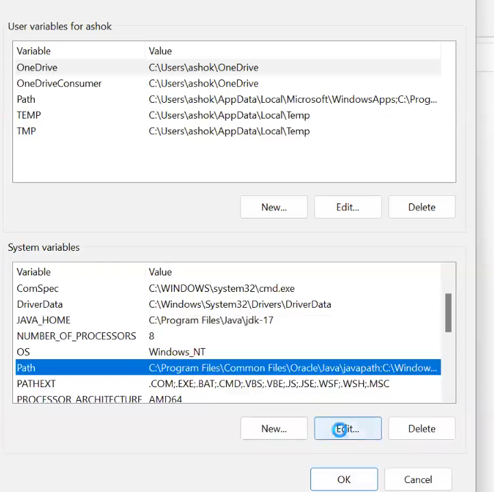
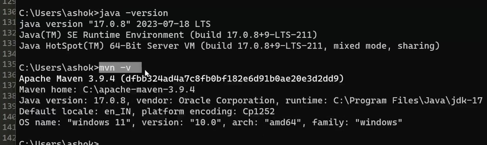

# Maven

### What is Java ?

=> Java is a computer programming language

=> Developed by Sun Microsystems in 1991

=> Using java we can build several types of projects

1) Stand-alone applications
2) Web applications

=> The application which is accessible only in one computer is called as stand-alone application.(install software and that application will run on you rmachine)

- Ex: Calculator, Notepad++, Sublime text, VS Code IDE etc..

=> The application which can be accessed by multiple users at a time is called as web application.

- Ex: Gmail, youtube, facebook, naukri, linkedin etc...

### Java Project Execution Flow


1) Developers will write source code (.java files)

2) Compile source code (java compiler) => It generate byte code (.class files)

3) Package .class files as jar/war for execution

    -  stand-alone app will be packaged as jar file (java archieve)

    -  web-app will be packaged as war file (web archieve)

4) If project is packaged as jar then we can execute jar file directly

5) If project is packaged as war then we need to deploy war file in server
	 (Ex: tomcat)


>Note: To execute java applications we will perform Build + Deployment.

as devops engineer , you must know various language execuetion flow!!


### Java Projects Build Process


1) Download required libraries / dependencies

	Ex : spring, hibernate, junit etc..

2) Add libraries to build path

3) Compile the source code (.java to .class)

4) Execute Unit test cases (junit)

5) package project as jar / war file.


=> Earlier people used to perform this build process manually.

=> To avoid manual build process, build tools came into picture

=> Using build tools, we can automate project build process.
### Maven is a build tool for java applications 

 earlier this process was done manually, to avoid this manul process,build tools came !! using build tools like maven we automate the build process!!

### What is Maven ?

=> Maven is a free and open source s/w

=> Developed by Apache org

=> Maven developed using java language

=> Maven is used as java projects build tool

=> It is used to automate java projects build process.(above mentioned build process is automated)

#### What maven can do

1) Create project folder structure (stnadalone has different structure and web app has different structure)

2) Download required dependencies/libraries

3) Add libraries to build path (junit, spring all added by maven)

4) Compile project source code

5) Execute unit test cases

6) Package project as jar/war
---

### Maven Setup in Windows

@@@ Reference Video : https://www.youtube.com/watch?v=hV1OWzYpzxo

1) Download and Install Java

2) Set JAVA_HOME and Java Path

- JAVA_HOME is set up by path where all folders are present 
 

- put here


- this adds to the system variable


- Java Path is path of bin folder


- in path click on edit


3) Verify Java Installation by chekcing java version by 
java -version

4) Download Maven Software

5) Set MAVEN_HOME and Maven Path (same as of java above we have done)

6) Verify Maven Setup by mvn -v



---

### Maven Setup in Linux
(quite simple)

Step-1: Create Amazon linux vm and connect with that using ssh client

Step-2: Install maven using package manager

	$ sudo yum install maven

Step-3: Verify maven version

	$ mvn -version

>Note: To use maven java is required. When we install maven using package manager then it will install java also.
---
### Maven Terminology

=> Archetype

=> Group ID

=> Artifact ID

=> Version

=> Packaging Type

=> Maven Dependencies

=> Maven Goals

=> Maven Repositories

----------
=> Archetype represents type of the project

- quick-start : stand-alone app 
- web-app : web application

=> groupId represents company name

- Ex: com.tcs, com.ibm, in.ashokit etc..

=> ArtifactId represents project name

- Ex : sbi-netbannking-app, axis-loans-app, flipkart-app	

=> Version represents project version number

- Ex: 0.0.1-SNAPSHOT, 1.0-RELEASE	

	SNAPSHOT => Under development

	RELEASE => delivered to client

=> Packaging type represents packaging format

- Ex: jar, war

=> Maven dependencies nothing but libraries required for development

- Ex: spring, hibernate, junit, kafka, redis etc...

=> Maven goals are used to perform maven build process

- Ex: clean, compile, test, package, deploy

=> Maven Repositories are used to store maven dependencies/libraries/artifacts

- Ex : Central Repo, Remote Repo, Local Repo...

### Creating Maven Stand-alone application


=> Execute below command to create maven stand-alone application

```bash
$ mvn archetype:generate -DgroupId=in.ashokit -DartifactId=sbi-app -DarchetypeArtifactId=maven-archetype-quickstart -DarchetypeVersion=1.4 -DinteractiveMode=false
```

=> Check project directory structure using tree command

	$ sudo yum install tree

this command tells dir structure in tree structure

	$ tree sbi-app

=> Inside the project we can see 'src' folder and pom.xml file

- src : It is used to store project source code (.java files)

- main => java (business logics)

- test => java (unit test logics)

- pom.xml : Project Object Model (Maven configuration file)	


> Note: Once project created, we can use maven goals to perform build process.

