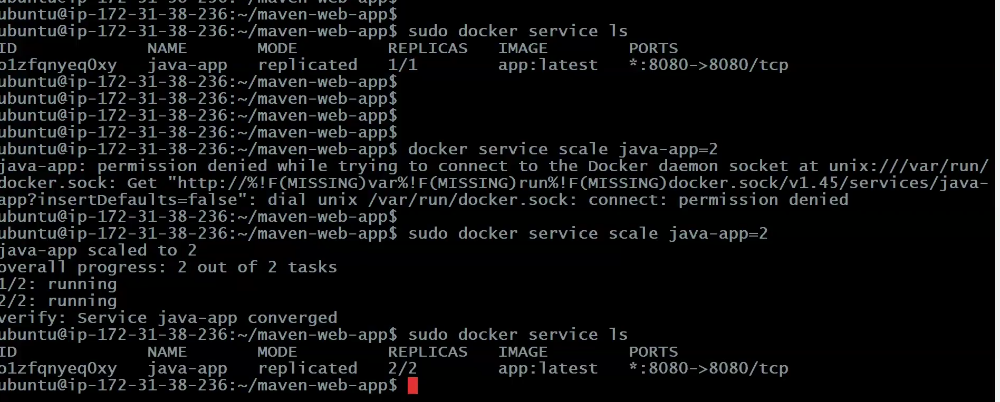

# Notes

## Stateful Vs Stateless Containers

Stateless Container : Data will be deleted after container deletion.

Statefull Container : Data will be available permanently

>Note: Docker containers are stateless by default.

>Note: In spring-boot-mysql app, we are using mysqldb as docker container to store application data. When we re-create containers db also got recreated hence we lost data (this is not accepted in realtime).

=> To maintain data permanently, we need to make docker container as statefull.

=> To make container as statefull, we need to use Docker volumes concept.

## Docker Volumes


=> Volumes are used to persist data which is generated by docker container.

=> Volumes are used to avoid data loss

=> Using volumes we can make container as statefull

=> We have 3 types of volumes in docker

		1) Anonymous volume (no name)
		2) Named Volume
		3) Bind mounts

- display docker volumes

        $ docker volume ls

-  docker volume create
        
        $ docker volume create <vol-name>

-  inspect docker volume
        
        $ docker volume inspect <vol-name>

-  Remove docker volume
        
        $ docker volume rm <vol-name>

-  Remove all docker volumes
        
        $ docker system prune --volumes


## Making docker container stateful


=> Create mount directory on host machine (path : /home/ec2-user/)

	$ mkdir app

=> Map this 'app' directory in docker-compose.yml like below

### docker-compose.yml

```yml
version: "3"
services:
  application:
    image: spring-boot-mysql-app
    ports:
      - "8080:8080"
    networks:
      - springboot-db-net
    depends_on:
      - mysqldb
    volumes:
      - /data/springboot-app
  mysqldb:
    image: mysql:5.7
    networks:
      - springboot-db-net
    environment:
      - MYSQL_ROOT_PASSWORD=root
      - MYSQL_DATABASE=sbms
    volumes:
      - .app:/var/lib/mysql
networks:
  springboot-db-net:  
```

/var/lib/mysql--> path where mysql will store the DB!!

.app--> we want to store db from /var/lib/mysql!!


## Docker Swarm


=> It is an Orchestration platform,like k8s

=> Orchestration means Managing the process (containers)

=> Docker swarm is used to setup docker cluster

=> Cluster means group of servers


## Docker Swarm Cluster Setup


-> Create 3 EC2 instances (ubuntu) & install docker in all 3 instances using below 2 commands

    $ curl -fsSL https://get.docker.com -o get-docker.sh
    $ sudo sh get-docker.sh

>Note: Enable 2377 port in security group for Swarm Cluster Communications


1  - Master Node

2  - Worker Nodes

We send task to master ,master assigns task to slave, slave has all containers!!

Here no single point of failure!! as we have cluster!!

-> Connect to Master Machine and execute below command

-   Initialize docker swarm cluster by creating master
        
        $ sudo docker swarm init --advertise-addr <private-ip-of-master-node>

        Ex : $ sudo docker swarm init --advertise-addr 172.31.41.217

- Get Join token from master  (this token is used by workers to join with master)
        
        $ sudo docker swarm <join-token> worker

>Note: Copy the token and execute in all worker nodes with sudo permission

    Ex: sudo docker swarm join --token SWMTKN-1-4pkn4fiwm09haue0v633s6snitq693p1h7d1774c8y0hfl9yz9-8l7vptikm0x29shtkhn0ki8wz 172.31.37.100:2377

-> In Docker swarm we need to deploy our application as a service.


## Docker Swarm Service


-> Service is collection of one or more containers of same image

-> There are 2 types of services in docker swarm

1) Replica (default mode)
2) global


        $ sudo docker service create --name <serviceName> -p <hostPort>:<containerPort> <imageName>

        Ex :  $ sudo docker service create --name java-web-app -p 8080:8080 ashokit/javawebapp

>Note: By default 1 replica will be created


>Note: We can access our application using below URL pattern

	URL : http://master-node-public-ip:8080/java-web-app/


- check the services created
        
        $ sudo docker service ls 

-   we can scale docker service
        
        $ docker service scale <serviceName>=<no.of.replicas>



see how we scaled up!!

-   inspect docker service
        
        $ sudo docker service inspect --pretty <service-name>

- see service details
        
        $ sudo docker service ps <service-name>

-   Remove one node from swarm cluster
        
        $ sudo docker swarm leave

-   remove docker service , everything including containers will be deleted!1
        
        $ sudo docker service rm <service-name>

Here scale up and down is manual process!! but we want it to be automatic based on load !! That is drawback of docker swarm !! In k8s it is automatic process!!

