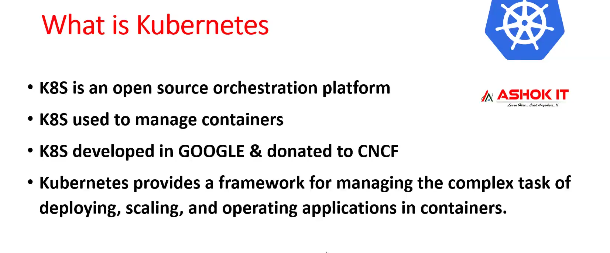
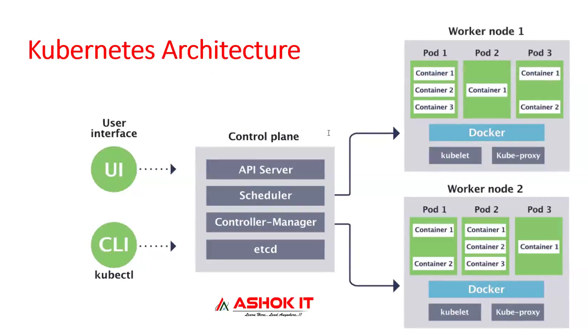

# Kubernetes Lecture 1

Kubernetes (between k ans s 8 character so called as k8s) 

=> It is free & open source s/w

=> Google developed this k8s

=> K8s developed using GO programming language

=> K8S provides Orchestration (Management)

=> K8S is used to manage containers 
	(create/stop/start/delete/scale-up/scale-down)



> we have multiple containers in microservices ,one container for each service , to manage all container we use k8s

### Advantages

1) Auto Scaling : Based on demand containers count will be increased or decreased. In docker swarm we need to increase container manually!!

2) Load Balancing : Load will be distributed all containers which are up and running

3) Self Healing : If any container got crashed then it will replaced with new container

These advantages are not with dockerSwarm so we use k8s only!!

---

### Docker vs k8s


Docker : Containerization platform

>Note: Packaging our app code and dependencies as single unit for execution is called as Containerization.

Kubernetes : Orchestration platform

>Note: Orchestration means managing the containers.

----

### Architecture
>Any orchestration follow cluster architecture



=> K8S will follow cluster architecture

=> Cluster means group of servers will be available so multiple machines are required for k8s setup

=> In K8s Cluster we will have master node (control plane) and worker nodes

=> we have one master node and multiple worker nodes then we go for k8s


### K8S Cluster Components


1) Control Node (Master Node)

 	Here we  have these components

	 - API Server
	 - Schedular
	 - Controller Manager
	 - ETCD

2) Worker Node

	Here we  have these components
	- Kubelet
	- Kube Proxy
	- Docker Runtime
	- POD
	- Container

>Control Node is like manager and Worker Node are employees under manager !! To give task to Control plane we use Kubectl Command line interface or can use User Interface !! we assign task to Control plane and it assign task to worker node!!

## How K8s works??

=> To deploy our application using k8s we need to communicate with control node or control plane.

=> We will use KUBECTL (CLI) to communicate with control plane.

=> API Server will receive the request given by kubectl and it will store that request in ETCD with pending status.

=> ETCD (no full form) is an internal database of k8s cluster.

=> Schedular will identify pending requests available in ETCD and it will identify worker node to schedule the task.

>Note: Schedular will identify worker node using kubelet.

=> Kubelet is called as Node Agent. It will maintain all the worker node information. Kubelet provide worker node information to the control plane and then scheduler decides if the worker node has enough resources then request is assigned to that worker node!!

=> For communication we need a network so Kube Proxy will provide network for the cluster communication.

=> Once task is assigned to worker node,thenController Manager will verify all the tasks are working as expected or not.

=> In Worker Node, Docker Engine will be available to run docker container.

=> In K8s, container will be created inside POD.

=> POD is a smallest building block that we can create in k8s cluster.In k8s everything is represented as POD!!

>Note: A Pod is a way to represent a running process in a cluster.

=>A Pod encapsulates one or more containers. It provides a unique network IP, attaches storage resources, and decides how containers should run. Everything in a Pod is tightly coupled. so just one more layer of OS on container having IP !!

>Note:We should clarify that containers in a Pod are not necessarily made by Docker. Other container runtimes are supported as well. Docker is, however, one of the most commonly used container runtimes, and we’ll use it in all our examples.

=> Inside POD, docker container will be created.there can be multiple container running inside one pod!!

=> sending request for k8s cluster for deployment of application ,we are telling to create POD for the application!! 

>Note: In K8s, everything will be represented as POD only.

=> to Create PODs we will be using yml Files

---

## What is a POD

=> POD is a smallest building block in the k8s cluster.

=> Application will be deployed as a pod in k8s.

=> We can create multiple pods for one application.

=> To create a POD we will use YML file called as Manifest YML.

=> In POD manifest YML we will configure our Docker image.

=> If POD is damaged/crashed/deleted then k8s will create new pod 
  (self-healing)

=> If application running in multiple pods, then k8s will distribute the load to all running pods (Load Balancer).

=> PODs can be increased or decreased automatically based on the load (Scalability).

---

### K8S Cluster Setup

1) Mini Kube => Single Node cluster => Only for practice (everything in single system control plane and worker node) not used in real time

2) Kubeadm Cluster => Self Managed Cluster => The person who using this are responsible for everything

3) Provider Managed Cluster => Ready Made Cluster => Provider will take care of everything

	Ex : AWS EKS, Azure AKS, GCP GKE etc...

>Note: Provider Managed Clusters are billable.

>Most of companies use Provider Managed cluster only!! Companies not use self managed cluster if any issue came with it ,company has to handle it ,in provider managed cluster provider is responsible!!

> In interview never say you using minicube cluster !!

> we are going to use EKS!!

---

### EKS Setup : https://github.com/ashokitschool/DevOps-Documents/blob/main/05-EKS-Setup.md

just see below just pasted here everything!


-  Step - 1 : Create EKS Management Host in AWS #

1) Launch new Ubuntu VM using AWS Ec2 ( t2.micro )	  
2) Connect to machine and install kubectl using below commands  
```
curl -o kubectl https://amazon-eks.s3.us-west-2.amazonaws.com/1.19.6/2021-01-05/bin/linux/amd64/kubectl
chmod +x ./kubectl
sudo mv ./kubectl /usr/local/bin
kubectl version --short --client
```
3) Install AWS CLI latest version using below commands 
```
sudo apt install unzip
curl "https://awscli.amazonaws.com/awscli-exe-linux-x86_64.zip" -o "awscliv2.zip"
unzip awscliv2.zip
sudo ./aws/install
aws --version
```

4) Install eksctl using below commands
```
curl --silent --location "https://github.com/weaveworks/eksctl/releases/latest/download/eksctl_$(uname -s)_amd64.tar.gz" | tar xz -C /tmp
sudo mv /tmp/eksctl /usr/local/bin
eksctl version
```
-  Step - 2 : Create IAM role & attach to EKS Management Host #

1) Create New Role using IAM service ( Select Usecase - ec2 ) 	
2) Add below permissions for the role <br/>
	- IAM - fullaccess <br/>
	- VPC - fullaccess <br/>
	- EC2 - fullaccess  <br/>
	- CloudFomration - fullaccess  <br/>
	- Administrator - acces <br/>
		
3) Enter Role Name (eksroleec2) 
4) Attach created role to EKS Management Host (Select EC2 => Click on Security => Modify IAM Role => attach IAM role we have created) 

- Step - 3 : Create EKS Cluster using eksctl # 
**Syntax:** 

eksctl create cluster --name cluster-name  \
--region region-name \
--node-type instance-type \
--nodes-min 2 \
--nodes-max 2 \ 
--zones <AZ-1>,<AZ-2>

## N. Virgina: <br/>
`
eksctl create cluster --name ashokit-cluster4 --region us-east-1 --node-type t2.medium  --zones us-east-1a,us-east-1b
`	
## Mumbai: <br/>
`
eksctl create cluster --name ashokit-cluster4 --region ap-south-1 --node-type t2.medium  --zones ap-south-1a,ap-south-1b
`

> Note: Cluster creation will take 5 to 10 mins of time (we have to wait). After cluster created we can check nodes using below command.

`
 kubectl get nodes  
`

> Note: We should be able to see EKS cluster nodes here.**

 We are done with our Setup 
	
- Step - 4 : After your practice, delete Cluster and other resources we have used in AWS Cloud to avoid billing ##

```
eksctl delete cluster --name ashokit-cluster4 --region ap-south-1
```
---


## How EKS works

An EKS cluster consists of two major components: Control plane and Nodes. When provisioning an EKS cluster to run an application, the control plane is hosted on the AWS-managed VPC, whereas the worker nodes and other infrastructure are hosted in the customer-managed VPC. The worker nodes may communicate with the control plane through the managed API endpoint in the control plane. The worker nodes are connected to the control plane through the API or an EKS-managed ENI, placed in the customer subnets.


## Example: Hosting a web application
Let’s look at an example to understand how EKS works in detail. For example, we want to host a highly available web application. The deployed EKS cluster’s control plane will be deployed in the AWS-managed cluster; the control plane will communicate with the worker nodes in the Customer-managed VPC through the EKS-managed ENI, assign tasks to the nodes, and maintain their health status. Nodes will not directly interact with the worker nodes; an application load balancer will forward the user requests to the nodes and serve the application.


## EKS Distro
Amazon EKS Distro, an open-source distribution of Kubernetes provided by AWS. It offers the same core components that power Amazon Elastic Kubernetes Service (EKS) for creating and managing containerized applications. The difference between EKS and EKS-D is that the latter is available to install and manage locally. EKS-D can be used on-premises, in a cloud, or in any system. EKS-D provides a path to having essentially the same Amazon EKS Kubernetes distribution running wherever you need to run it.

EKS Distro automatically creates and manages Kubernetes clusters. It offers a consistent Kubernetes experience across AWS cloud and data centers. It alleviates the need to manually track, update, and determine Kubernetes compatibility across different teams. EKS distro also offers installable, reproducible Kubernetes builds for cluster creation as well as security patches even after the community support expires.


