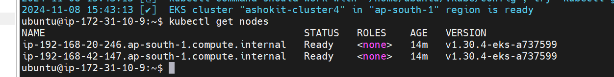

# Kubernetes Lecture 2

In k8s everything is POD!! we need to set up cluster !! we will use ready made cluster by AWS!! Kubernetes are free but these services to manage these services are not free!!


we create a EKS host machine and on that we install the below softwares!!

we need kubectl ,AWS CLI , EKS CLI all in one ec2 instance 

- kubectl - to run k8s command

- AWS CLI - to communicate with AWS using CLI

- EKS CLI - to create cluster in AWS

then we need AWS Role

then we create Control Plane that control plane will take care of worker node!!

>Note: Once cluster is created it can not be stopped it will be terminated only!! and it will generate bill!!

Let's create a ubuntu ec2 instance!!

>for ubuntu user-name is ubuntu ,for amazon linux machine username is ec2-user

-  Step - 1 : install required software on ubuntu machine

1) we know requirement  for 3 softwares as discussed above! for 3 softwares we have next 3 steps!!

2) Connect to machine and install kubectl using below commands  

	```
	curl -o kubectl https://amazon-eks.s3.us-west-2.amazonaws.com/1.19.6/2021-01-05/bin/linux/amd64/kubectl
	chmod +x ./kubectl
	sudo mv ./kubectl /usr/local/bin
	kubectl version --short --client
	```
3) Install AWS CLI latest version using below commands 

	```
	sudo apt install unzip
	curl "https://awscli.amazonaws.com/awscli-exe-linux-x86_64.zip" -o "awscliv2.zip"
	unzip awscliv2.zip
	sudo ./aws/install
	aws --version
	```

4) Install eksctl using below commands,used to create cluster

	```
	curl --silent --location "https://github.com/weaveworks/eksctl/releases/latest/download/eksctl_$(uname -s)_amd64.tar.gz" | tar xz -C /tmp
	sudo mv /tmp/eksctl /usr/local/bin
	eksctl version
	```
-  Step - 2 : Create IAM role & attach to EKS host machine we have created!! as we want to create cluster with this machine so this machine must have permission for EKS!!

> Search IAM and on left go to roles

1) Create New Role using IAM service ( Select Trusted entity type- AWS service , Usecase - ec2 ) 	

2) Add below permissions for the role <br/>
	- IAM - fullaccess <br/>
	- VPC - fullaccess <br/>
	- EC2 - fullaccess  <br/>
	- CloudFomration - fullaccess  <br/>
	- Administrator - acces <br/>
		
3) Enter Role Name (eksrole) 

4) Attach created role to EKS Management Host (Select EC2 => Actions=>Click on Security => Modify IAM Role => attach IAM role we have created) 

- Step - 3 : Create EKS Cluster using eksctl 

**Syntax:** 
```text
eksctl 
create cluster --name cluster-name  \
--region region-name \
--node-type instance-type \
--nodes-min 2 \
--nodes-max 2 \ 
--zones <AZ-1>,<AZ-2>
```

1st we tell cluster name then region name then type of ec2 machines (worker nodes) then min and max nodes and then zones

ex: N. Virgina: <br/>

`
eksctl create cluster --name ashokit-cluster4 --region us-east-1 --node-type t2.medium  --zones us-east-1a,us-east-1b
`

ex: Mumbai: <br/>

`
eksctl create cluster --name ashokit-cluster4 --region ap-south-1 --node-type t2.medium  --zones ap-south-1a,ap-south-1b
`


Here we have not given min and max ,so by default it will make 2 worker nodes

we using mumbai region command 


on EKS-console you can see cluster is being created!!

> Note: Cluster creation will take 5 to 10 mins of time (we have to wait). After cluster created we can check nodes using below command.

Internally k8s uses all given services to create cluster

- IAM - fullaccess 
- VPC - fullaccess 
- EC2 - fullaccess  
- CloudFomration 
- Administrator 

so that's why we have given all these access!

 

Once cluster in active state chcek if terminal is ready too !! if not that means only control plane is created till now not worker nodes!! once whole terminal is free that means cluster is completed fully!!

once ready it will be shown as this


>A kubeconfig file will be created ,In kubeconfig we have all config and it is very important file!!used to connect to k8s cluster! Cluster kubecconfig file is in host machine on which our 3 softwares are installed!!

If any other machine wants to communicate with the control plane ,it must have kube config file!!
Like jenkins machine we want to communicate with control plane so that machine must have config file!!

`
 kubectl get nodes  
`



once worker node ready you can see it by this commands!!

you can see on ec2 the two worker nodes,these worker nodes are created in ASG so there is self healing ,as if one node down other node will be started by ASG!!worker nodes are ec2 only!!


> Note: We should be able to see EKS cluster nodes here.

 We are done with our Setup 
	
- Step - 4 : After your practice, delete Cluster and other resources we have used in AWS Cloud to avoid billing ##

	```text
	eksctl delete cluster --name ashokit-cluster4 --region ap-south-1
	```

we using t2.medium 4GB ram in real time we use atleast 8GB RAM!!

Control plane and 2 t2.medium are chargable things in here!! You do not have any control over control plane !! it will be managed by AWS!!


now let's see pod

`
kubectl get pod
`


as newly created so cannot get pods!!