# Kubernetes Lecture 3

>Note: remember we used ubuntu machine to create cluster so username is ubuntu only

### create cluster command

`
eksctl create cluster --name ashokit-cluster4 --region ap-south-1 --node-type t2.medium --zones ap-south-1a,ap-south-1b`

>Note: It takes time to start

### delete cluster command

`eksctl delete cluster --name ashokit-cluster4 --region ap-south-1
`

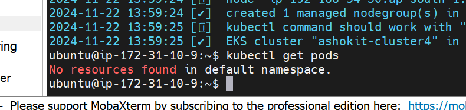

no namespace so getting this!

## Manifest YML
=> In K8s we will use Manifest YML to deploy our application or to do anything in K8s cluster!!

=> Entire k8s is dependent on this yml,most people not able to write these only!!

### K8s Manifest YML Syntax

```yml
---
apiVersion: <version-number>
kind:  <resource-type>
metadata: <name>
spec: <container>
...
```
starts with 3 -(hyphens) and ends with 3 dots

apiVersion --> version of resource you are going to create

kind--> what type of k8s resource you want to create like if pod then kind is POD ,if service then SERVICE

metdata --> name to resource you want to give

spec-->here we specify docker image , here we tell about container!!


- Execute k8s manifest yml like below
    
        $ kubectl apply -f <manifest-yml>

we can create multiple resources from one yml,sections are separated by 3 hyphens

```yml
---
apiVersion: <version-number>
kind:  <resource-type>
metadata: <name>
spec: <container>
---
apiVersion: <version-number>
kind:  <resource-type>
metadata: <name>
spec: <container>
---
apiVersion: <version-number>
kind:  <resource-type>
metadata: <name>
spec: <container>
...
```

These yml file you can get from internet and chatgpt 

### Example K8S POD Manifest YML

```yml
---
apiVersion: v1
kind: Pod
metadata:
 name: javawebapppod
 labels:
  app: javawebapp
spec:
 containers:
 - name: javawebappcontainer
   image: ashokit/javawebapp
   ports:
   - containerPort: 8080
...
```
In metadata we give label with name!!label can be anything, under label you can put color:red!!

=> Labels are used to identify pod!!

Conatiners we can have multiple container inside pod, image it take from dokcerHub!!

To create multiple containers we put multiple containers section inside spec!!

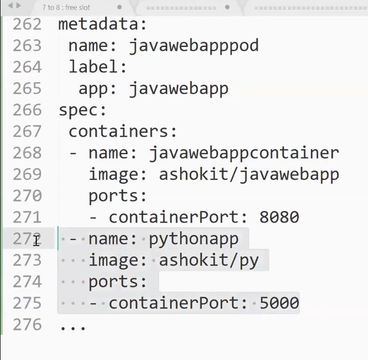

-  check pods available
            
        $ kubectl get pods

 - check nodes available

        $ kubectl get nodes

  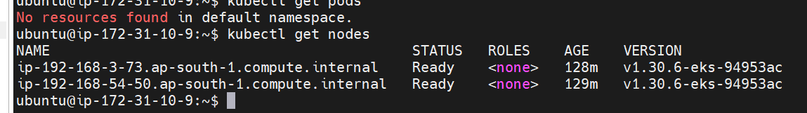             

- create and then Execute k8s manifest yml

        $ kubectl apply -f <manifest-yml>

    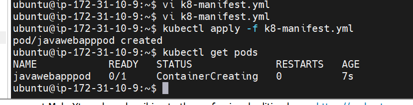
    
    see pods got created

- Check pods running in which worker node

        $ kubectl get pods -o wide

    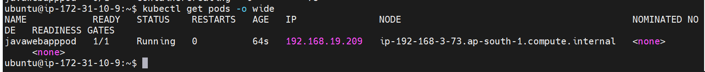

     192.168.19.209   ip-192-168-3-73.ap-south-1.compute.internal 
     
   ip-192-168-3-73.ap-south-1.compute.internal -->  tells private ip and name of worker node

   ip-->192-168-3-73

   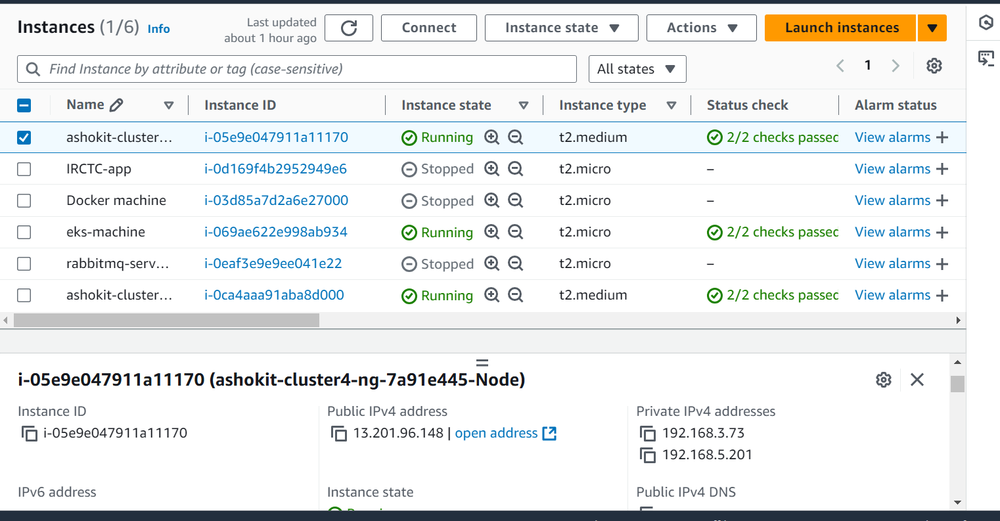

   see pod is created here!!

   Your control plane decides on which worker node pod is going to be created!!

- describe pod

        $ kubectl describe pod <pod-name>

    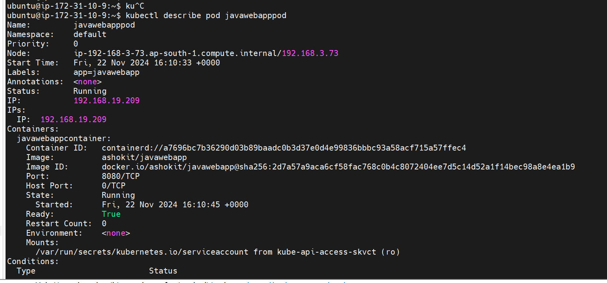

    You can see all pods details!!

    Restart tells how many time pod is restarted!!

    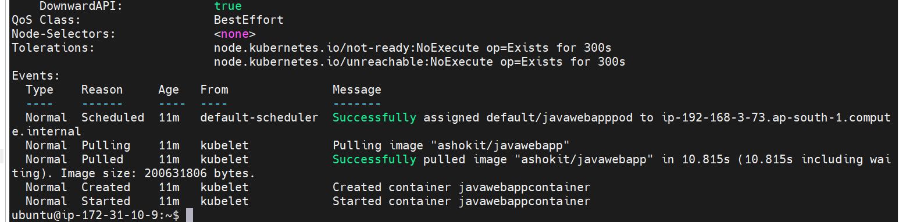

    can see events here too!

- get pod logs

        $ kubectl logs <pod-name>

    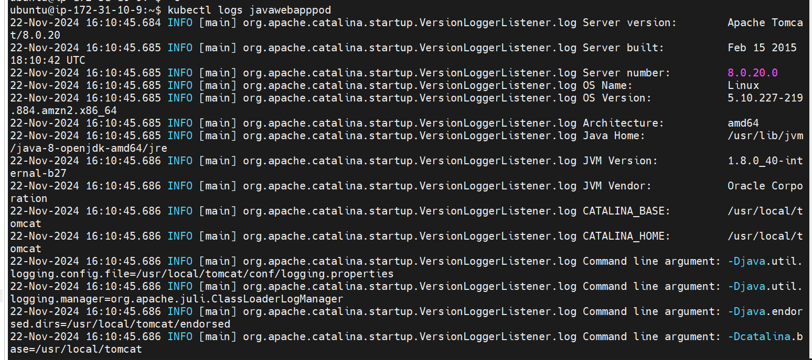


question --> my application running on k8s pod , can i access application now?

answer --> no we can not access as we cannot access pods outside!!To acess pods outside we need services!!

### Example K8S Service Manifest YML

=> Service is used to expose pods

```yml
---
apiVersion: v1
kind: Service
metadata:
 name: javawebappsvc
spec:
 type: LoadBalancer
 selector:
  app: javawebapp
 ports:
  - port: 80
    targetPort: 8080
...
```
 javawebappsvc is name of service

in spec we are telling service specification , for now we are using loadBalancer , it will use Aws load balancer!!rest 2 services we will see next lecture!!

```yml
spec:
 type: LoadBalancer
 selector:
  app: javawebapp
 ports:
  - port: 80
    targetPort: 8080
```

type tells we need load balancer service!!

>Selector selects the pods based on label in selector we give labels of pod!! that's why label of pods are very important!!

In ports we tell port of load balacer as 80 default port for load balancer

and conatiner port on which application running is 8080 defined as targetPort!!

- check k8s services

        $ kubectl get service

-  create service

        $ kubectl apply -f <service-manifest-yml>

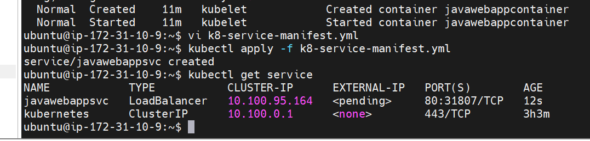

we can see our service , kubernetes is not our service other one is , kubernetes is default one

>Note: Once service got created we can see in EC2 dashabord Load balancer creation.

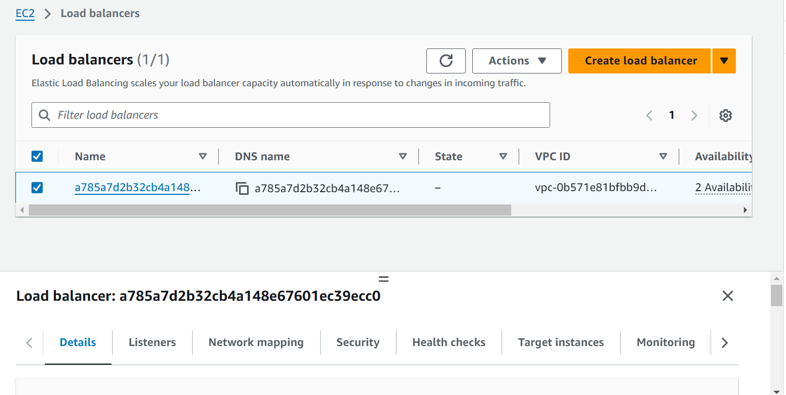

=> We can access our application using Loadbalance DNS url

		URL : LBR-DNS-URL/java-web-app/

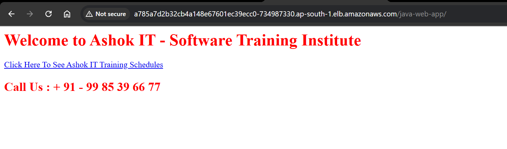

> working!!


