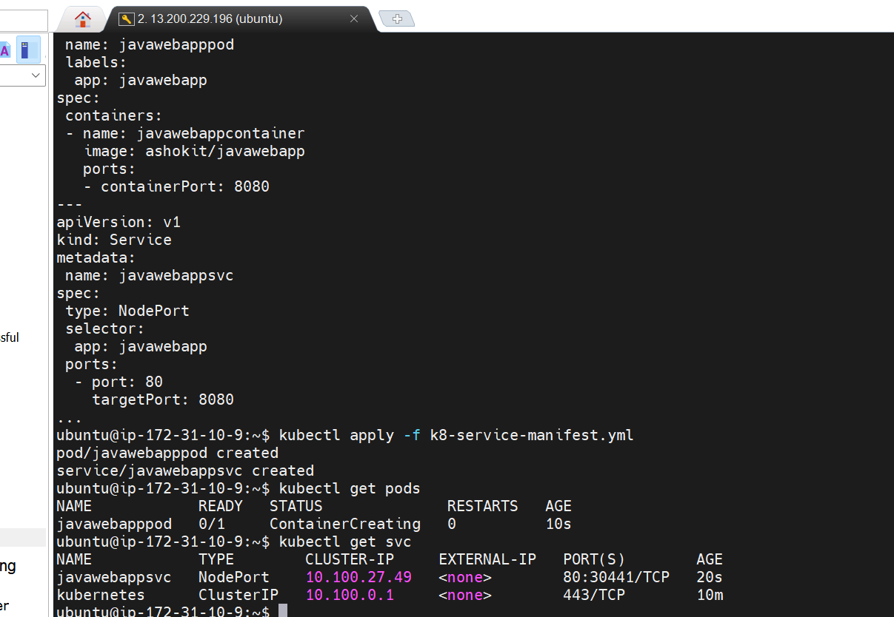
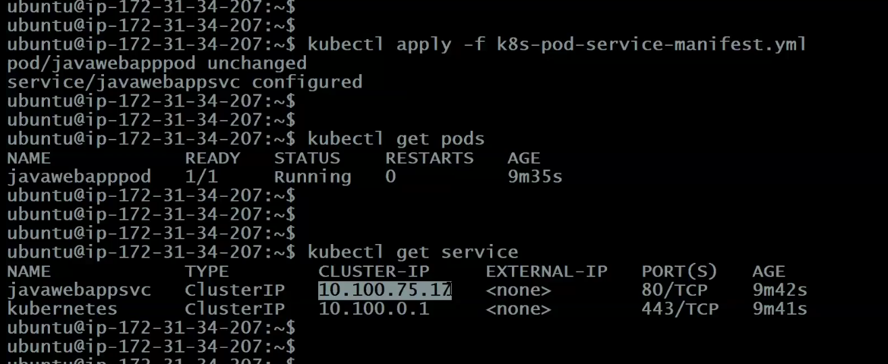
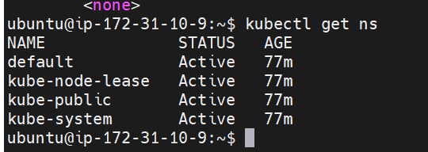
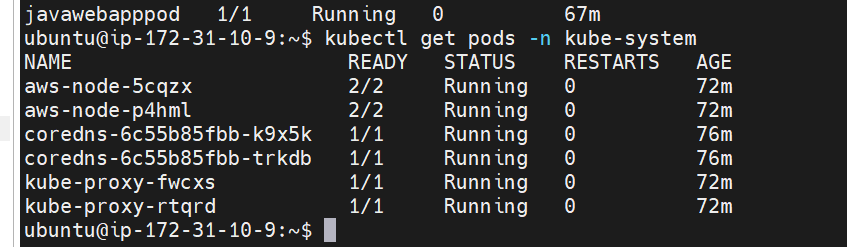
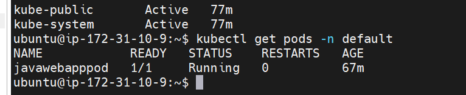
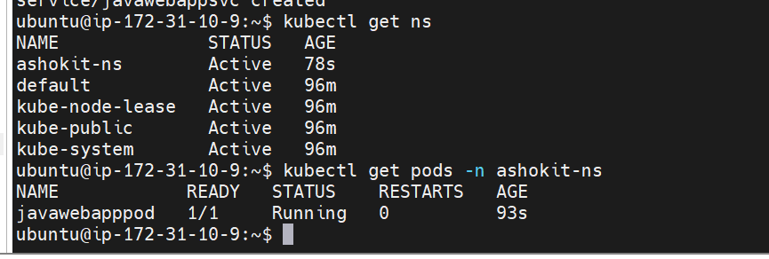
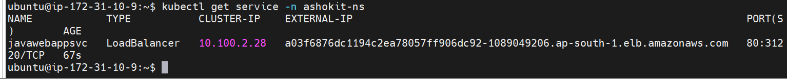
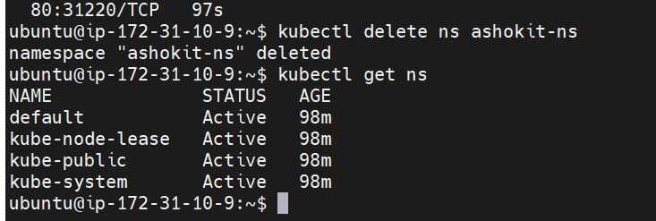

# Lecture 4


>Note: remember we used ubuntu machine to create cluster so username is ubuntu only

### create cluster command

`
eksctl create cluster --name ashokit-cluster4 --region ap-south-1 --node-type t2.medium --zones ap-south-1a,ap-south-1b`

>Note: It takes time to start

### delete cluster command

`eksctl delete cluster --name ashokit-cluster4 --region ap-south-1
`


- to delete all the resources(pods,services all) we have created
        
        $ kubectl delete all --all

 ## Example K8S Node Port Service       

 another way to expose pods!!yesterday we have seen load balancer


 ```yml
---
apiVersion: v1
kind: Service
metadata:
 name: javawebappsvc
spec:
 type: NodePort
 selector:
  app: javawebapp
 ports:
  - port: 80
    targetPort: 8080
...    

 ```
Yesterday we have seen how to write pods and Service yml in one ,so we use that only need to change spec type to NodePort


```yml

---
apiVersion: v1
kind: Pod
metadata:
 name: javawebapppod
 labels:
  app: javawebapp
spec:
 containers:
 - name: javawebappcontainer
   image: ashokit/javawebapp
   ports:
   - containerPort: 8080
---
apiVersion: v1
kind: Service
metadata:
 name: javawebappsvc
spec:
 type: NodePort
 selector:
  app: javawebapp
 ports:
  - port: 80
    targetPort: 8080
...
```


 
see pods and service got created,service type is NodePort!!

$ kubectl get pods -o wide --> to get on which worker node pod is running


>Note: We need to enable node-port number in the security group inbound rules of worker node in which our pod is running.so that from service we can access the pod


we see for now our port is 30441 so enable that ip--> anywhere!!

  URL To Access Our app : http://node-public-ip:node-port/java-web-app

  

we can access by public ip of worker node in which pod is running!!

>Every time you delete nodePort service and create a new service, you get a new random port, we want to get a fixed port number

### What is Nodeport number ?
 => If we don't specify node-port in service manifest yml then k8s will assign random node port number for the service in the range of 30000 to 32767.

>Note: If We don't want random node port number, we can specify that port number in service manifest yml in range only(30000 to 32767).

```yml
---
apiVersion: v1
kind: Service
metadata:
 name: javawebappsvc
spec:
 type: NodePort
 selector:
  app: javawebapp
 ports:
  - port: 80
    targetPort: 8080
    nodePort: 30070
... 

```

$ cat /<file-name>--> to see content of file 

$ kubectl apply -f \<yml-file-name>

$ kubectl get pods

$ kubectl get service


  URL To Access Our app : http://node-public-ip:node-port/java-web-app

>Note: In service load balancer you can use url of load balancer and port 80 fixed so no need to remember , here we need to search worker node in which pod is running , enable service port number in inbound rule and then we can access by public-ip of worker node!!  

## Example K8S ClusterIP Service

=> When we use service type as ClusterIP then one static ip will be created to access our all pods with in the cluster.

```yml
---
apiVersion: v1
kind: Service
metadata:
 name: javawebappsvc
spec:
 type: ClusterIP
 selector:
  app: javawebapp
 ports:
  - port: 80
    targetPort: 8080
...

```

All pods mapped to cluster IP!!This is not for outside access ,only for internal access ,we want to deploy database pods ,than database pods must be accessed internally ,not by outside world!!

> To change service type just edit yml file and then apply !! on applying you see pod is unchanged and see service is changed!!



cannot use cluster IP outside !! use case fixed ip for pods!! within cluster we will be able to access pods!!

Used for DB pods deployment!!

## K8S Namespaces

=> Namespaces are used to group k8s resources
	
	  frontend-app-pods ==> create under one namespace

	  backend-app-pods ==> create under one namespace

	  database-pods ==> create under once namespace

=> We can create multiple namespaces in k8s cluster

	Ex : ashokit-a1-ns, ashokit-a2-ns

=> Each namespace is isolated with another namespace

>Note: When we delete a namespace, all the resources belongs to that namespace gets deleted.	

- display all namespaces available
    
      $ kubectl get ns

  

  You see some namespace already available namespaces , except default there are namespaces used by k8s.

- get the pods available in kube-system namespace

      $ kubectl get pods -n <namespace-name>

    

    

>kubectl get pods --> gives pod in default namespace as we do not mention the namespace

>Note: If we don't give namespace then k8s will check under default namespace.


=> We can create namespace in 2 ways

1) using kubectl create ns command

2) using manifest yml

Approach-1:  

		$ kubectl create ns ashokit-ns		

Approach-2:

```yml
---
apiVersion: v1
kind: Namespace
metadata:
 name: ashokit-ns-2
...		
```

$ kubectl apply -f \<yml-file>

- We can delete namespace using below command

      $ kubectl delete ns <namespace-name>

### Pod and service under our namespace

Previously pod and service was in default namepsace now we want them to be in our namespace!!


```yml
---
apiVersion: v1
kind: Namespace
metadata: 
 name: ashokit-ns
---
apiVersion: v1
kind: Pod
metadata:
 name: javawebapppod
 namespace: ashokit-ns
 labels:
  app: javawebapp
spec:
 containers:
 - name: javawebappcontainer
   image: ashokit/javawebapp
   ports:
   - containerPort: 8080
---
apiVersion: v1
kind: Service
metadata:
 name: javawebappsvc
 namespace: ashokit-ns
spec:
 type: LoadBalancer
 selector:
  app: javawebapp
 ports:
  - port: 80
    targetPort: 8080
...
```

$ kubectl apply -f \<yml-file>

$ kubectl get ns

$ kubectl get pods -n ashokit-ns



$ kubectl get service -n ashokit-ns



$ kubectl get all -n ashokit-ns

$ kubectl delete ns ashokit-ns



>see deleted

> Do not touch rename or anything else the namespaces already present !!

### Questions
1) What is Orchestration
2) K8S Introduction
3) K8S Advantages
4) K8S Architecture
5) K8S Architecture components
6) K8S Cluster Setup
7) K8S Resources
8) What is POD
9) What is Service (ClusterIP, NodePort & LBR)
10) What is Namespace

