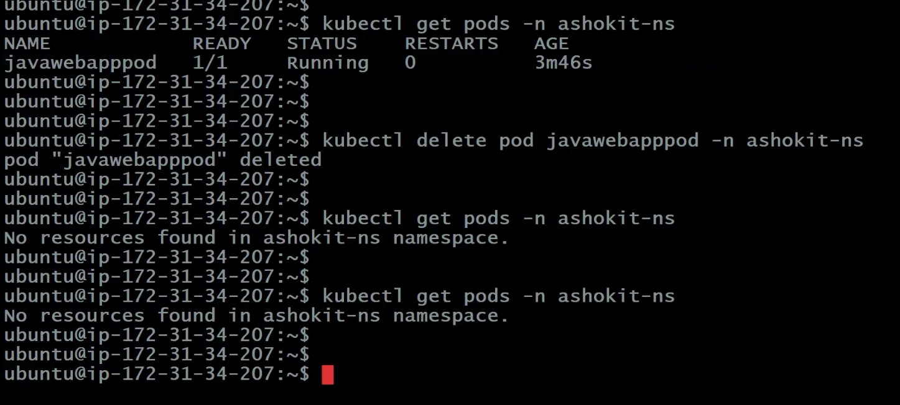
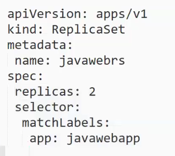
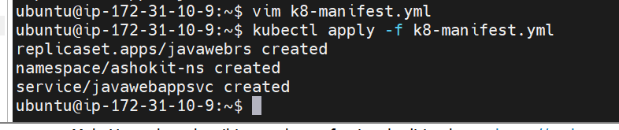
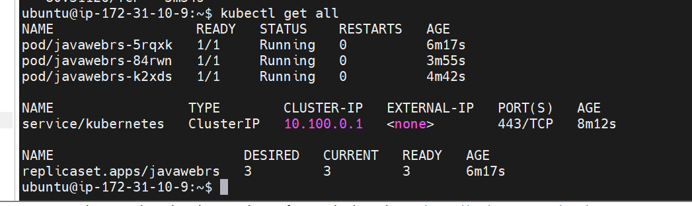

# Lecture 5

>Note: remember we used ubuntu machine to create cluster so username is ubuntu only

### create cluster command

`
eksctl create cluster --name ashokit-cluster4 --region ap-south-1 --node-type t2.medium --zones ap-south-1a,ap-south-1b`

>Note: It takes time to start

### delete cluster command

`eksctl delete cluster --name ashokit-cluster4 --region ap-south-1
`


- to delete all the resources(pods,services all) we have created
        
        $ kubectl delete all --all

 - to get everything in any namespace

        $ kubectl get all  -n <namespace-name> 

- to execute manifest yml

        $ kubectl apply -f \<yml-file>

- get all namespace

        $ kubectl get ns   


## Self healing in k8s

- If pod is damaged then k8s should create a new pod!! 



we deleted the pod but k8s not creating pod!!


=> As of now, we have created POD directly using POD Manifest YML.
    
(kind: Pod)

=> If we create POD directly then we don't get self-healing capability.

=> If POD is damaged/crashed/deleted then k8s will not create new POD.

=> If pod damaged then our application will be down.

>Note: We shouldn't create POD directly to deploy our application in k8s.

>Note: We need to use k8s resources to create pods.

=> If we create pod using k8s resources, then pod life cycle will be managed by k8s.

=> We have below resources to create pods

1) ReplicationController (Outdated)
2) ReplicaSet(RS)
3) Deployment
4) DeamonSet
5) StatefulSet

These resouces take care of self healing capability!!

ReplicationController only one label is supported for identification of pod whereas in ReplicaSet muliple labels are supported!!

## ReplicaSet

=> It is one of the k8s resource which is used to create & manage pods.

=> ReplicaSet will take care of POD life cycle.

>Note: When POD is damaged/crashed/deleted then ReplicaSet will create new POD.

=> Always It will maintain given no.of pods count available for our application.

Ex=> replicas: 2

=> With this approach we can achieve high availability for our application.

=> By using RS, we can scale up and scale down our PODS count.(increase and decrease number of pods)

```yml
---
apiVersion: apps/v1
kind: ReplicaSet
metadata:
 name: javawebrs
spec:
 replicas: 2
 selector:
  matchLabels:
   app: javawebapp
 template:
  metadata:
   name: javawebpod
   labels:
    app: javawebapp
  spec:
   containers:
   - name: javawebcontainer
     image: ashokit/javawebapp
     ports:
      - containerPort: 8080
---
apiVersion: v1
kind: Namespace
metadata: 
 name: ashokit-ns      
---
apiVersion: v1
kind: Service
metadata:
 name: javawebappsvc
 namespace: ashokit-ns
spec:
 type: LoadBalancer
 selector:
  app: javawebapp
 ports:
  - port: 80
    targetPort: 8080
...

```



>Here kind:pod is not there , we are using kind:Replicaset. 

>In selector,matchlabels tells which label to match with the pod!!

>replicas:2 means two pods will be created if one deleted other one be working , if all 2 deleted than 2 more will be up and running!!

>In spec>template  of Replicaset we put details of POD.

Here we have not put namespace name but can put

Also - (hyphen ) whereever we put it means to add list !!

This helps to get high avialability - no downtime!!


$ kubectl get all

$ kubectl apply -f \<yml-file>



$ kubectl get pods

$ kubectl get rs --> to see all replicaset

$ kubectl delete pod <pod-name>

$ kubectl get pods

 to increase pod we can increase by editing yml file or can use below command, this command does not affect yml file

$ kubectl scale rs javawebrs --replicas 3

>Note: When we execute above command replicaset will check how many pods are currently running based on that it will decide scale up or scale down.


See how we scaled up and self healing capability!!



>Note: If we want to delete the pods then we have to delete the resource which created those pods.You cannot delete only pods , you have to delete replicaset!!

$ kubectl delete rs javawebrs

javawebrs is replicaset name

>Note: In ReplicaSet, scale up & scale down is manual process.

=> K8S supports Auto Scaling when we use 'Deployment' to create pods.

## K8S Deployment


=> It is one of the k8s resource/component

=> It is most recommended approach to deploy our applications in k8s.

=> Deployment will manage pod life cycle.

=> We have below advantages with K8s Deployment 

1) Zero Downtime

2) Auto Scaling

3) Rolling Update & Rollback


=> We have below deployment strategies

1) ReCreate (all at once)

2) RollingUpdate (one by one)


=> ReCreate means it will delete all existing pods and will create new pods.

=> RollingUpdate means it will delete and create new pod one by one.


```yml
---
apiVersion: apps/v1
kind: Deployment
metadata:
 name: javawebdeploy
spec:
 replicas: 2
 strategy: 
  type: RollingUpdate
 selector:
  matchLabels:
   app: javawebapp
 template:
  metadata:
   name: javawebpod
   labels:
    app: javawebapp
  spec:
   containers:
   - name: javawebappcontainer
     image: ashokit/javawebapp
     ports:
     - containerPort: 8080
---
apiVersion: v1
kind: Service
metadata:
 name: javawebsvc
spec:
 type: LoadBalancer
 selector:
  app: javawebapp
 ports:
  - port: 80
    targetPort: 8080
...

```


$ kubectl delete all --all

$ kubectl get all

$ kubectl apply -f \<yml-file>

$ kubectl get all

Note: Access app using LBR URL

$ kubectl scale deployment javawebdeploy --replicas 4

$ kubectl get pods

$ kubectl scale deployment javawebdeploy --replicas 3