# Lecture-6

>Note: remember we used ubuntu machine to create cluster so username is ubuntu only

### create cluster command

`
eksctl create cluster --name ashokit-cluster4 --region ap-south-1 --node-type t2.medium --zones ap-south-1a,ap-south-1b`

>Note: It takes time to start

### delete cluster command

`eksctl delete cluster --name ashokit-cluster4 --region ap-south-1
`


- to delete all the resources(pods,services all) we have created
        
        $ kubectl delete all --all

 - to get everything in any namespace

        $ kubectl get all  -n <namespace-name> 

- to execute manifest yml

        $ kubectl apply -f <yml-file>

- get all namespace

        $ kubectl get ns   


## K8S Deployment


=> It is one of the k8s resource/component

>Note: It is most recommended approach to deploy our applications in k8s.

=> Deployment will manage pod life cycle.

=> We have below advantages with K8s Deployment 

1) Zero Downtime --> if one pod goes down another pod will be up

2) Auto Scaling --> load increase pods increase and if load decrease pods will be decreased

3) Rolling Update & Rollback -->deploy using zero downtime.RollingUpdate means it will delete and create new pod one by one.Rollback means we can comeback to previous deployment!!

Suppose pods already running in k8s cluster!! Now we want to redeploy as code changes!! Now we need to delete old pod and create new ones!!

=> We have below deployment strategies

1) ReCreate (all at once)

2) RollingUpdate (one by one)


=> ReCreate means it will delete all existing pods and will create new pods.It will have some downtime!!

=> RollingUpdate means it will delete and create new pod one by one.No downtime!!


```yml
---
apiVersion: apps/v1
kind: Deployment
metadata:
 name: javawebdeploy
spec:
 replicas: 2
 strategy: 
  type: RollingUpdate
 selector:
  matchLabels:
   app: javawebapp
 template:
  metadata:
   name: javawebpod
   labels:
    app: javawebapp
  spec:
   containers:
   - name: javawebappcontainer
     image: ashokit/javawebapp
     ports:
     - containerPort: 8080
---
apiVersion: v1
kind: Service
metadata:
 name: javawebsvc
spec:
 type: LoadBalancer
 selector:
  app: javawebapp
 ports:
  - port: 80
    targetPort: 8080
...

```
>Note:Here we have put deployement strategy in spec of Deployment!!quite understandable yml

$ kubectl delete all --all

$ kubectl get all

$ kubectl apply -f \<yml-file>

$ kubectl get all

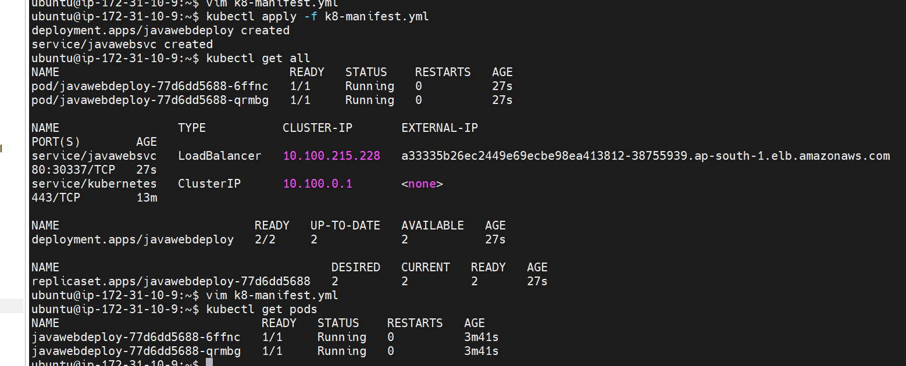

>Note: see Replicaset is created ,internally deployment uses replicaset only!!

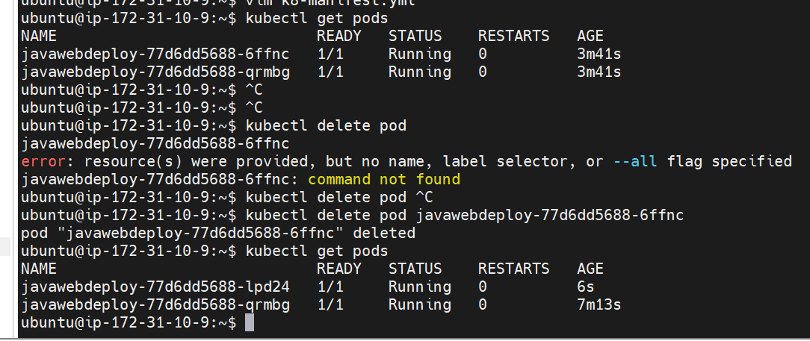
>See self healing working!!

>Note: Access app using LBR URL

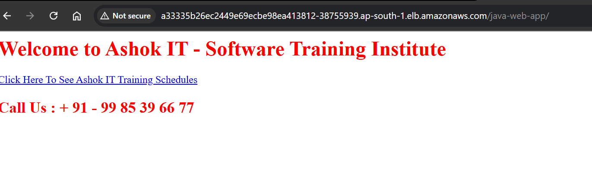

### Manual Scaling
$ kubectl scale deployment javawebdeploy --replicas 4

$ kubectl get pods

$ kubectl scale deployment javawebdeploy --replicas 3

>Autoscaling we need to do some configurations ,it would not happend directly!!

### Autoscaling

-> It is the process of increasing / decreasing infrastructure resources based on demand.

-> Autoscaling can be done in 2 ways

1) Horizontal Scaling

2) Verticle Scaling

-> Horizontal Scaling means increasing number of instances/servers/pods.

-> Veriticle Scaling means increasing capacity of single system.

    HPA(Elasticity) : Horizontal POD Autoscaling

    VPA : Vertical POD Autoscaling (we don't use this)

HPA: It is used to scale up/down no.of pod replicas based on the observed metrics 
    (CPU or memory utilization)

-> HPA will interact with "Metric Server" to identify CPU/Memory utilization of POD.so we need to install that Metrics server!!

-> Metrics server is an application that collect metrics from objects such as pods, nodes according to the state of CPU, RAM and keeps them in time.

- to get node metrics
        
        $ kubectl top nodes

- to get pod metrics
        
        $ kubectl top pods

>Note: By default metrics server is not available in our k8s cluster

>Metrices server will run as pod only so we use yml!!
### Step-1 : Install Metrics API

>In ubuntu git client is already available so use git --version and see

1) clone git repo
 
        $ git clone https://github.com/ashokitschool/k8s_metrics_server

2) check the cloned repo

        $ cd k8s_metrics_server

        $ ls deploy/1.8+/

3)  apply all manifest files from manifest-server directlry

        $ kubectl apply -f deploy/1.8+/

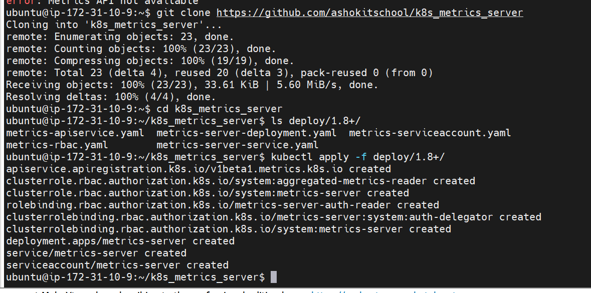

>Note: it will create service account, role, role binding all the stuff

- we can see metric server running in kube-system ns
        $ kubectl get all -n kube-system

- check the top nodes using metric server
        $ kubectl top nodes

- check the top pods using metric server
        $ kubectl top pods


>Note: When we install Metric Server, it is installed under the kube-system namespaces.

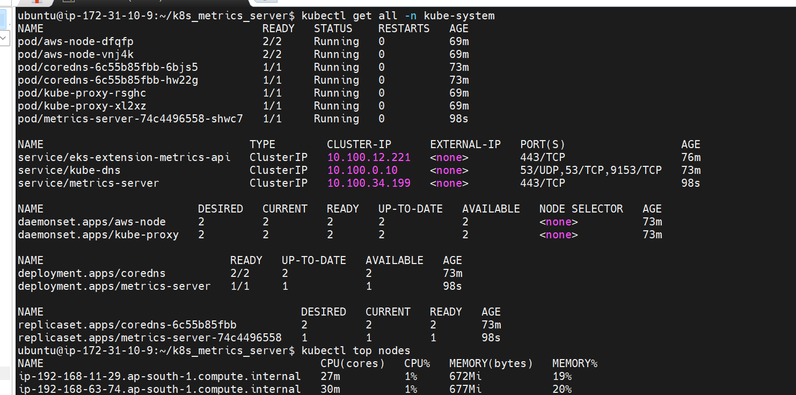

See metrics server insatlled as a pod!! for this cluster ip service is created as it is used for internal purpose !! no need of public access!!

also see cpu utilization of nodes(ec2-worker-nodes)!!

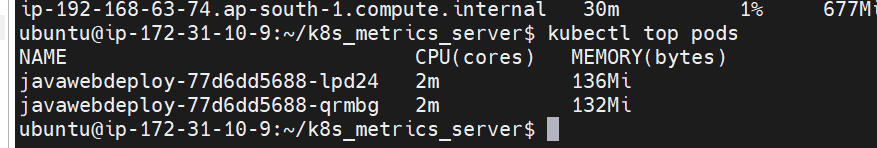

see we are getting cpu and memory information!!

### Step-2 : Deploy Sample Application

using k8s provided image, here we have put resoucre limit!!

```yml
---
apiVersion: apps/v1
kind: Deployment
metadata:
 name: hpa-demo-deployment
spec:
 selector:
   matchLabels:
     run: hpa-demo-deployment
 replicas: 1
 template:
   metadata:
     labels:
       run: hpa-demo-deployment
   spec:
     containers:
     - name: hpa-demo-deployment
       image: k8s.gcr.io/hpa-example
       ports:
       - containerPort: 80
       resources:
         limits:
           cpu: 500m
         requests:
           cpu: 200m
...

```
### Step-3 : Create Service

 see label is run: hpa-demo-deployment
```yml
---
apiVersion: v1
kind: Service
metadata:
 name: hpa-demo-deployment
 labels:
   run: hpa-demo-deployment
spec:
 ports:
 - port: 80
 selector:
   run: hpa-demo-deployment
...
```
here we are not giving any service type!! so default service it will take is Cluster Ip , can see below image!!

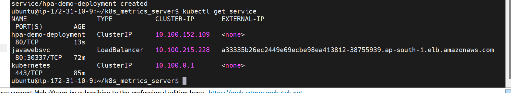

### Step-4 : Create HPA
to run kubectl get hpa or to get autoscaler in cluster

```yml
---
apiVersion: autoscaling/v1
kind: HorizontalPodAutoscaler
metadata:
 name: hpa-demo-deployment
spec:
 scaleTargetRef:
  apiVersion: apps/v1
  kind: Deployment
  name: hpa-demo-deployment
 minReplicas: 1
 maxReplicas: 10
 targetCPUUtilizationPercentage: 50
...

```

in spec we tell what to monitor
```yml
 scaleTargetRef:
  apiVersion: apps/v1
  kind: Deployment
  name: hpa-demo-deployment
```
Here we monitor deployment we created at step-2, here we telling id cpu utlization>50 percent scale up!!

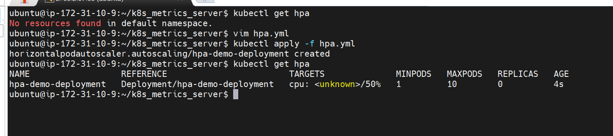

see we get hpa ,in sometime we get other things 
### Step-5 : Increase the Load

$ kubectl get hpa

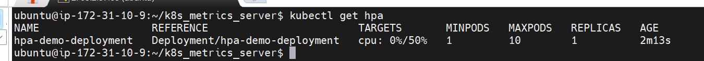

On new window we increase load

$ kubectl run -i --tty load-generator --rm --image=busybox --restart=Never -- /bin/sh -c "while sleep 0.01; do wget -q -O- http://hpa-demo-deployment; done"

Note: After executing load generator open new git bash and connect to eks vost vm and monitor hpa with below commands

$ kubectl get hpa -w

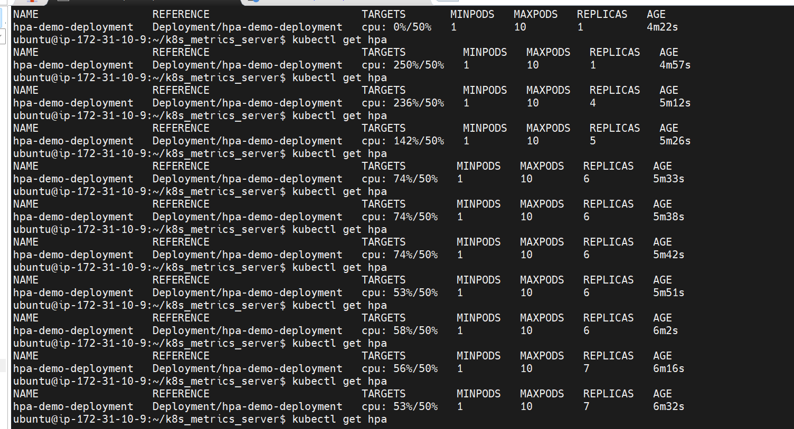

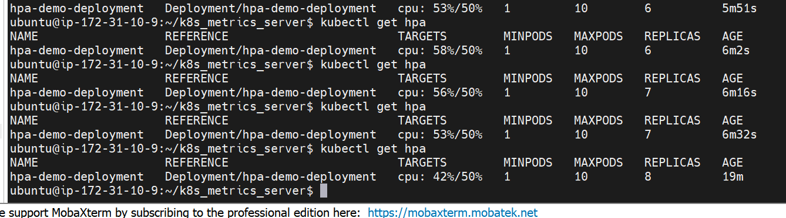

>see how cpu utilization goes down and replicas are made to decrease the cpu utilization!!

$ kubectl describe deploy hpa-demo-deployment

$ kubectl get hpa

$ kubectl get events

$ kubectl top pods 

$ kubectl get hpa

now we decreased load
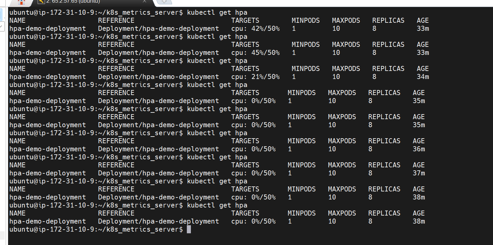

now in some time pod will be decreased too

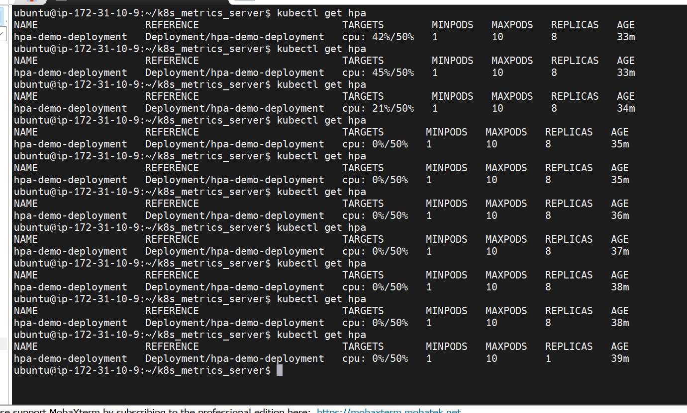

