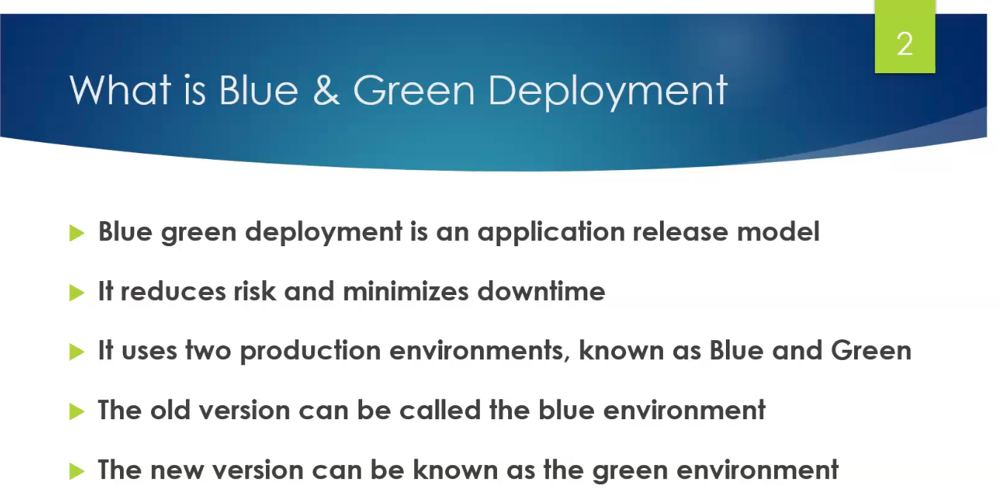
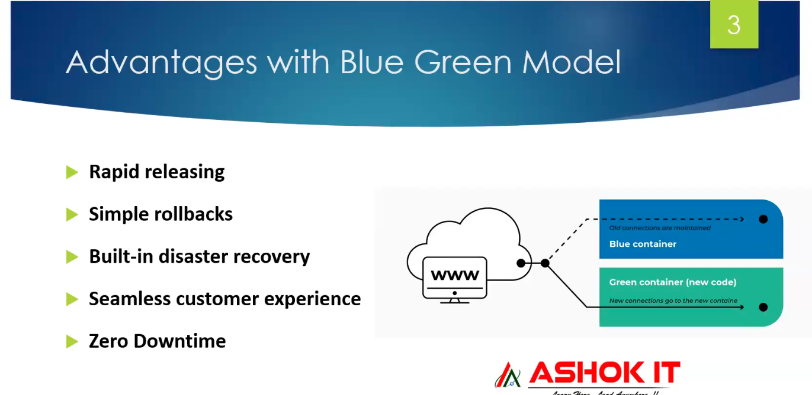
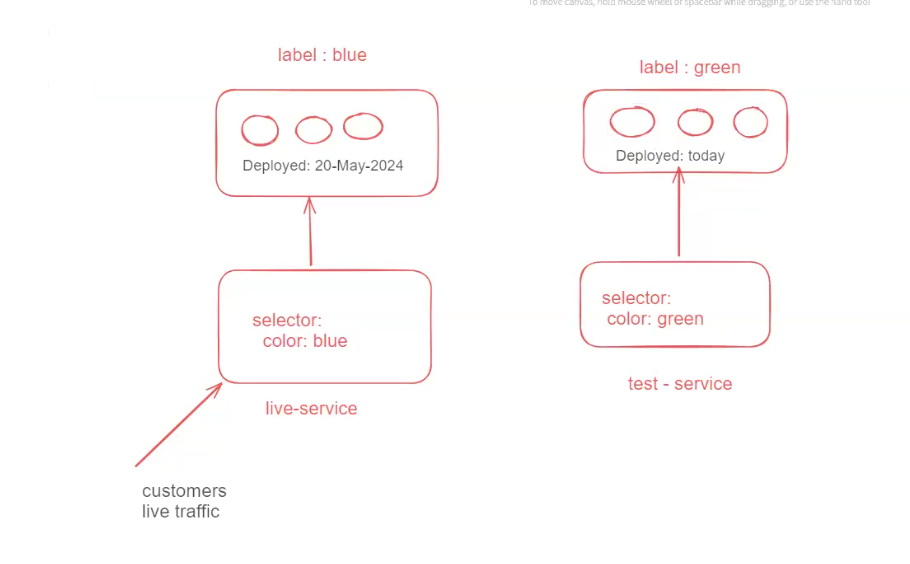
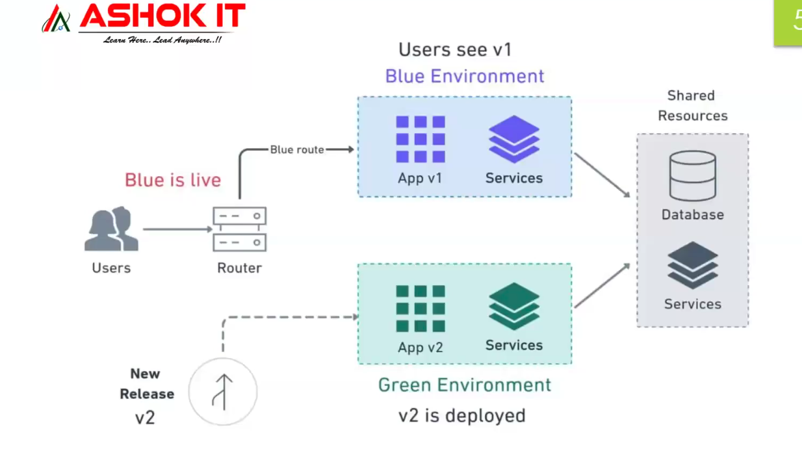
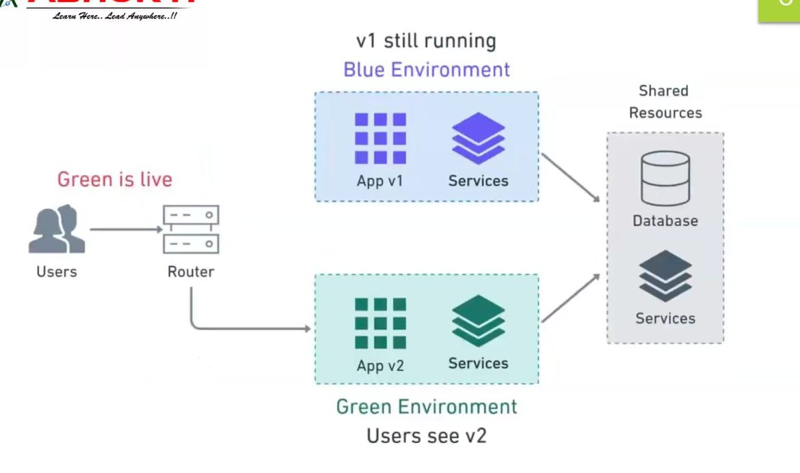

# Lecture-8

>Note: remember we used ubuntu machine to create cluster so username is ubuntu only

### create cluster command

`
eksctl create cluster --name ashokit-cluster4 --region ap-south-1 --node-type t2.medium --zones ap-south-1a,ap-south-1b`

>Note: It takes time to start

### delete cluster command

`eksctl delete cluster --name ashokit-cluster4 --region ap-south-1
`

- to delete all the resources(pods,services all) we have created
        
        $ kubectl delete all --all

 - to get everything in any namespace

        $ kubectl get all  -n <namespace-name> 

- to execute manifest yml

        $ kubectl apply -f <yml-file>

- get all namespace

        $ kubectl get ns   

 ##  Blue Green deployment

 Most application use this model to deploy application with zero downtime!!
 Here we have 2 production environment blue and green !! blue is current version and green one is new version!!
 green one is open for testing ! once testing is done load balancer traffic is moved to green environment ,if any customer 
 face any issue green environment is switched back to blue one!!

This helps in case when latest pod have bug , in that case you can rollback to blue environment!!
also zero downtime!!

you no need to tell to customer that 2 hours mainatainence as zero downtime!!

test-service will be tested by tetsing team!!
this tetsing is pre-prod service!!

to make green pods live , you need to put change label of live service
and live service will direct all traffic to green , just chnage live-service
label to color:green!!

if any problem in green just change label to blue!!

Now what about people using application while chnaging label? like in case of banking application and 
we deployed , while we were deploying some people were doing some transaction , then?
what about their transaction??

 Step-0: Clone below git repo

  URl : https://github.com/ashokitschool/kubernetes_manifest_yml_files.git

Step-1 : Navigate into blue-green directory

Step-2 : Create Blue Pods deployment (pod-label : v1)

Step-3 : Create Live Service to expose blue pods

Step-4 : Access App using Live Service LBR DNS Url

   (blue pods response we should be able to see in browser)

Step-5: Create Green Pods deployment

Step-6: Check all pods running

Step-7: Create Pre-Prod service

Step-8: Access Green Pods using pre-prod service

Step-9: Make green pods live 

Step-10 : Access Live Service (green pods response should come)          