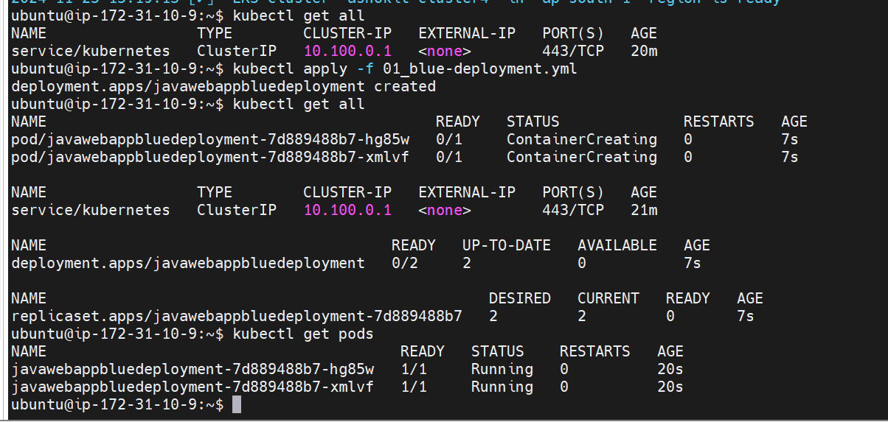
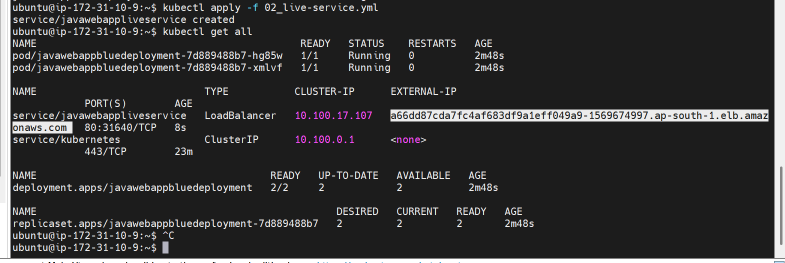
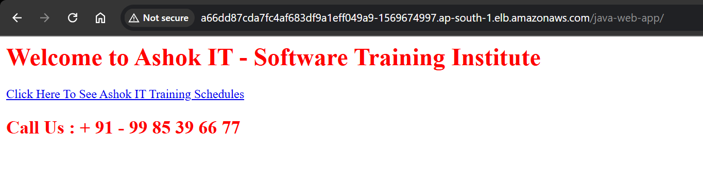
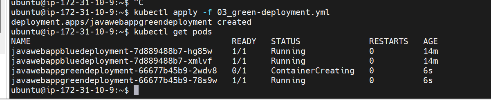
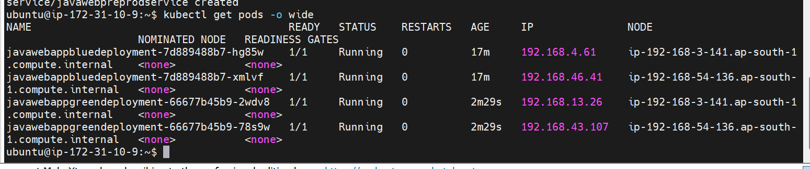
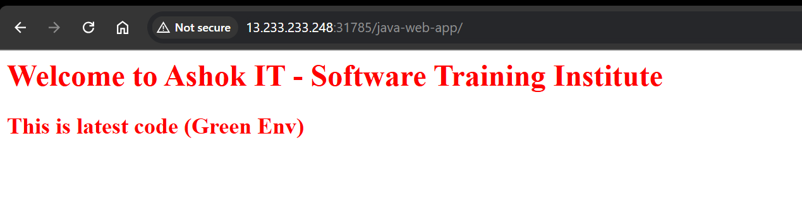
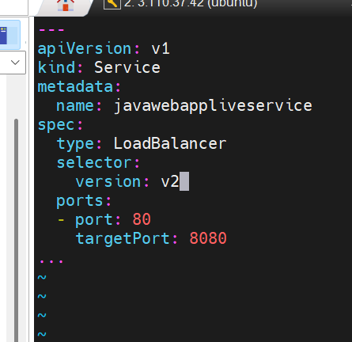
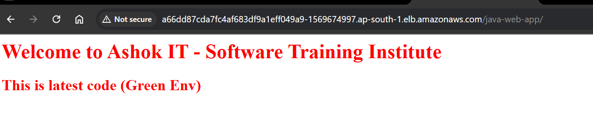

# Lecture-9

>Note: remember we used ubuntu machine to create cluster so username is ubuntu only

### create cluster command

`
eksctl create cluster --name ashokit-cluster4 --region ap-south-1 --node-type t2.medium --zones ap-south-1a,ap-south-1b`

>Note: It takes time to start

### delete cluster command

`eksctl delete cluster --name ashokit-cluster4 --region ap-south-1
`


- to delete all the resources(pods,services all) we have created
        
        $ kubectl delete all --all

 - to get everything in any namespace

        $ kubectl get all  -n <namespace-name> 

- to execute manifest yml

        $ kubectl apply -f <yml-file>

- get all namespace

        $ kubectl get ns   

 ##  Blue Green deployment

 Most application use this model to deploy application with zero downtime!!
 Here we have 2 production environment blue and green !! blue is current version and green one is new version!!
 green one is open for testing ! once testing is done load balancer traffic is moved to green environment ,if any customer 
 face any issue green environment is switched back to blue one!!

if any problem in green just change label to blue!!

Now what about people using application while chnaging label? like in case of banking application and 
we deployed , while we were deploying some people were doing some transaction , then?
what about their transaction??


        Step-0: Clone below git repo

  URl : https://github.com/ashokitschool/kubernetes_manifest_yml_files.git

We have 4 yml as
1. blue pod and live service  
2. green pod and test service

All this yml files are under folder k8s-yml-files
        Step-1 : Navigate into blue-green directory

        Step-2 : Create Blue Pods deployment (pod-label : v1)

        Step-3 : Create Live Service to expose blue pods

        Step-4 : Access App using Live Service LBR DNS Url

        (blue pods response we should be able to see in browser)

        Step-5: Create Green Pods deployment

        Step-6: Check all pods running
### Blue deployment (Deployment yml)

```yml
---
apiVersion: apps/v1
kind: Deployment
metadata:
  name: javawebappbluedeployment
spec:
  replicas: 2
  strategy:
    type: RollingUpdate
  selector:
    matchLabels:
      app: java-web-app
      version: v1
      color: blue
  template:
    metadata:
      name: javawebapppod
      labels:
        app: java-web-app
        version: v1
        color: blue
    spec:
      containers:
      - name: javawebappcontainer
        image: ashokit/javawebapp
        imagePullPolicy: Always
        ports:
        - containerPort: 8080
...

```
see 3 labels here!!



see blue pods got created

we cannot access outside cluster so now we need to create service!!So we create service

### live service

```yml
---
apiVersion: v1
kind: Service
metadata:
  name: javawebappliveservice
spec:
  type: LoadBalancer
  selector:
    version: v1
  ports:
  - port: 80
    targetPort: 8080
...

```


created load balancer service!! blue pods are accessed by this!!



blue pods or version v1 are accessible
### Green deployment

```yml
---
    apiVersion: apps/v1
    kind: Deployment
    metadata:
      name: javawebappgreendeployment
    spec:
      replicas: 2
      strategy:
        type: RollingUpdate
      selector:
        matchLabels:
          app: java-web-app
          version: v2
          color: green
      template:
        metadata:
          name: javawebapppod
          labels:
            app: java-web-app
            version: v2
            color: green
        spec:
          containers:
          - name: javawebappcontainer
            image: ashokit/javawebapp:v2
            imagePullPolicy: Always
            ports:
            - containerPort: 8080
...

```
here we are using another docker image!!same code just version v2



see blue pods and green pods both running , green one running from 6 sec
        
        Step-7: Create Pre-Prod service
### Pre-prd service

```yml
---
    apiVersion: v1
    kind: Service
    metadata:
      name: javawebpreprodservice
    spec:
      type: NodePort
      selector:
        version: v2
      ports:
      - port: 80
        targetPort: 8080
        nodePort: 31785
...
```

it is type of nodeport as for testing purpose!!



see 1st blue and green pod are on same worker node!!

to check green one working enable port 31785 in green worker nodes!!

after enabling access by node public ip



now we want load balancer to access v2 or green version

        Step-8: Access Green Pods using pre-prod service

to make latest code live or green pod live ,we have to change selector of live service!! so just edit live servie yml!!In live service change selector to v2



after applying see



accessing by load balancer URL

        Step-9: Make green pods live 

        Step-10 : Access Live Service (green pods response should come)        


>Note: to divert traffic to old application just change v2 to v1 in live service      

Ques-->how to manage downtime while green one is going to be up and blue to be down??it is fraction of milisec but still how to manage that??

Ans-->HA proxy server will be configuered for this!!

For long-lived TCP connections, such as database connections or websockets, HAProxy can ensure that connections are not dropped during the switchover. Traffic from an ongoing transaction will continue to flow to the blue environment until it is completed.

Instead of an abrupt switch, you can gradually shift new traffic to the green environment while keeping ongoing sessions on the blue environment. This minimizes the risk of disrupting active users.

When switching from blue to green, you can configure HAProxy to stop sending new connections to the blue environment while allowing existing connections to complete. This is done using the drain mode for servers.

### Transaction Routing Behavior:
- Active Transactions: If a user is mid-transaction in the blue environment, HAProxy keeps routing their requests to blue (via sticky sessions or persistent connections). Their transaction will complete without interference.
- New Transactions: New users or transactions are directed to the green environment based on the updated HAProxy configuration or rules.

