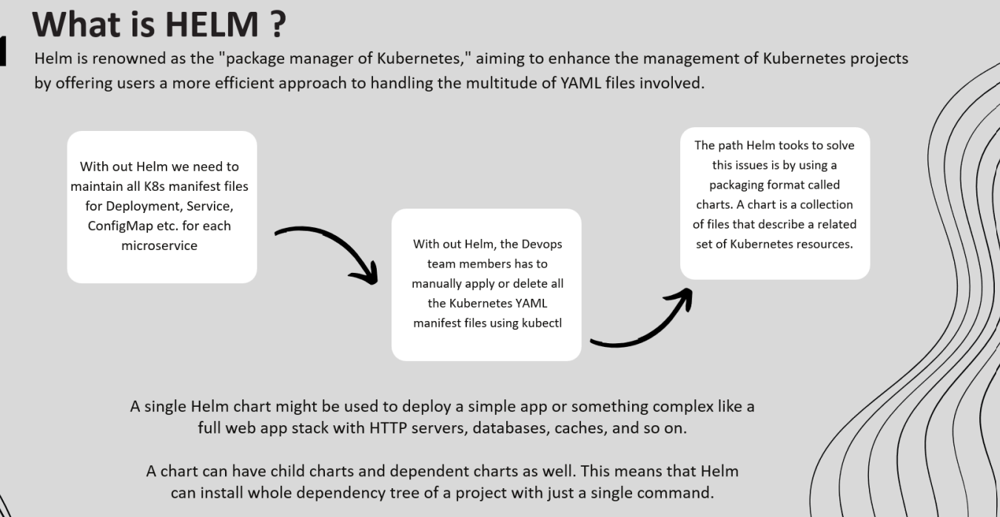
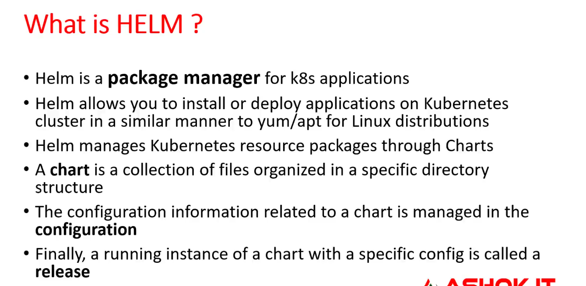
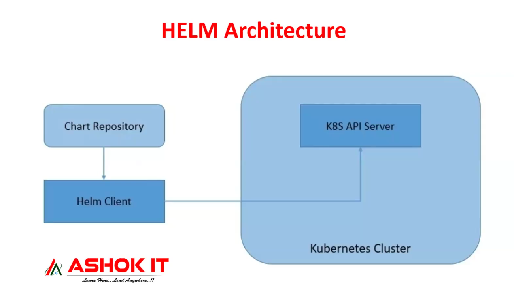
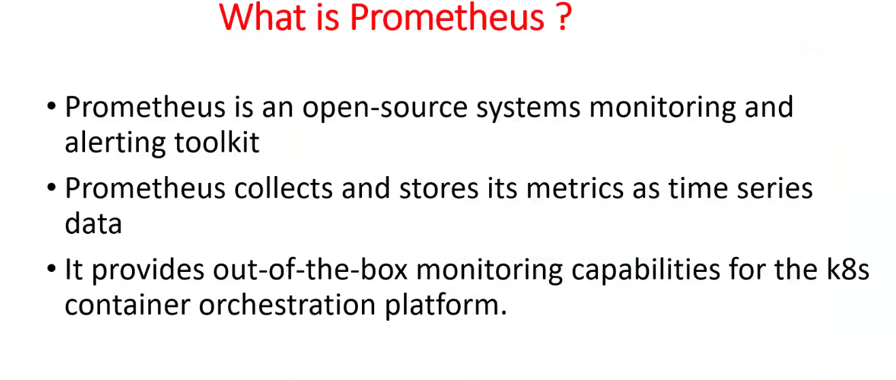
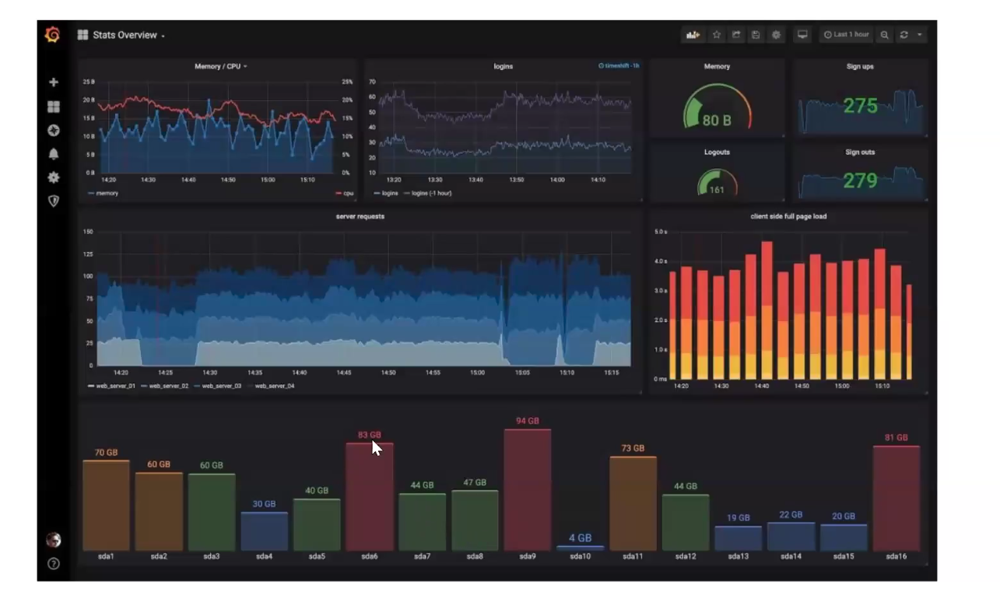
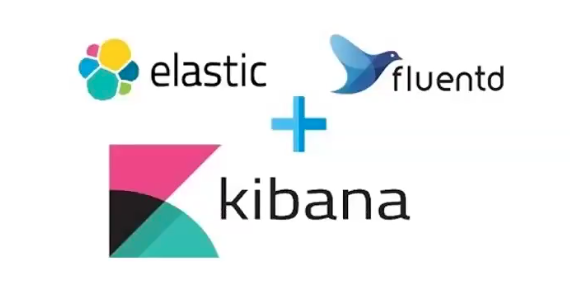
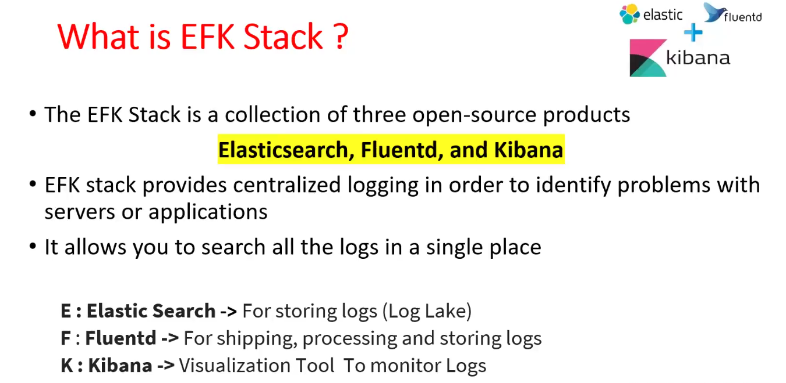
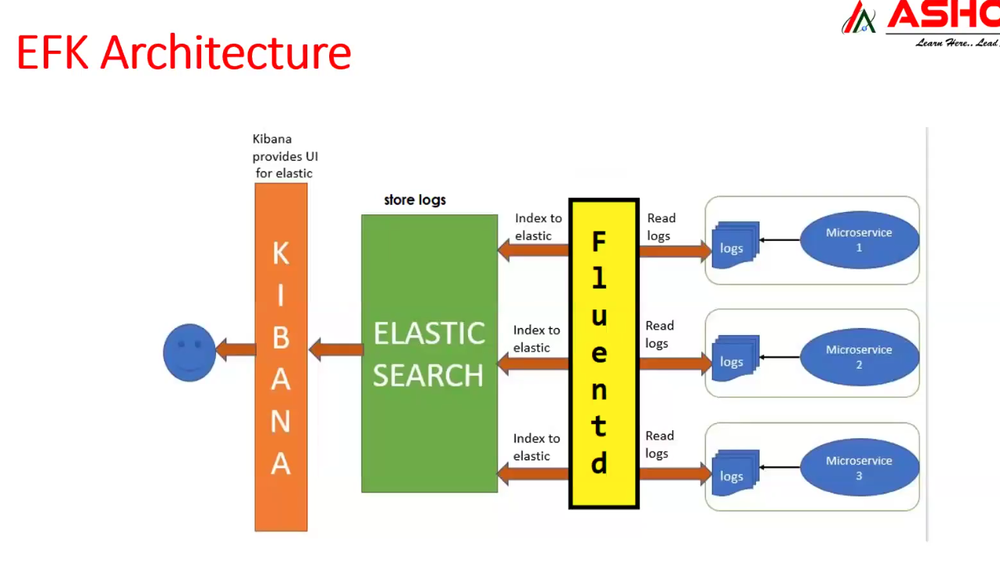
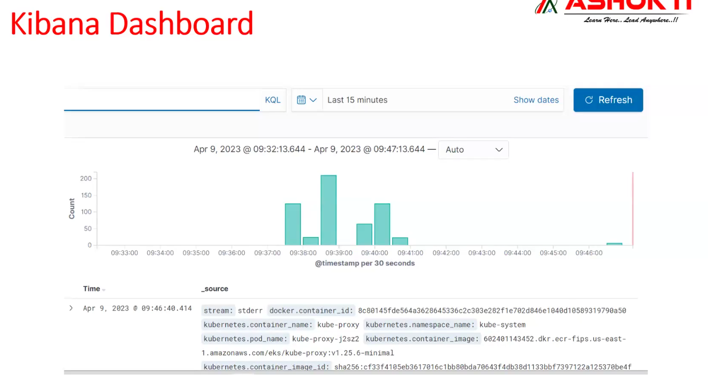
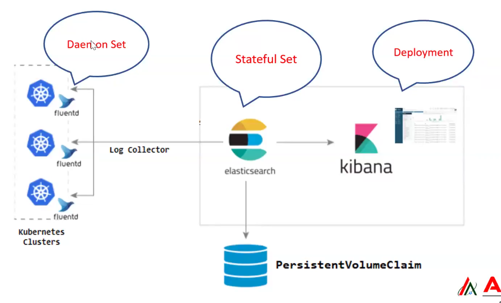

# Lecture-10

>Note: remember we used ubuntu machine to create cluster so username is ubuntu only

### create cluster command

`
eksctl create cluster --name ashokit-cluster4 --region ap-south-1 --node-type t2.medium --zones ap-south-1a,ap-south-1b`

>Note: It takes time to start

### delete cluster command

`eksctl delete cluster --name ashokit-cluster4 --region ap-south-1
`

- to delete all the resources(pods,services all) we have created
        
        $ kubectl delete all --all

 - to get everything in any namespace

        $ kubectl get all  -n <namespace-name> 

- to execute manifest yml

        $ kubectl apply -f <yml-file>

- get all namespace

        $ kubectl get ns  

# Lecture started

1) HELM Charts

2) Promethues

3) Grafana

4) EFK Stack

## What is HELM ?

=> HELM is a package manager which is used to install required software's in k8s cluster

=> HELM will use charts to install required packages e.g. grafana ,prometheus , efk 

=> Chart means collection of configuration files (manifest ymls)

### HELM Charts

=> Using HELM chart we can install promethues server

=> Using HELM chart we can install grafana server

To download grafana , i download helm chart of grafana, and run that!!Then grafana will be installed in cluster!!
### Helm Architecture

Helm mainatin chart repository!!

In k8s cluster(eks-host-ec2-machine) we install helm client which take chart from Chart Repository!!Helm client will connect to k8s API server which execute helm chart!!

Or we can create manifest yml file manually and create pods of that!!With helm chart no need to write yml files!!

>Note: remember Helm chart is basically collection of manifest yml files!!

>Note:Helm Chart is used to install inside clusters , we do not install jenkins ,jvm using helm charts

### Helm Installation

$ curl -fsSl -o get_helm.sh https://raw.githubusercontent.com/helm/helm/master/scripts/get-helm-3

$ chmod 700 get_helm.sh

$ ./get_helm.sh

$ helm

-> check do we have metrics server on the cluster

$ kubectl top pods

$ kubectl top nodes

1) execute manifest ymls -- we are done with this process

2) use helm chart

- check helm repos 
    
        $ helm repo ls

- Add the metrics-server repo to helm
        
        $ helm repo add metrics-server https://kubernetes-sigs.github.io/metrics-server/

- Install the chart
        
        $ helm upgrade --install metrics-server metrics-server/metrics-server

## Kubernetes Monitoring

=> We can monitor our k8s cluster and cluster components using below software's

1) Prometheus

2) Grafana

### Prometheus

for every some time interval ,it will collect data !!

>Note:Metrices server which we have previously used gives only cpu and memory utilization!! Prometheus just provide more details!!If using Prometheus and Grafana no need of metrices server!!

>Prometheus and Grafana is just monitoring tools ,not only for k8s ,can be used with any application!!

### Grafana

-> Grafana is an  analysis and monitoring tool

-> It provides visualization for monitoring 

-> It provides charts, graphs, and alerts for the web when connected to supported data sources.

>Note: Grafana will connect with Prometheus for data source.Prometheus collect data from data source and Grafana displays data in form od graph!! so both are complementary!!

### EFK
used for logs monitoring

E--> ElasticSearch( log lake)

F--> FluentD(shipping ,processing and storing)

K-->Kibana(Visualization tool)

#### Architecture

>Note:Quite understandable

Multiple microservices in k8s , for each we have logs , we can use kubectl logs but if we have 20 pods then it is not easy to manage logs!!

So here in this case we need to use logs centralization!!All the logs store into one place!!

FluentD collect logs from all the microservices and give it to elastic search!!

In some companies splunk is used which is commercial for log monotoring!!

FluentD will be deployed using Daemon Set service

Elastic Search using Stateful set service

and Kibana by deployment

some people use ELK L-->Logstash FluentD is more Advanced than Logstash!!

These will be installed as pods !! EFK is for application logs!!