# Lecture-11

>Note: remember we used ubuntu machine to create cluster so username is ubuntu only

### create cluster command

`
eksctl create cluster --name ashokit-cluster4 --region ap-south-1 --node-type t2.medium --zones ap-south-1a,ap-south-1b`

>Note: It takes time to start

### delete cluster command

`eksctl delete cluster --name ashokit-cluster4 --region ap-south-1
`

- to delete all the resources(pods,services all) we have created
        
        $ kubectl delete all --all

 - to get everything in any namespace

        $ kubectl get all  -n <namespace-name> 

- to execute manifest yml

        $ kubectl apply -f <yml-file>

- get all namespace

        $ kubectl get ns  

## Lecture started

### Helm Installation

download get_helm.sh

    $ curl -fsSl -o get_helm.sh https://raw.githubusercontent.com/helm/helm/master/scripts/get-helm-3

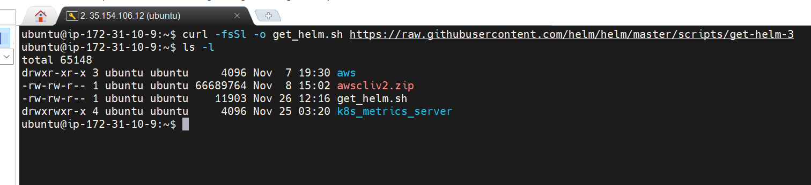

need exexute permission on get_helm.sh

        $ chmod 700 get_helm.sh

to execute

        $ ./get_helm.sh

        $ helm

>Note:These 4 commands we need to install helm using shell script file!!

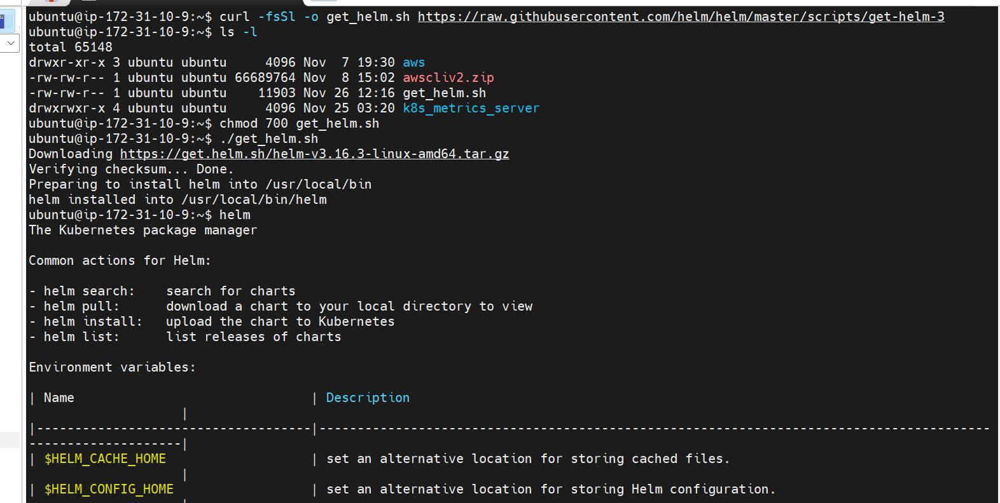

-> check do we have metrics server on the cluster

$ kubectl top pods

$ kubectl top nodes

to install metrices API

1) execute manifest ymls -- we are done with this process

2) use helm chart

- check helm repos 
    
        $ helm repo ls

- Add the metrics-server repo to helm
        
        $ helm repo add metrics-server https://kubernetes-sigs.github.io/metrics-server/

        url is chart name od metrices server

- Install the chart
        
        $ helm upgrade --install metrics-server metrics-server/metrics-server

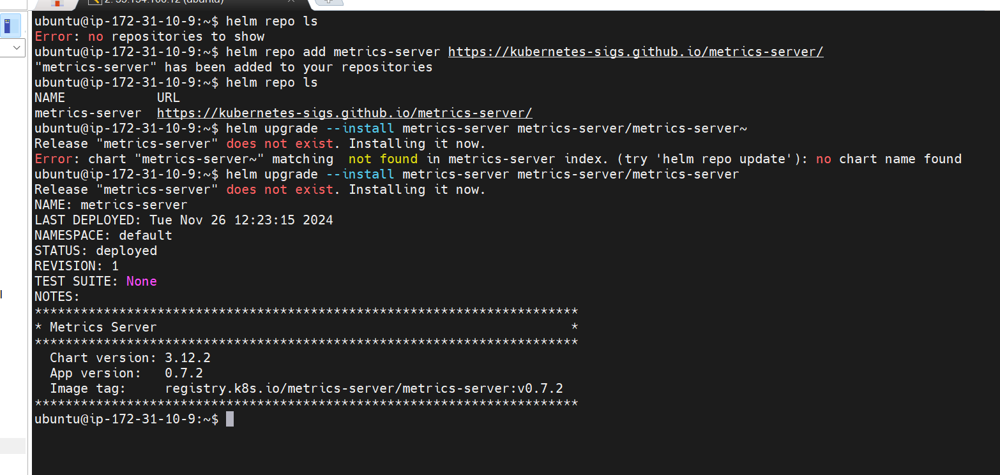

1st helm repo has nothing then we add by helm repo add command then you see helm repo has something!!! then by helm upgrade we install !!

Helm is package manager help to download manifest yml files!!This manifest yml are called as helm chart!!

-> Using HELM charts we can easily deploy Prometheus and Grafana

### Install Prometheus & Grafana In K8S Cluster using HELM

we need to monitor k8s clutser with help of these we monitor k8s cluster!!

- Add the latest helm repository in Kubernetes
    
        $ helm repo add stable https://charts.helm.sh/stable

-  Add Prometheus repo to helm
    
        $ helm repo add prometheus-community https://prometheus-community.github.io/helm-charts

- Update Helm Repo
        
        $  helm repo update

- install prometheus
    
        $ helm install stable prometheus-community/kube-prometheus-stack

- Get all pods 
        
        $ kubectl get pods

>Node: You should see prometheus pods running

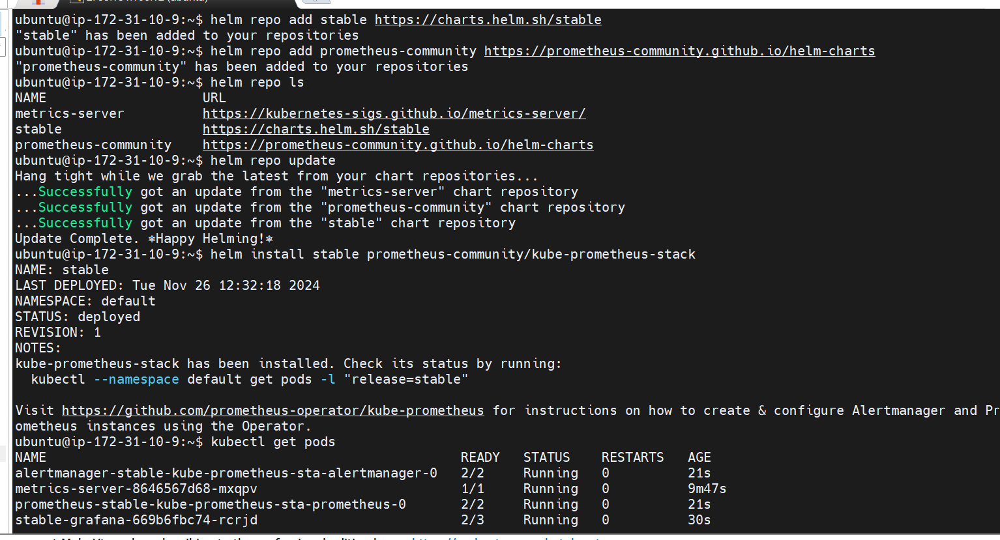

- Check the services 
        
        $ kubectl get svc

 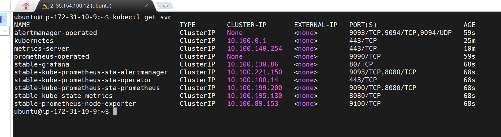       

>Note: By default prometheus and grafana services are available within the cluster as ClusterIP, to access them outside lets change it to LoadBalancer.

- Edit Prometheus Service & change service type to LoadBalancer then save and close that file
        
        $ kubectl edit svc stable-kube-prometheus-sta-prometheus

- Now edit the grafana service & change service type to LoadBalancer then save and close that file
        
        $ kubectl edit svc stable-grafana

>Note: This service is created by helm chart if our yml then change service type and then apply ,but here we need to service directly by command

        kubectl edit svc <service-name>

- Verify the service if changed to LoadBalancer
        
        $ kubectl get svc

first chnage for prometheus and it is now accessible

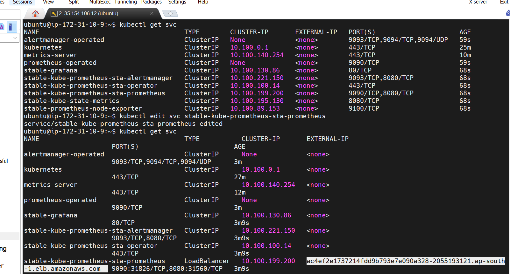

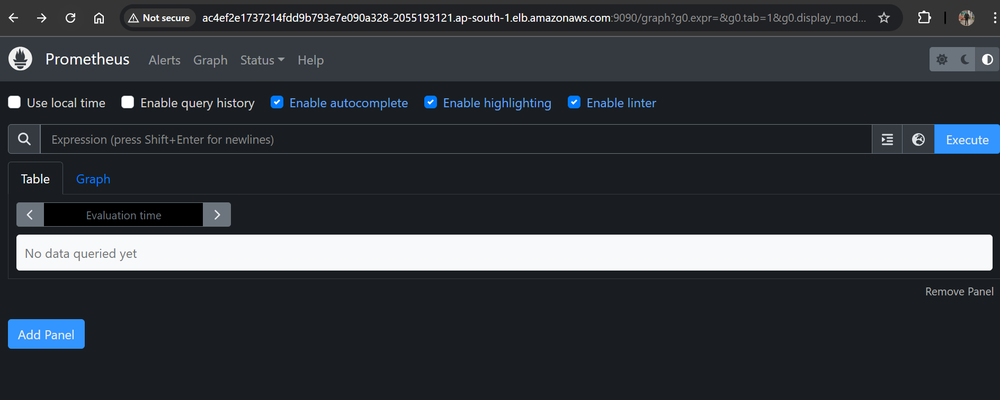

then chnaged for grafana

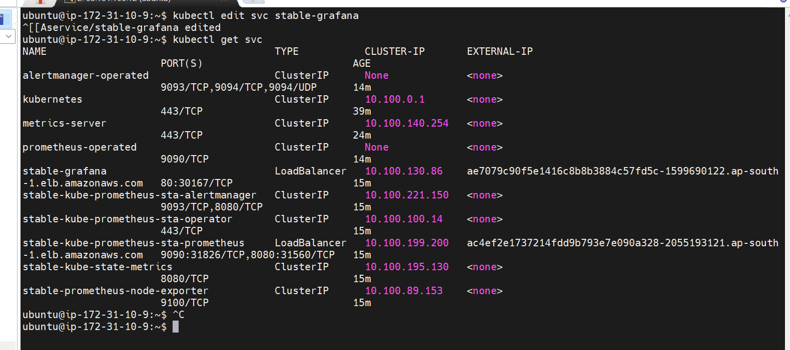

now edit inbound rules of ec2 machine having private ip as cluster ip and enable the ports

=> Access Promethues server using below URL

    URL : http://LBR-DNS:9090/

=> Access Grafana server using below URL

    URL : http://LBR-DNS/

=> Use below credentials to login into grafana server

UserName: admin

Password: prom-operator

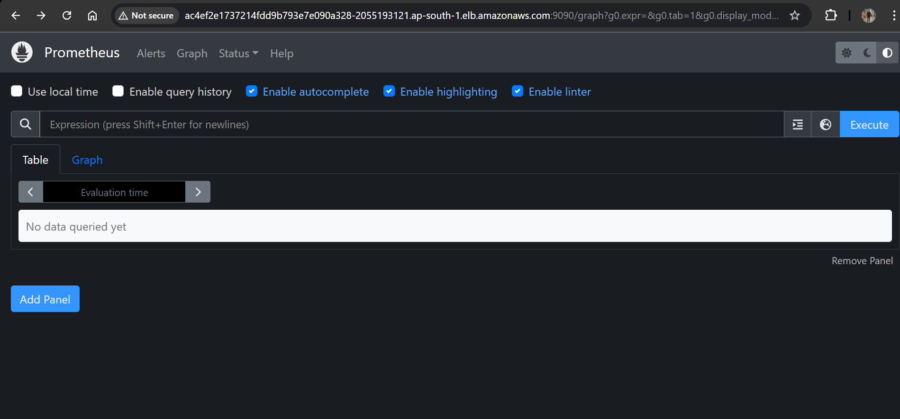

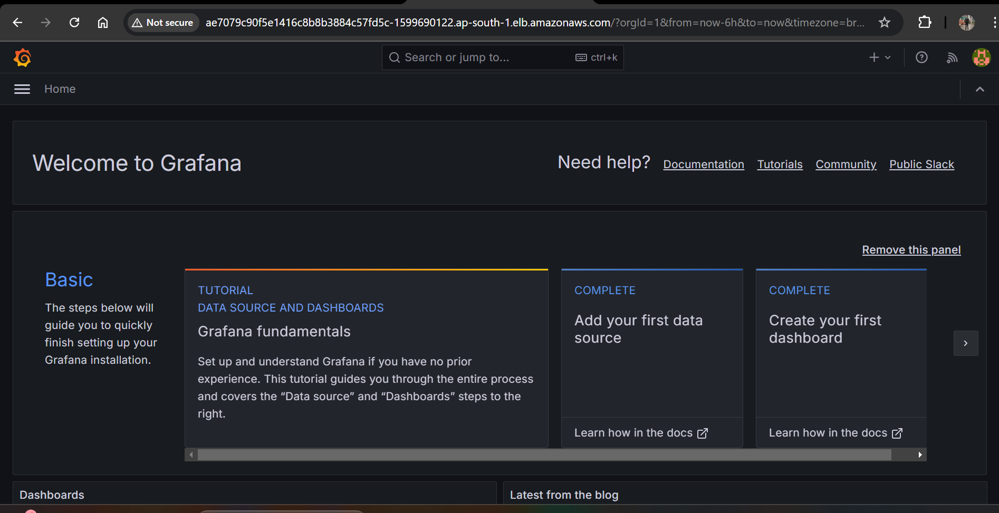

=> Once we login into Grafana then we can monitor our k8s cluster. Grafana will provide all the data in charts format.

On Dashbord you can see services running

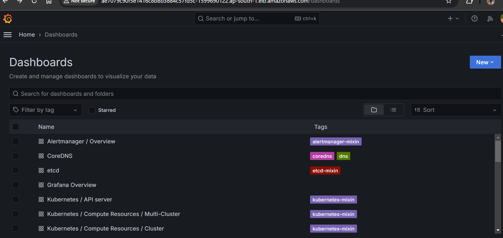

