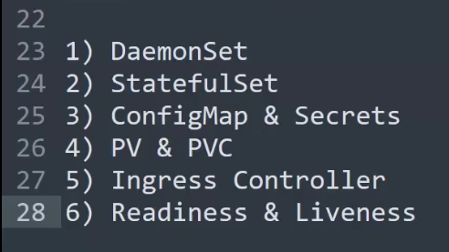

# Lecture-12

>Note: remember we used ubuntu machine to create cluster so username is ubuntu only

### create cluster command

`
eksctl create cluster --name ashokit-cluster4 --region ap-south-1 --node-type t2.medium --zones ap-south-1a,ap-south-1b`

>Note: It takes time to start

### delete cluster command

`eksctl delete cluster --name ashokit-cluster4 --region ap-south-1
`


- to delete all the resources(pods,services all) we have created
        
        $ kubectl delete all --all

 - to get everything in any namespace

        $ kubectl get all  -n <namespace-name> 

- to execute manifest yml

        $ kubectl apply -f <yml-file>

- get all namespace

        $ kubectl get ns  

## Lecture started

Topics left



### DaemonSet 
DaemonSet is a resource used when we want pods to be deployed in every worker node ,no need to mention replica ,it will identify worker nodes and push pods in all worker nodes!!

Like FluentD is needs to be insatlled on every worker node to get logs in every worker node so in such case we use DaemonSet

as a new worker node added new pod be added ,if delete worker node than that pod be garbage collected!!

For fluentd this is yml !! here we put kind as Daemonset to create FluentD pods
```yml
apiVersion: v1
kind: ServiceAccount
metadata:
  name: fluentd-es
  namespace: efklog
  labels:
    k8s-app: fluentd-es
    addonmanager.kubernetes.io/mode: Reconcile
---
kind: ClusterRole
apiVersion: rbac.authorization.k8s.io/v1
metadata:
  name: fluentd-es
  labels:
    k8s-app: fluentd-es
    addonmanager.kubernetes.io/mode: Reconcile
rules:
- apiGroups:
  - ""
  resources:
  - "namespaces"
  - "pods"
  verbs:
  - "get"
  - "watch"
  - "list"
---
kind: ClusterRoleBinding
apiVersion: rbac.authorization.k8s.io/v1
metadata:
  name: fluentd-es
  labels:
    k8s-app: fluentd-es
    addonmanager.kubernetes.io/mode: Reconcile
subjects:
- kind: ServiceAccount
  name: fluentd-es
  namespace: efklog
  apiGroup: ""
roleRef:
  kind: ClusterRole
  name: fluentd-es
  apiGroup: ""
---
apiVersion: apps/v1
kind: DaemonSet
metadata:
  name: fluentd-es-v2.7.0
  namespace: efklog
  labels:
    k8s-app: fluentd-es
    version: v2.7.0
    addonmanager.kubernetes.io/mode: Reconcile
spec:
  selector:
    matchLabels:
      k8s-app: fluentd-es
      version: v2.7.0
  template:
    metadata:
      labels:
        k8s-app: fluentd-es
        version: v2.7.0
      # This annotation ensures that fluentd does not get evicted if the node
      # supports critical pod annotation based priority scheme.
      # Note that this does not guarantee admission on the nodes (#40573).
      annotations:
        scheduler.alpha.kubernetes.io/critical-pod: ''
    spec:
      serviceAccountName: fluentd-es
      containers:
      - name: fluentd-es
        image: quay.io/fluentd_elasticsearch/fluentd:v2.7.0
        env:
        - name: FLUENTD_ARGS
          value: --no-supervisor -q
        resources:
          limits:
            memory: 500Mi
          requests:
            cpu: 100m
            memory: 200Mi
        volumeMounts:
        - name: varlog
          mountPath: /var/log
        - name: varlibdockercontainers
          mountPath: /var/lib/docker/containers
          readOnly: true
        - name: config-volume
          mountPath: /etc/fluent/config.d
      terminationGracePeriodSeconds: 30
      volumes:
      - name: varlog
        hostPath:
          path: /var/log
      - name: varlibdockercontainers
        hostPath:
          path: /var/lib/docker/containers
      - name: config-volume
        configMap:
          name: fluentd-es-config-v0.2.0

```
DaemonSet is not for application deployment!! For that we have resource called Deployment!!

By DaemonSet we deploy logs collector app, metrics app 

## Stateful set

we have 2 type of containers
1. stateful containers : have storage 
2. stateless containers :not have storage

whenever we delete db container we create it again we use stateful here ,as data should be available permanently!!

in k8s we call it as 
stateful (have storage )and stateless(no storage) pods!!

we create pods by DaemonSet, replicaset or Deployment all are stateless !!

>Note:to get staorage we use stateful set!!for db deployment we use this!!

To attach storage we have PV(persistance volume) and PVC (persistance volume cliams)

###  PersistentVolume (PV)
A PersistentVolume is a piece of storage in the cluster provisioned by an administrator or dynamically provisioned using Storage Classes. It abstracts the physical storage details (like NFS, AWS EBS, GCP PD, etc.) and provides a unified way to consume storage.

Scope: Cluster-wide

Lifecycle: Independent of any Pod.

Provisioning Types:

- Static: Predefined storage created by an administrator.

- Dynamic: Created on-demand using StorageClasses.

Attributes:
- capacity: Size of the volume.
- accessModes: Defines how the volume can be mounted (e.g., ReadWriteOnce, ReadOnlyMany, ReadWriteMany).
- reclaimPolicy: What happens to the PV after its claim is released (Retain, Recycle, Delete).

### 2. PersistentVolumeClaim (PVC)
A PersistentVolumeClaim is a request for storage by a user. It specifies the size, access mode, and possibly the storage class of the desired storage.

Scope: Namespace-specific

Lifecycle: Bound to a PV when a matching volume is found.

Binding Process:

- The PVC is matched to a PV based on the requirements.
- Once bound, the PVC and PV are tightly coupled.

## ConfigMap and Secrets

Database credentials in separate file!! environment variables and credntials to be put in pods for that we use this , we do not hardcode this!!

## Ingress Controller

To route incoming traffic to particular cluster as we do not give services access to public by load balancer and nodeport!! Routing part is taken care by ingress controller

## Readiness and Liveness

pods qualify readiness test and then only pod will be given traffic!!

Liveness check is for is pod live or not!!

## Taints and Tolerations

by default we have no control on which worker node pod will be created ,by this we can decide on which worker node pod to be created!!