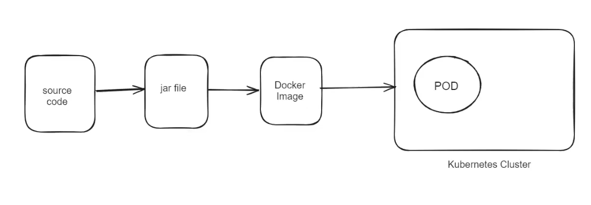
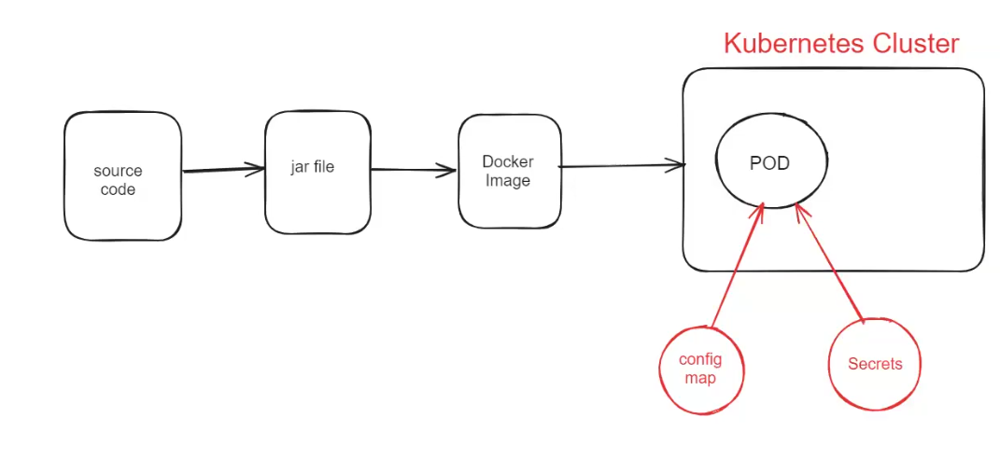

# Lecture-13

>Note: remember we used ubuntu machine to create cluster so username is ubuntu only

### create cluster command

`
eksctl create cluster --name ashokit-cluster4 --region ap-south-1 --node-type t2.medium --zones ap-south-1a,ap-south-1b`

>Note: It takes time to start

### delete cluster command

`eksctl delete cluster --name ashokit-cluster4 --region ap-south-1
`


- to delete all the resources(pods,services all) we have created
        
        $ kubectl delete all --all

 - to get everything in any namespace

        $ kubectl get all  -n <namespace-name> 

- to execute manifest yml

        $ kubectl apply -f <yml-file>

- get all namespace

        $ kubectl get ns  

 ## Lecture started

 

###  Config Map & Secrets


=> For every application multiple environments will be available for testing purpose

      a) DEV (development)
      b) SIT (system integration testing)
      c) UAT (user acceptance testing)
      d) PILOT 

=> DEV env used by development team for code integration testing

=> SIT env used by testing team for functional testing      

=> UAT env used by client side team for acceptance testing

=> PILOT env used for pre-production testing

=> Once appilcation testing is completed in all above environments then it will be deployed into PRODUCTION environment (Live Environment).

>Note: For every environment, some properties will be different

      1) Database properties
      2) SMTP properties
      3) Kafka properties
      4) Redis properties etc.....

 We shouldn't hardcode properties in our source code 

how we deploy??

source code >> Jar file >>Docker image and this docker image is put in k8s cluster!! now for each environment we have different configuration!!



We need to make our application loosely coupled to deploy in any environment as different dbs different configurations and so on other configuration change with environments!!



=> Config Map & Secret concepts are used to avoid hard coded properties in the application.

=> Config Map & Secret allows us to de-couple application properties from Docker images so that our application can be deployed into any environment without making any changes for our Docker image.


=> Config Map is used to store data in key-value (non-confidential)

=> Secret is used to store confidential data in key - value format (ex: pwd)

>Note: ConfigMap & Secrets will make docker images as portable.

#### Application.properties(hardcoded)

```properties
spring:
  datasource:
    driver-class-name: com.mysql.cj.jdbc.Driver
    url: jdbc:mysql://mysqldb:3306/sbms
    username: root
    password: root
  jpa:
    hibernate:
      ddl-auto: update
    show-sql: true

```
#### Application Properties (with Env Variables)

```properties
spring:
  datasource:
    driver-class-name: ${DB_DRIVER:com.mysql.cj.jdbc.Driver}
    url: ${DB_URL:jdbc:mysql://mysqldb:3306/sbms}
    username: ${DB_USERNAME:local}
    password: ${DB_PASSWORD:local}
  jpa:
    hibernate:
      ddl-auto: update
    show-sql: true

```
 
>Note: Here in placeholder after colon(:) we have put value ,that is default value in case developer need to run in local , he not knows about ConfigMap and all so for that we provide default value

>Note:If no configmap then only default value be  considered

#### ConfigMap Manifest


 => Below is the configmap manifest yml,from here values will be taken!

 ```yml

---
apiVersion: v1
kind: ConfigMap
metadata:
  name: ashokit-config-map
  labels:
   storage: ashokit-db-config-map
data:
  DB_DRIVER: com.mysql.cj.jdbc.Driver
  DB_URL: jdbc:mysql://mysqldb:3306/sbms
  DB_USERNAME: root
...


 ```
 under data we put all the values!!
 
 #### Secreat manifest
 => Below is the secret manifest yml

Note : URL To encode : https://www.base64encode.org/


 ```yml
---
apiVersion: v1
kind: Secret
metadata:
  name: ashokit-secret
  labels:
   storage: ashokit-db-secret
data:
  DB_PASSWORD: cm9vdA==
type: Opaque  
...


 ```

 ### Reading Data From ConfigMap

```yml
- name: DB_DRIVER
  valueFrom:
   configMapKeyRef:
    name: ashokit-config-map
    key: DB_DRIVER
```


### Reading Data From Secret  

```yml
- name: DB_PASSWORD
  valueFrom:
   secretKeyRef:
     name: ashokit-secret
     key: DB_PASSWORD
```     