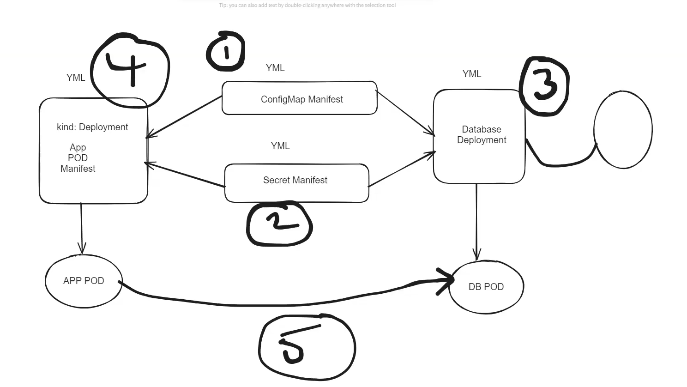
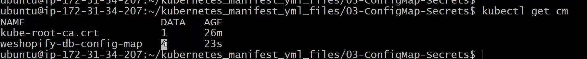
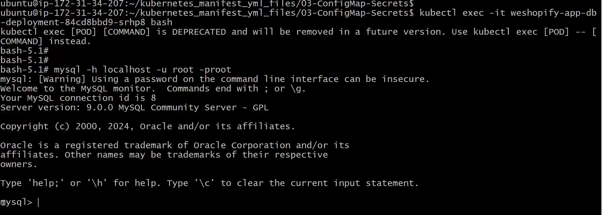
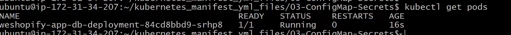

# Lecture-14

>Note: remember we used ubuntu machine to create cluster so username is ubuntu only

### create cluster command

`
eksctl create cluster --name ashokit-cluster4 --region ap-south-1 --node-type t2.medium --zones ap-south-1a,ap-south-1b`

>Note: It takes time to start

### delete cluster command

`eksctl delete cluster --name ashokit-cluster4 --region ap-south-1
`


- to delete all the resources(pods,services all) we have created
        
        $ kubectl delete all --all

 - to get everything in any namespace

        $ kubectl get all  -n <namespace-name> 

- to execute manifest yml

        $ kubectl apply -f <yml-file>

- get all namespace

        $ kubectl get ns  


 ## Lecture started       

### Reading Data From ConfigMap

```yml
- name: DB_DRIVER
  valueFrom:
   configMapKeyRef:
    name: ashokit-config-map
    key: DB_DRIVER
```


### Reading Data From Secret  

```yml
- name: DB_PASSWORD
  valueFrom:
   secretKeyRef:
     name: ashokit-secret
     key: DB_PASSWORD
```     

### Spring Boot with MYSQL DB Deployment 


=> In this project we will use below k8s resources

1) ConfigMap
2) Secret
3) PV 
4) PVC
5) StatefulSet--> to get data even pod is recreated!
6) Deployment --> for application deployment



first we deploy ConfigMapManifest

Then Secret Manifest

Then DB deployment

Then Application deployment

and after that application will coomunicate with DB!!

 Git Hub Repo : https://github.com/ashokitschool/kubernetes_manifest_yml_files.git 

OR We have this folder k8s-yml-files Go to Config-map-secrets folder

1) Create Config Map

        $ kubectl apply -f <yml>
        $ kubectl get cm

1ConfigMap.yml
```yml
apiVersion: v1
kind: ConfigMap
metadata: 
  name: weshopify-db-config-map
  labels: 
    storage: weshopify-db-storage
data: 
 DB_DRIVER_NAME_VALUE: com.mysql.cj.jdbc.Driver
 DB_HOST_SERVICE_NAME_VALUE: weshopify-app-db-service
 DB_SCHEMA_VALUE: weshopify-app
 DB_PORT_VALUE: "3306"
```


Data 4 means we have 4 key value pair as in data!!

2) Create Secret

        $ kubectl apply -f <yml>
        $ kubectl get secret

2secret.yml
```yml
apiVersion: v1
kind: Secret
metadata: 
 name: weshopify-db-config-secrete
 labels: 
  secrete: weshopify-db-config-secrete
data:
 DB_USER_NAME_VALUE: cm9vdA==
 DB_PASSWORD_VALUE: cm9vdA==
type: Opaque
```

Here also when you get secret in that you get data:2 which means 2 key value pairs you have set

>Note:Both step 1 and 2 are easy to understand

3) Create PV

        $ kubectl apply -f <yml>
        $ kubectl get pv

```yml
apiVersion: v1
kind: PersistentVolume
metadata:
 name: weshopify-db-pv
 labels: 
  name: weshopify-db-pv
spec:
  capacity: 
   storage: 4Gi
  accessModes: 
   - ReadWriteOnce
  persistentVolumeReclaimPolicy: Retain
  storageClassName: local-storage
  hostPath: 
    path: /opt/mysql
```
Kind is PersistentVolume!!
on hostmachine at /opt/mysql we storing data!

4) Create PVC

        $ kubectl apply -f <yml>
        $ kubectl get pvc

whatever volume you have created in 3 the permissions are provided by PVC 

4th file!!
```yml
apiVersion: v1
kind: PersistentVolumeClaim
metadata:
  name: weshopify-db-pvc
spec:
  volumeName: weshopify-db-pv      
  accessModes:
    - ReadWriteOnce
  storageClassName: local-storage
  resources:
    requests:
      storage: 4Gi
```
5) Create DB Deployment
5th file
```yml
apiVersion: apps/v1
kind: Deployment
metadata: 
 name: weshopify-app-db-deployment
 labels: 
  app: weshopify-app-db
spec:
 template: 
   metadata: 
     labels: 
       app: weshopify-app-db-pod
   spec: 
    volumes: # Attaching volumes and PVC
     - name: weshpify-app-db-volume
       persistentVolumeClaim: 
        claimName: weshopify-db-pvc
    containers: 
     - name: weshopify-app-db
       image: mysql
       ports: 
        - containerPort: 3306
       volumeMounts:
         - name: weshpify-app-db-volume
           mountPath: /opt/mysql
       env: # environment properties reading from configmap and secreat
        - name: MYSQL_ROOT_PASSWORD
          #value: root
          valueFrom: 
           secretKeyRef: 
            name: weshopify-db-config-secrete
            key: DB_PASSWORD_VALUE
        - name: MYSQL_DATABASE
          #value: weshopify-app
          valueFrom: 
           configMapKeyRef: 
            name: weshopify-db-config-map
            key: DB_SCHEMA_VALUE
 selector: 
    matchLabels: 
     app: weshopify-app-db-pod
 replicas: 1
---
apiVersion: v1
kind: Service
metadata: 
 name: weshopify-app-db-service
 labels: 
  app: weshopify-app-db-service
spec: # Cluster Ip as not exposed to public
 type: ClusterIP
 ports:
  - port: 3306
    targetPort: 3306
    protocol: TCP
 selector: 
  app: weshopify-app-db-pod
```

        $ kubectl apply -f <yml>
        $ kubectl get pods
        $ kubectl get svc
> Note : We can check mysql db is running in the pod or not 

        $ kubectl exec -it <db-pod-name> bash
        $ mysql -h localhost -u root -p
        $ show databases;

- Exit from database : $exit

In docker Container was available for DB but here POD is not avialable, but we want to check if POD is ruuning!!

        kubectl exec -it <pod-name>

   

 ---     

see Db pod is running and also can see service will be running too!!

6) Create App Deployment see how cluster ip used to communicate to DB we not pass clusterIp !!

```yml
apiVersion: apps/v1
kind: Deployment
metadata:
  name: spring-boot-mysql
spec:
  selector:
    matchLabels:
      app: spring-boot-mysql
  replicas: 1
  template:
    metadata:
      labels:
        app: spring-boot-mysql
    spec:
      containers:
        - name: spring-boot-mysql
          image: ashokit/spring-boot-mysql
          ports:
            - containerPort: 8080
          env:   # Setting Enviornmental Variables
            - name: DB_DRIVER_CLASS   # Setting Database host address from configMap
              valueFrom :
                configMapKeyRef :
                  name : weshopify-db-config-map
                  key :  DB_DRIVER_NAME_VALUE

            - name: DB_HOST   # Setting Database host address from configMap
              valueFrom :
                configMapKeyRef :
                  name : weshopify-db-config-map
                  key :  DB_HOST_SERVICE_NAME_VALUE

            - name: DB_NAME  # Setting Database name from configMap
              valueFrom :
                configMapKeyRef :
                  name : weshopify-db-config-map
                  key :  DB_SCHEMA_VALUE

            - name: DB_USERNAME  # Setting Database username from Secret
              valueFrom :
                secretKeyRef :
                  name : weshopify-db-config-secrete
                  key :  DB_USER_NAME_VALUE

            - name: DB_PASSWORD # Setting Database password from Secret
              valueFrom :
                secretKeyRef :
                  name : weshopify-db-config-secrete
                  key :  DB_PASSWORD_VALUE
---
apiVersion: v1 # Kubernetes API version
kind: Service # Kubernetes resource kind we are creating
metadata: # Metadata of the resource kind we are creating
  name: springboot-mysql-svc
spec:
  selector:
    app: spring-boot-mysql
  ports:
    - protocol: "TCP"
      port: 8080 # The port that the service is running on in the cluster
      targetPort: 8080 # The port exposed by the service
      nodePort: 30785
  type: NodePort # type of the service.
```

>Note: Check app pod running in which worker node then enable node-port number in security group in-bound rules.

>Note: ConfigMap and Secrets are running as resources not PODs

>Note:For yml file you can use ChatGpT or k8s documentation!!


Here we have app taking values from ConfigMap and in configMap we are telling which service of db to communicate !!

