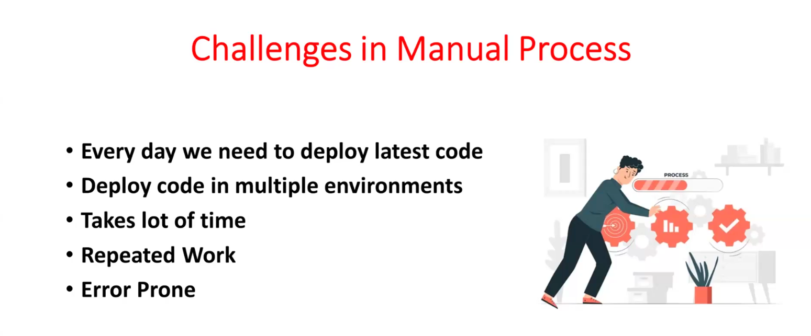
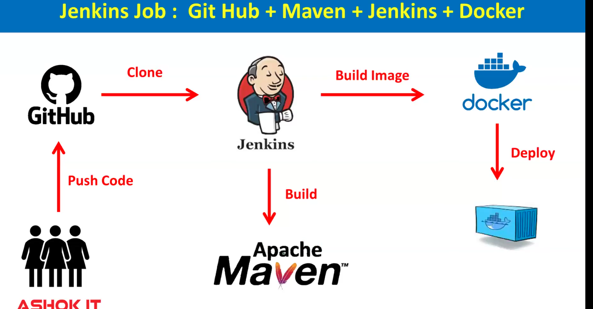
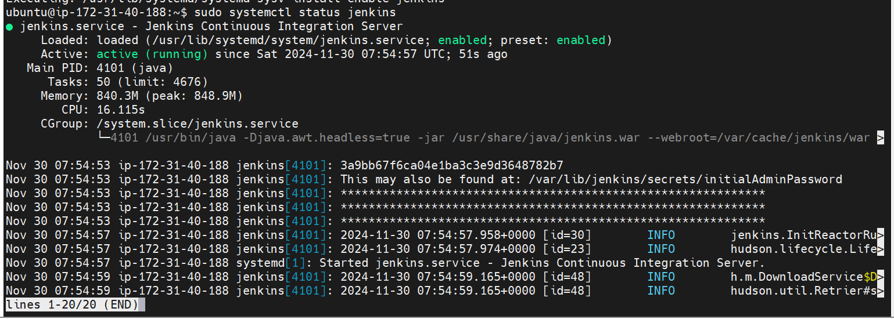
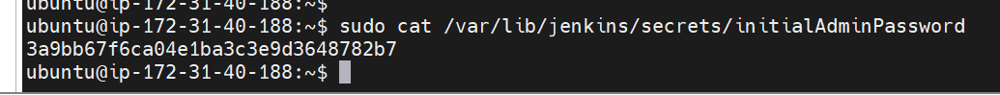
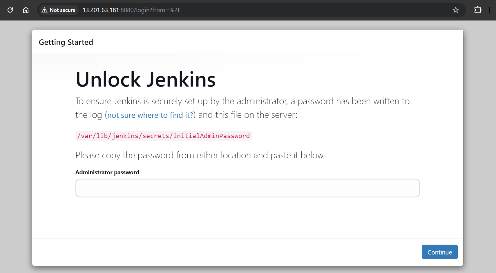
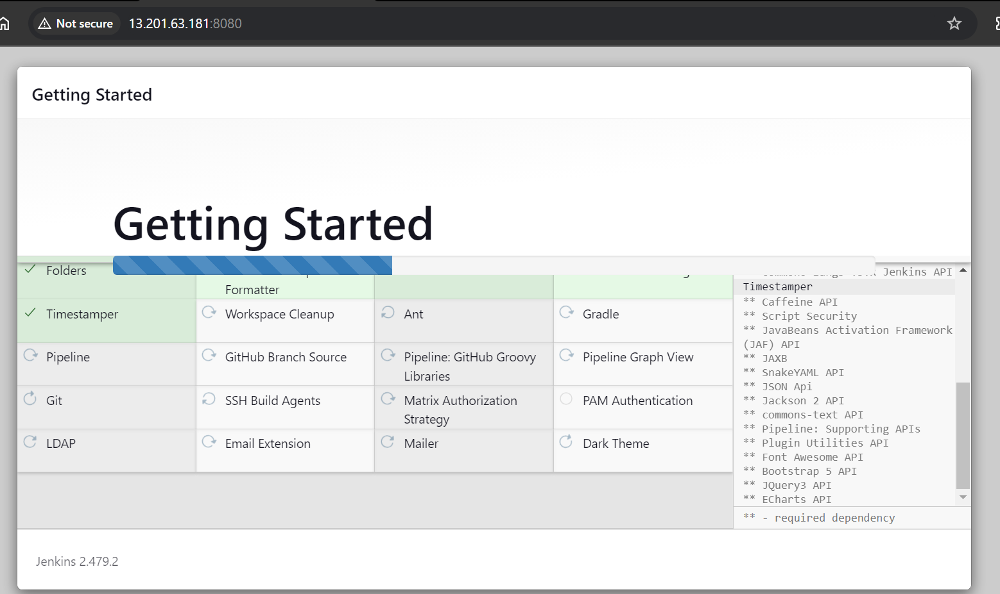

# Lecture-1 jenkins

=> Open source Software & free of cost

=> Developed by using Java Language,so to run jenkins we must have java!!

=> It is called as CI CD Server

		CI : Continuous Integration

		CD : Continuos Delivery

=> CI CD is one appraoch to automate project Build & Deployment process.

=> Using Jenkins we can deploy any type of project (ex: java, python, dot net, react, angular).

## What is Build & Deployment

=> Take latest code from Git Hub Repo

=> Build Source code using Maven

=> Perform Code Review Using Sonar

=> Upload Project Artifact into Nexus

=> Deploy code into server.

These are build and deployment steps

=> In single day multipe times code will be committed to git hub repository from Development team so multiple times we have to perform build and deployment process.

>Note: If we do build and deployment process manually then it is time taking process and error prone.

=> To overcome above problems, we need to automate Project Build and Deployment process.

=> To automate project build and deployment process we will use JENKINS.





## Jenkins Server Setup in Linux VM 


Git Repo : https://github.com/ashokitschool/DevOps-Documents/blob/main/01-Jenkins-Server-Setup.md


can see documentation of installing jenkins in jenkins.io documentation!!

here too ubuntu machine so username is ubuntu!!

- Step - 1 : Create Linux VM 

1) Create Ubuntu VM using AWS EC2 (t2.medium) 
2) Enable 8080 Port Number in Security Group Inbound Rules
3) Connect to VM using MobaXterm

-  Step-2 : Install Java 

```
sudo apt update
sudo apt install fontconfig openjdk-17-jre
java -version
```

- Step-3 : Install Jenkins 
```
sudo wget -O /usr/share/keyrings/jenkins-keyring.asc \
  https://pkg.jenkins.io/debian-stable/jenkins.io-2023.key
echo deb [signed-by=/usr/share/keyrings/jenkins-keyring.asc] \
  https://pkg.jenkins.io/debian-stable binary/ | sudo tee \
  /etc/apt/sources.list.d/jenkins.list > /dev/null
sudo apt-get update
sudo apt-get install jenkins
```

-  Step-4 : Start Jenkins  

```
sudo systemctl enable jenkins
sudo systemctl start jenkins
```
-  Step-5 : Verify Jenkins 

```
sudo systemctl status jenkins
```
	

- Step-6 : Open jenkins server in browser using VM public ip 

```
http://public-ip:8080/
```

-  Step-7 : Copy jenkins admin pwd 
```
sudo cat /var/lib/jenkins/secrets/initialAdminPassword
```





Paste password here!!
	   
- Step-8 : Create Admin Account & Install Required Plugins(Suggested) in Jenkins 




Then sign in and then logout and login !!

ques--> vscode written in typescript we need not install typescript to run vscode but for jenkins we need to install java, why?

Answer--> you don't need to install JavaScript for VS Code because it packages its runtime. For Jenkins, Java must be installed because it relies on an external Java runtime environment.

1. VS Code and JavaScript Runtime:
- Built-in Runtime:
Visual Studio Code is built using Electron, which packages the necessary runtime components (like Node.js and Chromium) along with the application itself. This means the JavaScript runtime required to execute VS Code is bundled into the application, so users don't need to install anything extra.
- Self-Contained:
When you download and install VS Code, it already includes everything it needs to run, making it self-sufficient.

2. Jenkins and Java Runtime:
- External Dependency:
Jenkins is written in Java, which requires a Java Virtual Machine (JVM) to run. However, unlike Electron-based apps, Jenkins does not bundle the JVM with its distribution to keep its package size smaller and allow users to choose the specific Java version they prefer.
- Separation of Concerns:
By requiring users to install Java separately, Jenkins delegates the responsibility of providing the runtime environment to the system. This makes Jenkins lightweight and flexible, especially in server or containerized environments where Java is often pre-installed or managed centrally.

### Why They Differ:
- Packaging Strategy:
VS Code takes an all-in-one approach, while Jenkins relies on the host system to provide the runtime.

- Use Case:
Jenkins is often deployed on servers, where pre-installed Java is common, whereas VS Code is a desktop application meant to "just work" for individual users.

- Ecosystem Flexibility:
Jenkins users may already have Java installed for other applications. Allowing Java to be managed separately prevents redundancy and keeps Jenkins lightweight.
## what is job in jenkins ?

=> JOB means set of steps that we are giving to jenkins to perform the task

		step-1 : take code from git repo

		step-2 : perform maven build

		step-3 : build docker image

		step-4 : deploy docker image in k8s cluster

## Creating First Job in Jenkins 

1) Goto Jenkins Dashboard

2) Click on New Item

		-> Enter Item Name (Job Name)
		-> Select Free Style Project & Click OK
		-> Enter some description
		-> Click on 'Build' tab
		-> Click on 'Add Build Step' and select 'Execute Shell'

3) Enter below shellscript

echo "Hello Guys,"
touch ashokit.txt
echo "Hello Guys, Welcome to Jenkins Classes" >> ashokit.txt
echo "Done..!!"		

4) Apply and Save

Note: With above steps we have created JENKINS Job

5) Click on 'Build Now' to start Job execution

6) Click on 'Build Number' and then click on 'Console Ouput' to see job execution details.


=> Jenkins Home Directory in EC2 : /var/lib/jenkins/workspace/

		$ cd /var/lib/jenkins/workspace/

7) Go to Jenkins home directory and check for the job name --> check the file created inside the job

## Jenkins Job with with GIT Hub Repo + Maven - Integeration

Step-1 : Instal git client in jenkins server

	 sudo apt install git -y

Step-2 : Configure Maven as global tool

  (Jenkins Dashboard -> Manage Jenkins --> Global Tools Configuration -> Add maven)

Note: With step-2 configuration, jenkins will download and install maven s/w  


Step-3 : Take project git repo (https://github.com/ashokitschool/maven-web-app.git)

Step-4 : Create Jenkins job

			-> New Item
			-> Enter Item Name (Job Name)
			-> Select 'Free Style Project' & Click OK
			-> Enter some description
			-> Go to "Source Code Management" Tab and Select "Git"
			-> Enter Project "Git Repo URL"
			-> Go to "Build tab"
			-> Click on Add Build Step and Select 'Inovke Top Level Maven Targets'
			-> Select Maven and enter goals 'clean package'
			-> Click on Apply and Save

>Note: With above steps we have created JENKINS Job

Step-5 : Click on 'Build Now' to start Job execution.

Step-6 : Click on 'Build Number' and then click on 'Console Ouput' to see job execution details.

=> Jenkins Home Directory in EC2 : /var/lib/jenkins/workspace/

=> Go to jenkins workspace and then go to job folder then go to target folder there we see war file created.
