# Lecture-2 jenkins

steps we follow in jenkins is called as job!!

## Job :: Steps To Create Jenkins Job with Git Repo + Maven + Tomcat Server


1) Tomcat Server Setup in Linux VM

	Amazon Linux ,t2.micro
	
	ec2-user is user name for this

=>	first need to install java as tomcat is build on java

		sudo yum install java

=> Download tomcat server tar file

	$ wget https://dlcdn.apache.org/tomcat/tomcat-9/v9.0.89/bin/apache-tomcat-9.0.89.tar.gz	

use wget and then download url from tomcat website of tar file

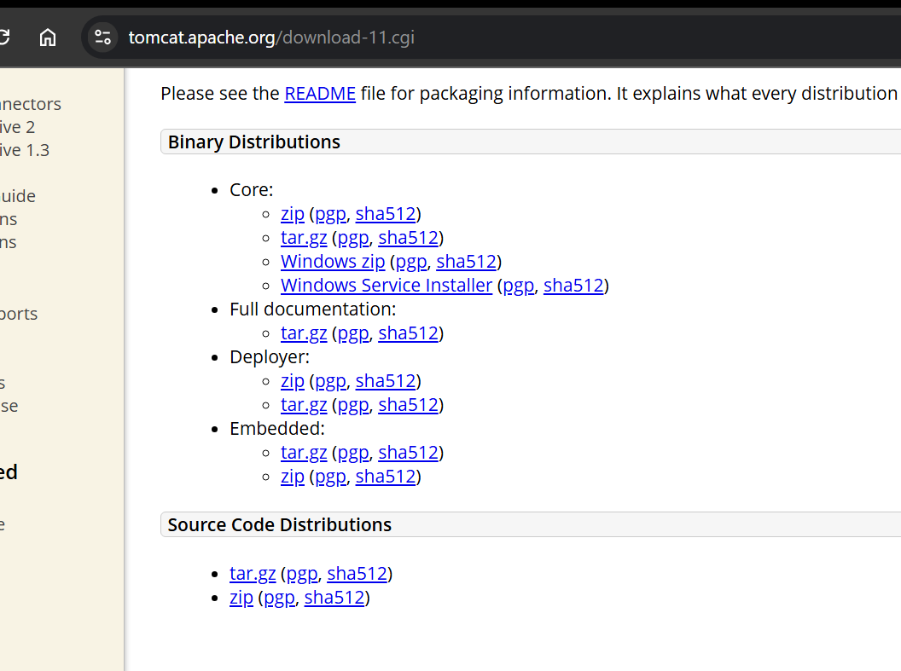

we download core>tar.gz file by copy url and then wget \<url\>

=> Extract tar file

	$ tar -xvf <tar-file-name>	

	$ cd <tomcat-dir-name>

	$ ls -l

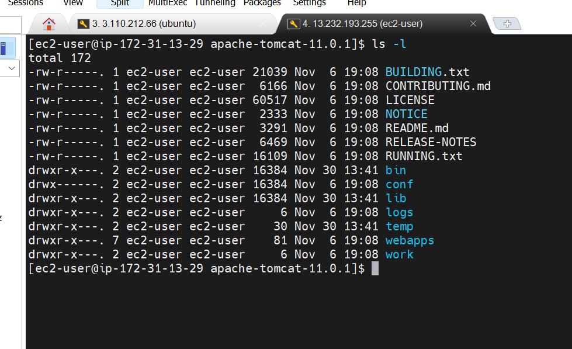

bin have files to start and stop tomcat server

conf has configuration file

in webapps folder we put war file here whichever we deployed!!

in bin we have startup.sh we go to bin and run that file to start tomcat

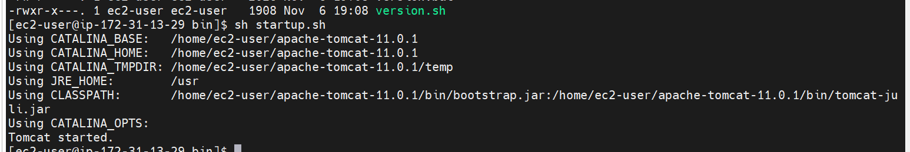

you see tomcat started and then enable tomcat port 8080 in inbound rules!!

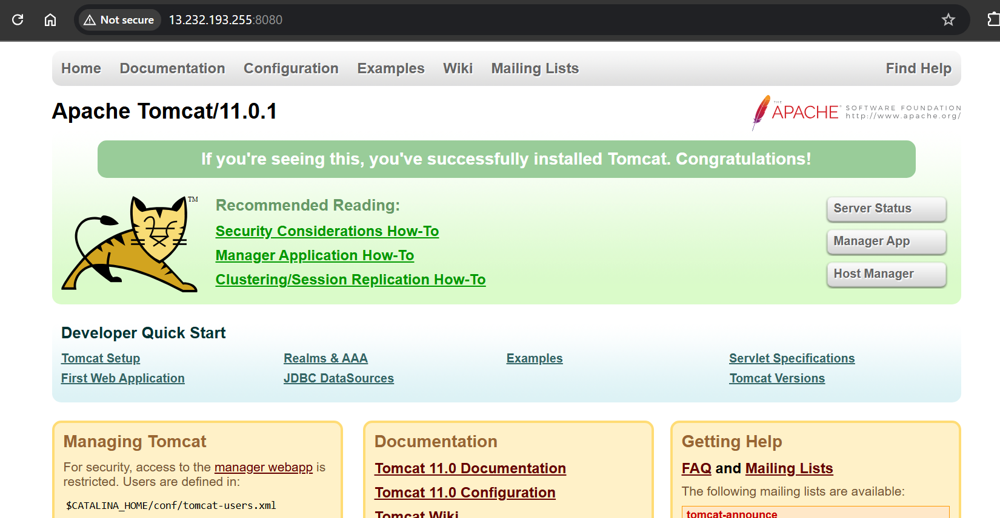

now can see tomcat admin console

to go to manager app we need to configure users!!</br>
Go to webapps/manager/meta-inf/context.xml and edit that!

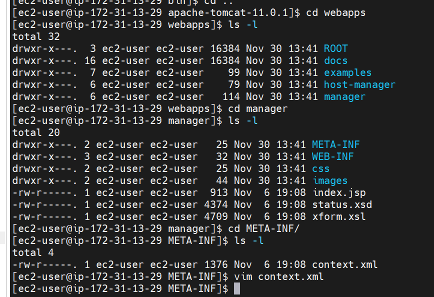

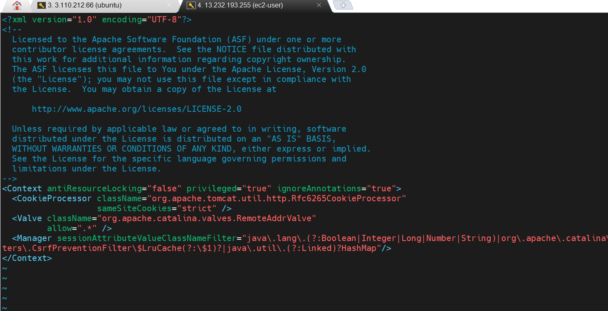

we put .* in 5th line so that we can connect to every machine

now we need to have users
 
that we can configure in conf/users.xml

everything is commented now


we add in user.xml

``` xml
<role rolename="manager-gui" />
<role rolename="manager-script" />
<role rolename="admin-gui" />

<user username="tomcat" password="tomcat" roles="manager-gui" />
<user username="admin" password="admin" roles="manager-gui,admin-gui,manager-script"/>
```

now stop and start tomcat by going to bin!!

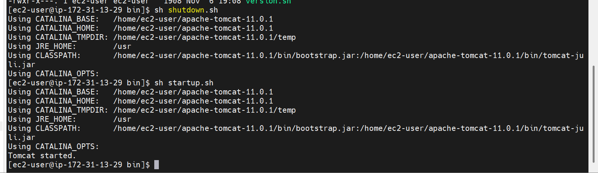

you see on manager there is no apps on tomcat

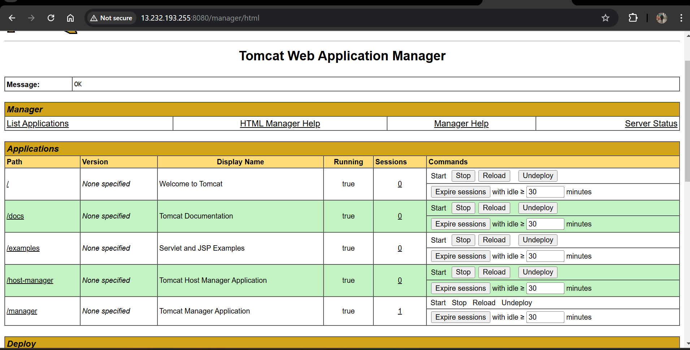

now tomcat running on 8080

jenkins runningg on different machine on port 8080

2) Install "Deploy To Container Plugin" in Jenkins

    Go to Jenkins Dashboard -> Manage Jenkins --> Manage Plugins -> Goto Available Tab -> Search For "Deploy To Container" Plugin -> Install without restart.

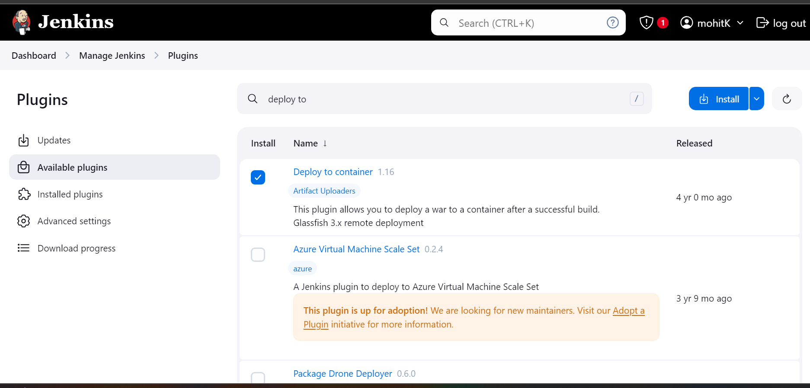

this plugin is to communicate between jenkins and tomcat machine!!

with this we can deploy war file on tomcat!!

using this jenkins send warfile to tomcat webapps folder!!

3) Create Jenkins Job (Free Style Project)

git url--> https://github.com/ashokitschool/maven-web-app.git

		-> New Item
		-> Enter Item Name (Job Name)
		-> Select Free Style Project & Click OK
		-> Enter some description
		-> Go to "Source Code Management" Tab and Select "Git"
		-> Enter Project "Git Repo URL"
		-> Go to "Build tab"
		-> no build trigger as we trigger manually!!
		-> Click on Add Build Step and Select 'Inovke Top Level Maven Targets'
		-> Select Maven and enter goals 'clean package'
		-> Click on 'Post Build Action' and Select 'Deploy war/ear to container' option
		-> Give path of war file (You can give like this also : **/*.war )
		-> Enter Context Path (give project name Ex: java_web_app)
		-> Click on 'Add Container' and select Tomcat version 9.x
		-> Add Tomcat server credentials (Credentials>add>Jenkins)
				(give the username & pwd which is having manager-script role)
		-> Enter Tomact Server URL (http://ec2-vm-ip:tomcat-server-port)
		-> Click on Apply and Save

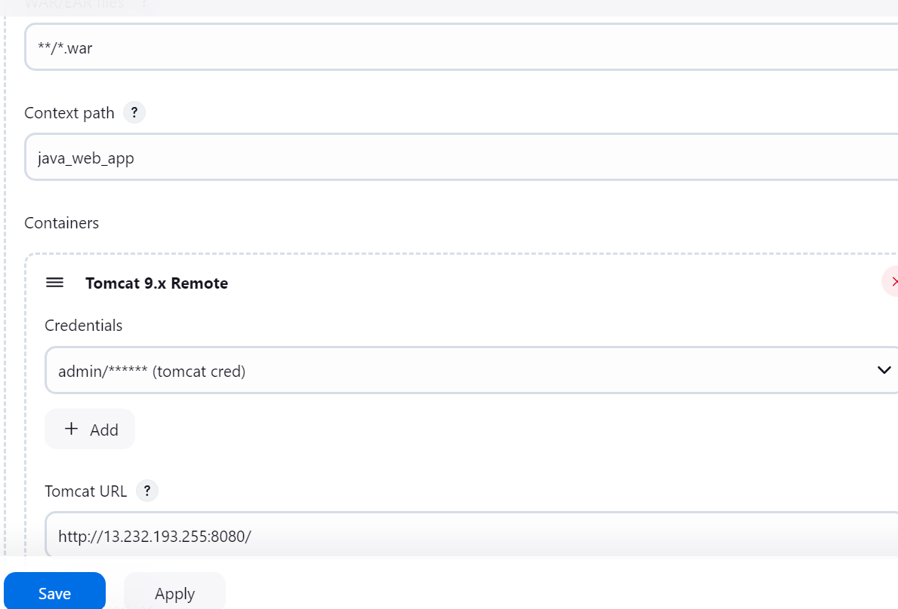

4) Run the job now using 'Build Now' option and see see 'Console Output' of job

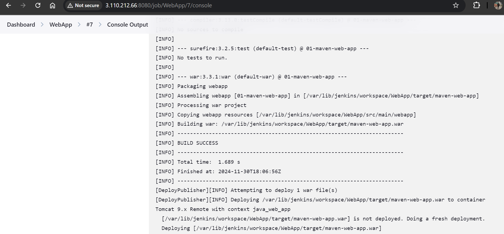

5) Once Job Executed successfully, go to tomcat server dashboard and see application should be displayed.

6) Click on the applicaton name (it should display our application)

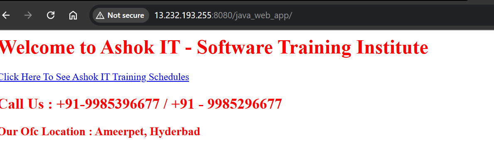

deployed!!

This is automated build and deploy!!

now we undeploy from tomcat server!!

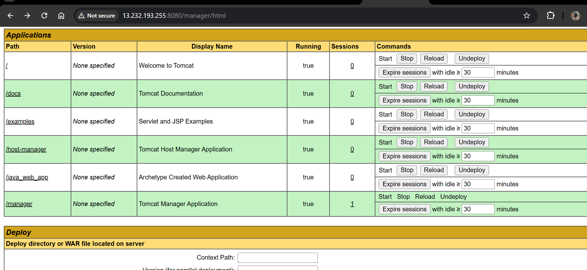

And redeploy!! we can see app on tomcat server!!

now we want to deploy automatically!!

when you change code and deploy in server!! you see redeploying as it uninstall existing war and then install new war!!

Now we want this to happen automatically!!

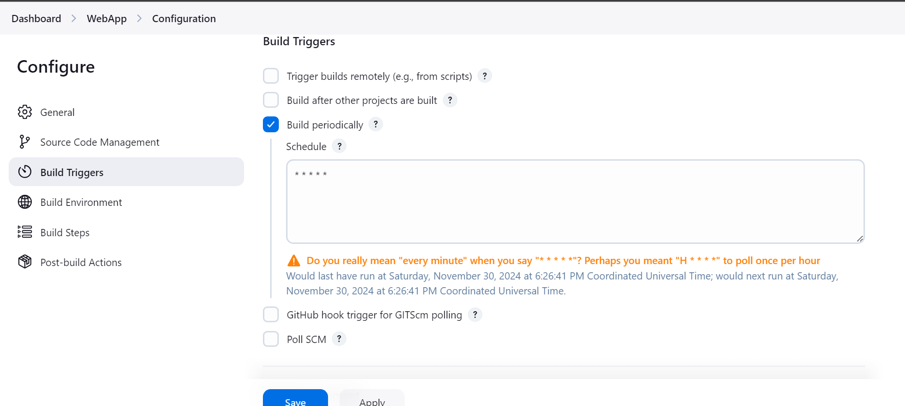

every minute it will deploy!!

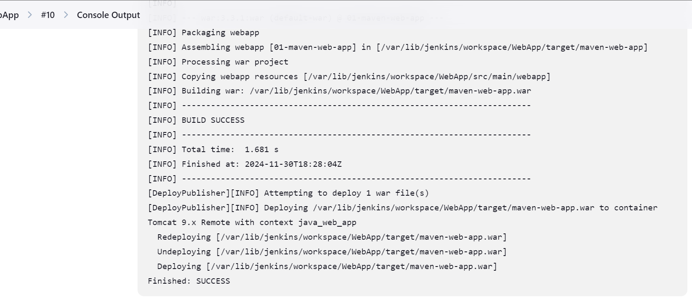

uninstalled and installed again !!

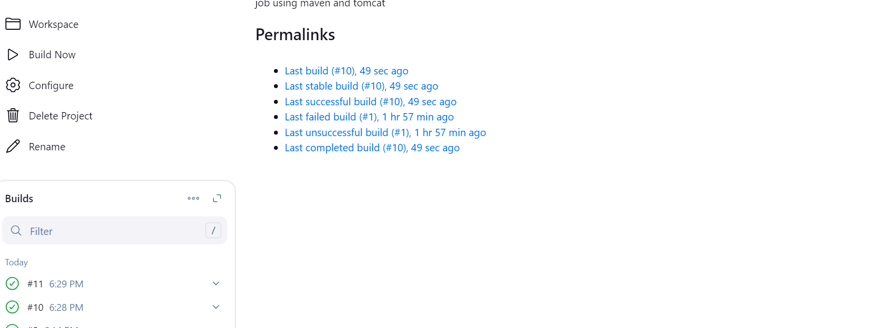

see build 10 and 11 started automatically!!

---

but we want deployment only when code change is there!!

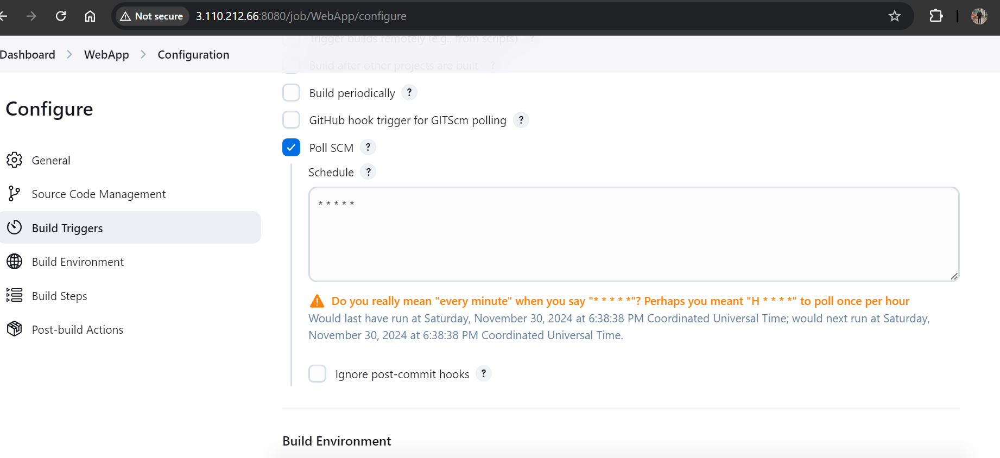

for every 1 min jenkins check with github and see if there is any commit then it will redeploy!!


>Note:Springboot  tomcat is not required!! it has embedded tomcat!!

In real-time we run job manually, we do not use Poll SCM!!


next day when we start ip will be changed so here ip needs to be changed in jenkins!

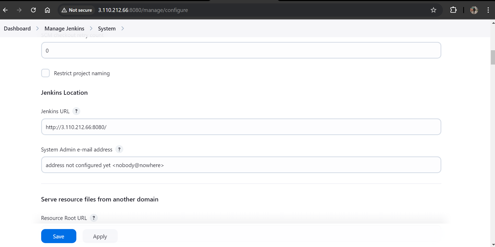
