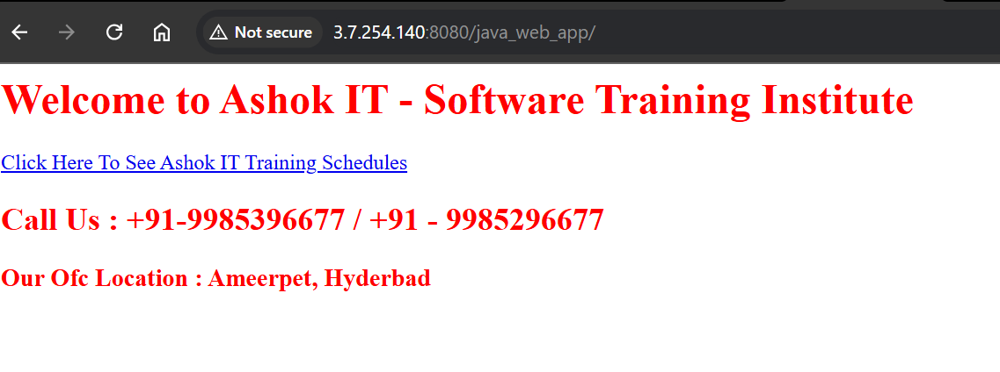
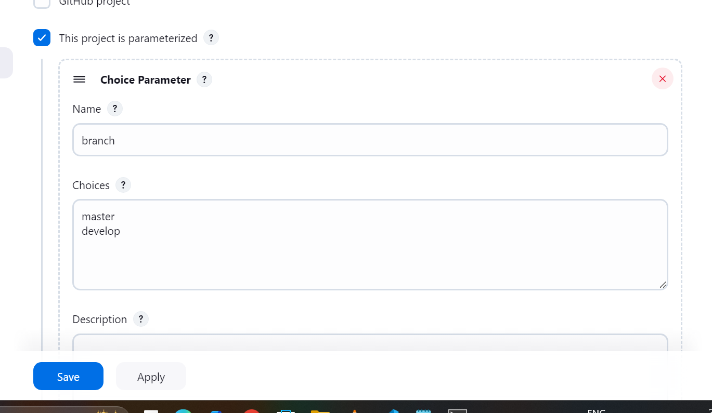
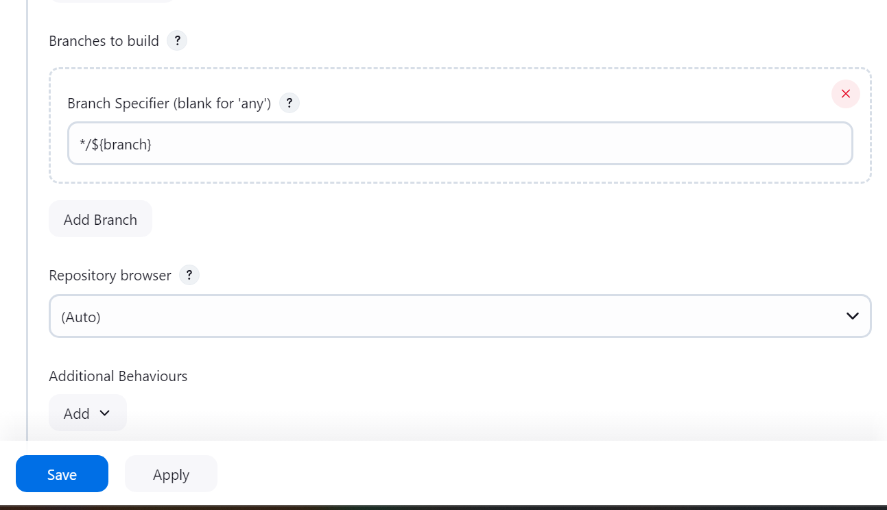
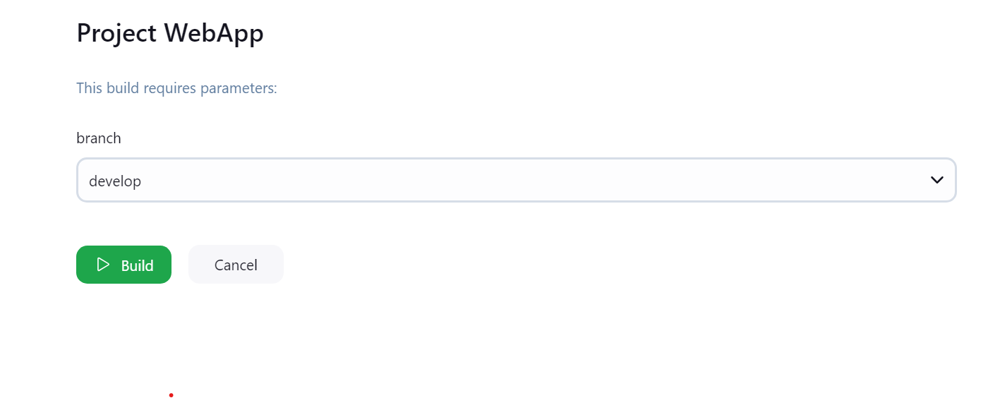
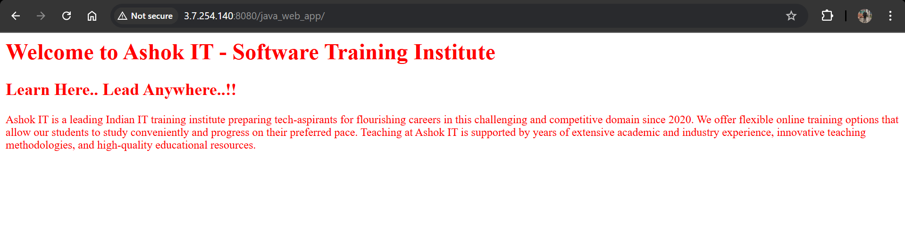
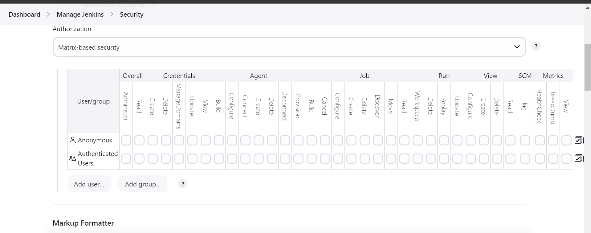

# Lecture-3 jenkins

In real-time we build job manually , we do not build automatically whenever change happens automatic build is not done!!

In tomcat directory bin folder we have startup.sh ,s o go to that directorya and run this

    sh startup.sh

To stop use shutdown.sh

jenkins

id-mohit

pass-2978

go to manage jenkins>system 

in jenkins url change ip to new ip of ec2-machine!!

>Note:Also chnage ip of tomcat in job!! where u want to deploy

## How to Create Jenkins Jobs with Build Parameters

We need to take build from different branches!!

master branch we have deployed and output is:

=> Build Parameters are used to supply dynamic inputs to run the Job. 

=> Using Build Parameters we can avoid hard coding in jenkins job configuration.

		Ex : We can pass branch name as build parameter in runtime.

=> Open Jenkins Job

=> In General Section 

=> Select "This Project is parameterized option"

=> Select choice parameter

=> Enter name as branch

=> Give choices like below

		master
		develop

click on apply and save!!

=> In source code management, give branch name to take dynamic value like below

					*/${branch}

if every env we have different server , then we can pass server name as parameter too!!

when you try to build it ask your parameters

output:

In real time we deploy at cluster not at server!!We build image and deploy to cluster!!

## User & Roles Management In Jenkins

=> In Our Project multiple teams will be available

			a) Development team (10)
			b) Testing team (5)
			c) DevOps Team (3)

=> For every Team member Jenkins login access will be provided.

Note: Every team members will have their own user account to login into jenkins.

=> Operations team members are responsible to create / edit / delete / run jenkins jobs.

=> Dev and Testing team members are only responsible to run the jenkins job.

## How to create users and manage user permissions

As devlopers should not delete jenkins job!! only run the job!!

-> Go to Jenkins Dashboard

-> Manage Jenkins -> Manage Users

-> Create Users

-> Go to Security

using this you can give permissions to different user!!

-> Manage Roles & Assign Roles

>Note: By default admin role will be available and we can create custom role based on requirement

-> In Role we can configure what that Role assigned user can do in jenkins

-> In Assign Roles we can add users to particular role

## Working with User Roles in Jenkins 

-  Step-1 : Install Required Plugins

    => Install "Role-based Authorization Strategy" Plugin

    => This plugin allows you to define roles and assign them to users or groups.

-   Step-2 : Configure Security

    => Go to "Manage Jenkins" > "Configure Security."

    => Select Authorization as "Role-Based Strategy"

    => Click "Save" to apply the changes

- Step-3 :  Create User Roles

    => Go to "Manage Jenkins" > "Manage and Assign Roles."

    => Click "Manage Roles" and define new roles based on your requirements (e.g., admin, developer, tester).

    => Click "Add" to create a new role, and specify the permissions for that role.

- Step-4 : Assign Users to Roles

    => After creating roles, go to "Manage Jenkins" > "Manage Users & Roles."

    => Select a user and click "Assign Roles" to add them to one or more roles.

- Step-5 : Test the user login functionality

