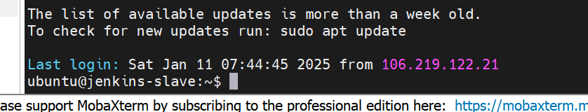
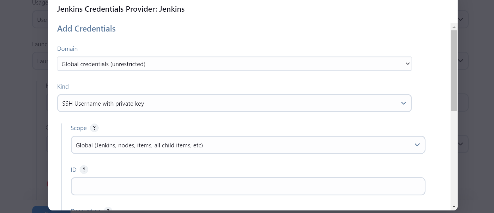
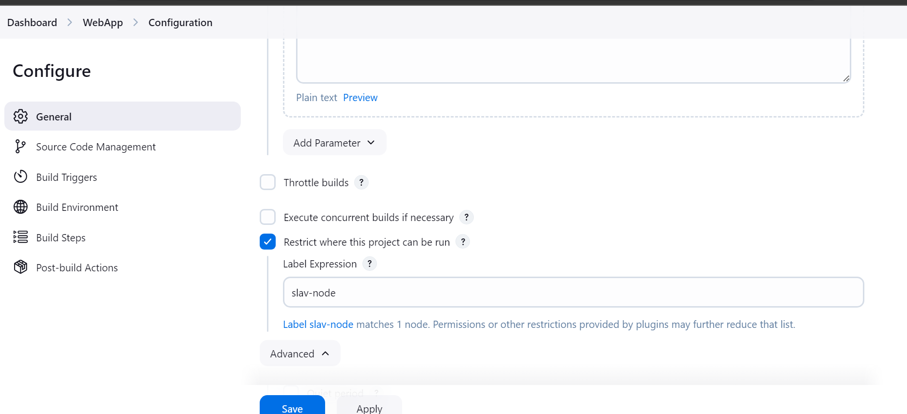
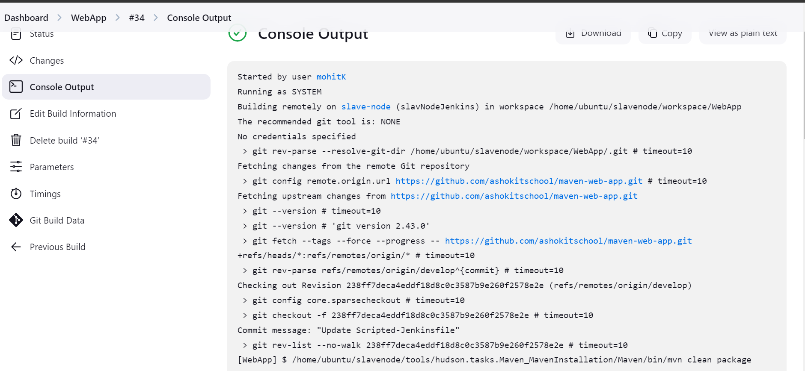
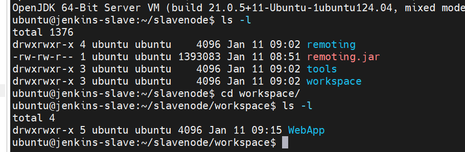

# Lecture-4 jenkins

In tomcat directory bin folder we have startup.sh ,so go to that directorya and run this

    sh startup.sh

To stop use shutdown.sh

go to manage jenkins>system 

in jenkins url change ip to new ip of ec2-machine!!

>Note:Also chnage ip of tomcat in job!! where u want to deploy

## Jenkins - Master & Slave Architecture

=> If we use single machine jenkins, then burden will be increased if we run multiple jobs at a time. 

=> If burden increased then system can crash.

=> To reduce burden on jenkins server we will use Master & Slave Configuration.

=> Master & Slave configuration is used to reduce burden on Jenkins Server by distributing tasks/load.

### Jenkins Master

=> The machine which contains Jenkins s/w is called as Jenkins Master machine.

=> It is used to create the jobs

=> It is used to schedule the jobs

=> It is responsible to distribute Jobs execution to slave machines.

>Note: We can run jobs on Jenkins Master machine directly but not recommended.

### Jenkins Slave

=> The machine which is connected with 'Jenkins Master' machine is called as 'Jenkins-Slave' machine.

=> Slave Machine will receive task from 'Master Machine' for job execution.

### Steps to create master slave

- Step-1 : Create Jenkins Master vm

    1) Launch Linux VM (t2.medium)
    2) Install Java s/w
    3) Install Jenkins s/w

- Step-2 : Create Jenkins Slave vm

    1) Create EC2 instance (Ubuntu with t2.micro)
    2) Connect to EC2 using ssh client
    3) Change hostname for readability

            $ sudo hostname jenkins-slave
            $ exit

    

    4) Install Java Software

            $ sudo apt install default-jre

    5) Create one directory in /home/ubuntu

                $ mkdir slavenode

        can give any node , this directory is our workspace directory!

- Step-3: Configure Slave Node in Jenkins Master Node
	
    Till now there is no relation between master ans slave , now we need to configuree the relation between both!!

    1) Go to Jenkins Dashboard
    2) Go to Manage Jenkins
    3) Select Nodes option
    4) Click on 'New Node' -> Enter Node Name -> Select Permanent Agent
    5) Enter Remote Root Directory ( /home/ubuntu/slavenode ),no of executors means no of jobs that can run parallely!!
    6) Enter Label name as Slave-1
    7) Select Launch Method as 'Launch Agent Via SSH'
    8) Give Host as 'Slave VM DNS public ipv4 URL'
    9) Add Credentials ( Select Kind as : SSH Username with private key )

    

    10) Enter Username as : ubuntu

    11) Select Private Key as Enter Directley and add private key

    >Note: Open pem file and copy content add add 

    12) Select Host Key Strategy as 'Manually Trusted Key Verification Strategy'

    13) Click on Save (We can see configured slave)

To run old job we need to put where to run job!!

You need to put label !!

start tomcat by command startup.sh!!

see output of console we can see it ran on slave node!!

In slave machine you can see it is in workspace inside folder we have created!!

>With above steps Master and Slave Configuration Completed 

Now we have deployed using one slave but in real time we use pipeline where we tell use any slave which is available!!

-> Go to Jenkins Server and Create Jenkins Job

>Note: Under Generation Section of Job creation process, Select "Restrict Where This Project Can Run" and enter Slave Nodel Label name and finish job creation.

-> Execute the Job using 'Build Now' option

>Note: Job will be executed on Slave Node (Go to Job Console Ouput and verify execution details)

Q--> What will happen if master is down??

Sol--> need to take backup of jenkins job of master machine!!We use thin backup plugin !!

