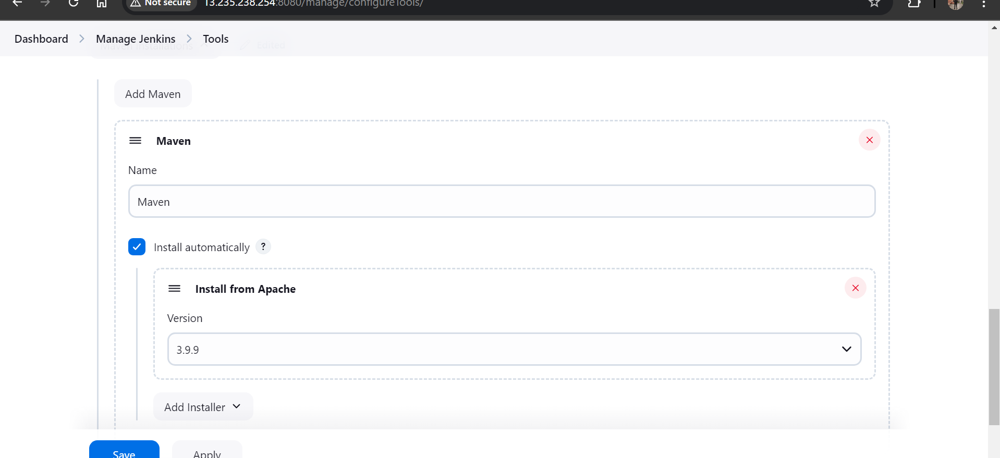
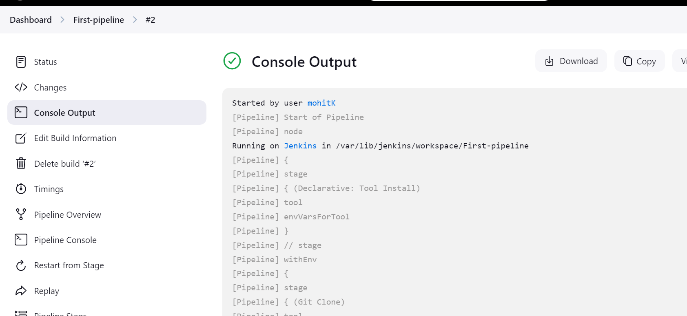

# Lecture-5 jenkins

In tomcat directory bin folder we have startup.sh ,so go to that directorya and run this

    sh startup.sh

To stop use shutdown.sh


go to manage jenkins>system 

in jenkins url change ip to new ip of ec2-machine!!

>Note:Also chnage ip of tomcat in job!! where u want to deploy

From here on slave URL also needs to be changed when we start up again!!

>Note: whatever we have deployed will be on the server only till we delete it!!Even when server is restarted!!

##  Jenkins Pipeline

=> Jenkins pipeline is a way to define CI CD process as a code.

=> The whole CI CD workflow we will define as a code in pipeline.

=> when we are dealing with complex CI CD process then pipelines are highly recommended.

=> Pipeline contains set of stages to perform CI CD

		Stage-1: Clone Git Repo

		Stage-2: Maven Build

		State-3: Code Review

		Stage-4 : Artifact Upload

		Stage-5: Build Docker Image

		Stage-6: Push Image to Registry

		Stage-7: Deploy App in K8S

		Stage-8: Send Email Notification

=> We can create jenkins pipelines in 2 ways

			1) Declarative Pipeline (just plain english)(starts with pipeline keyword)

			2) Scripted (groovy) Pipeline (just groovy is used)(starts with node keyword)

both type are used!!

 ### Jenkins Declarative Pipeline

 Starts with keyword pipeline!!

 Agent tells on which jenkins slave machine to run !! if you do not know which slave to run put agent
 as any!!

Then we tell about tools!! like here below we need maven!!  maven "Maven" here 
maven is key Maven is value!!as we have that one set in global tools!!



Then we write about stages!!

Can see below example:-

 ```pipeline
 
pipeline {
	
	 agent any

	 tools{
	 	 maven "Maven
	 }

	 stages {
 		stage('Git Clone'){
 			steps{
 				echo 'cloning git repo'
 			}
 		}
 		stage('Maven Build'){
 			steps{
 				echo 'Maven Build'
 			}
 		}
 		stage('Deploy'){
 			 steps{
 			 		echo 'Tomcat Deployment'
 			 }
 		}
	 }
}

 ```           
## Pipeline creation

Create a new job


select pipeline!!Then OK!!

then go to Advanced pipeline options


In Script on right we have dropdown!! but we are using our above pipeline and let us apply and save!!

output:




## Pipeline Overview


### Note 

1. The stage names 'Git Clone', 'Maven Build', and 'Deploy' are custom and descriptive. You could rename them to anything else, such as:
 ```pipeline
stages {
    stage('Checkout Code') {
        steps {
            echo 'Checking out the source code'
        }
    }
    stage('Compile and Test') {
        steps {
            echo 'Compiling the code and running tests'
        }
    }
    stage('Deployment') {
        steps {
            echo 'Deploying the application'
        }
    }
}

 ```
2. Stage names should be meaningful to improve readability and make it clear what the pipeline is doing.
3. Avoid using generic or overly vague names like Stage 1, Step 2, etc.
4. Jenkins will display these stage names in the UI when visualizing the pipeline, so clear names help with debugging and monitoring.

we ran above pipeline and see how we got overview:


5. declarative pipeline starts with keyword pipeline
 ### Declarative Pipeline with Git + Maven + Jenkins

 ```pipeline
pipeline {
    agent any
    
    tools{
        maven "Maven"
    }

    stages {
        stage('Git Clone') {
            steps {
               git branch: 'develop', url: 'https://github.com/ashokitschool/maven-web-app.git'
            }
        }
        stage('Maven Build'){
            steps{
             sh 'mvn clean package'
            }
        }
    }
}

We are using sh command to run the command as we running!! mvn clean package command

Here we are telling tools as Maven !!If we remove that than slave we know do not have maven installed so to run mvn clean pacakage we must tell where to take Maven , this is maven we have configuered in global tool!!

Global tool is send by master node to slave node, whatever software needed we configure them as global tools in pipeline!!

 ```


When you are new to pipeline you can use this to generate piepline !!


using this we can generate code/snippet to do something!!


 ### SSH Agent Configuration

 
=> SSH Agent is used to establish remote ssh connection from one linux vm to another linux vm

		Ex: jenkins server should connect with tomcat server to copy war file

=> Install SSH Agent plugin 
	
>Note:We were using deploy to container plugin in freeStyle project!!For piepline we need SSH agent plugin!!


		(Manage Jenkins -> Plugins -> Available -> Search for SSH Agent -> Install)		

=> Use pipeline syntax and create ssh-agent for tomcat server vm.		

					-> Snippet Generator
					-> Sample Step -> Select SSh Agent
					-> Add -> SSH Username with private key
					-> Configure Tomcat server username and pem file content
					-> Click on generate pipeline script to get ssh-agent

=> Configure SSH Agent details in Deployment stage steps like below

				sshagent(['tomcat-server-credentials']) {
    			// some block
				}					


=> With the help of ssh-agent we will copy war file to tomcat server using scp command scp means secure copy ,where strict hostKeychecking is no!!

`sh 'scp -o StrictHostKeyChecking=no target/01-maven-web-app.war ec2-user@public-ip:/home/ec2-user/apache-tomcat-9.0.91/webapps'`

-o means options

StrictHostKeyChecking=no as tomcat is in differnt machine so putting this option as no!!

-o StrictHostKeyChecking=no
(This SSH option disables the host key verification check.
Normally, when you connect to a remote server for the first time, SSH asks for confirmation to add the server's key to the known hosts file. This option skips that prompt, which is useful in automated scripts but reduces security.)

### Git + Maven + Tomcat + Jenkins Pipeline

```pipeline

pipeline {
    agent any
    
    tools{
        maven "Maven"
    }

    stages {
        stage('Git Clone') {
            steps {
               git branch: 'develop', 
                   url: 'https://github.com/ashokitschool/maven-web-app.git'
            }
        }
        stage('Maven Build'){
            steps{
             sh 'mvn clean package'
            }
        }
        stage('Deployment'){
            steps{
                sshagent(['tomcat-server-credentials']) {
                   sh 'scp -o StrictHostKeyChecking=no target/01-maven-web-app.war ec2-user@public-ip:/home/ec2-user/apache-tomcat-9.0.91/webapps'
                }
            }
        }
    }
}
```


Ques:When we specify agent:any in pipeline can it run on master jenkins node

ChatGPT said:
Yes, specifying agent any in a Jenkins pipeline means that the job can run on any available node, including the master (or controller) node, provided the master is configured to accept builds.

To run on specific node

```pipeline

pipeline {
   agent {
        label 'slave-node'
    }
   
   tools{
       maven "Maven"
   }

   stages {
       stage('Git Clone') {
           steps {
              git branch: 'develop', url: 'https://github.com/ashokitschool/maven-web-app.git'
           }
       }
       stage('Maven Build'){
           steps{
            sh 'mvn clean package'
           }
       }
        stage('Deployment'){
            steps{
                sshagent(['jenkins-slave-cred']) {
                   sh 'scp -o StrictHostKeyChecking=no target/01-maven-web-app.war ec2-user@<ip>:/home/ec2-user/apache-tomcat-9.0.97/webapps'
                }
            }
        }
   }
}

```

3 machines are communicating here : master , slave and tomcat server!!
