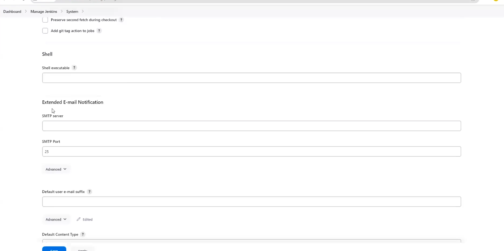
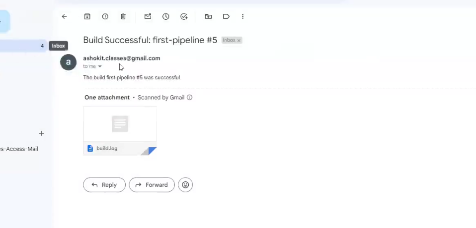
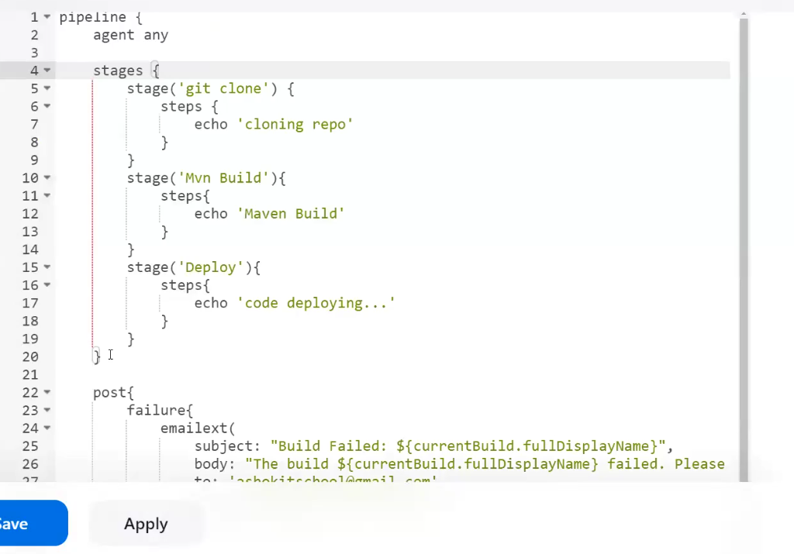
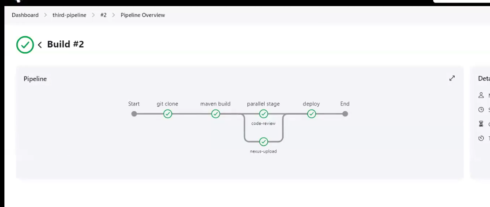
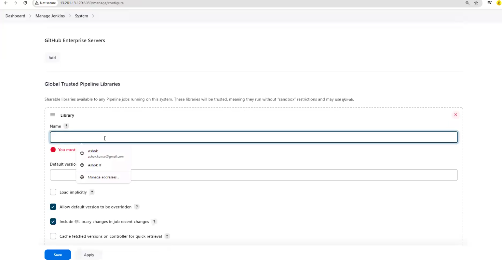

# Lecture-6 jenkins

In tomcat directory bin folder we have startup.sh ,so go to that directorya and run this

    sh startup.sh

To stop use shutdown.sh

jenkins

id-mohit

pass-2978

go to manage jenkins>system 

in jenkins url change ip to new ip of ec2-machine!!

>Note:Also chnage ip of tomcat in job!! where u want to deploy

From here on slave URL also needs to be changed when we start up again!!

>Note: whatever we have deployed will be on the server only till we delete it!!Even when server is restarted!!

## Email Notifications In Jenkins

-> We can configure Email notifications in Jenkins

-> With this option we can send email notification to team members after jenkins job execution completed.

-> We need to configure SMTP properties to send emails

		-> Go To Manage Jenkins 
		-> Go To System
		-> Go to "Extended E-mail Notification"
		-> We will add company provided SMTP server details to send emails.



>Note: For practice we can use GMAIL SMTP Properties,but in real time company provide SMTP details, every company has it's own SMTP!!

SMTP Server : smtp.gmail.com<br>
SMTP Port : 587

>Note: Under Advanced section add your gmail account credential for authentication purpose.


> Note: Instead of gmail password we need to add gmail app password 

>URL To generate gmail app pwd : https://myaccount.google.com/apppasswords

    => Select use TLS checkbox


    => For testing purpose we can use "Email Notification option which is available at the bottom of the page"

### Declarative Pipeline with Email Notification 

```pipeline

pipeline {
    agent any
    
    tools{
        maven "Maven"
    }

    stages {
        stage('Clone') {
            steps {
                git 'https://github.com/ashokitschool/maven-web-app.git'
            }
        }
        stage('Build') {
            steps {
                sh 'mvn clean package'
            }
        }
    }
    
	   post {
			failure {
				emailext(
					subject: "Build Failed: ${currentBuild.fullDisplayName}",
					body: "The build ${currentBuild.fullDisplayName} failed. Please check the console output for more details.",
					to: 'ashokitschool@gmail.com',
					from: 'ashokit.classes@gmail.com',
					attachLog: true
				)
			}
			success {
				emailext(
					subject: "Build Successful: ${currentBuild.fullDisplayName}",
					body: "The build ${currentBuild.fullDisplayName} was successful.",
					to: 'ashokitschool@gmail.com',
					from: 'ashokit.classes@gmail.com',
					attachLog: true
				)
			}
		}    
}
```

After pipeline we are putting post action!!Once job is completed this action will be performed!!



here build log is sent as email!!

In jenkins red line represent starting and ending of stages!!



This is one time configuration!!

If we want to send to multiple people, people are grouped into one and that group email is put here!!

## Jenkins Job with Parallel Stages 

Till now stages happen one after other , now we want some stages to execute simultaneously!!

```pipeline
pipeline {
	
	agent any

	stages{
		stage('git clone'){
			steps{
				echo 'git clone....'
			}
		}
		stage('maven build'){
			steps{
				echo 'maven build...'
			}
		}

		stage('parallel stage'){
		    parallel{//must write parallel keyword here else it will be sequential too
		        stage('code-review'){
		          steps{
		              echo 'code review....'
		          }
		        }
		        stage('nexus-upload'){
		            steps{
		                echo 'nexus upload...'
		            }
		        }
		    }
		}

		stage('deploy'){
			steps{
				echo 'deployment...'
			}
		}
	}
}
```


code review and nexus upload can be done simultaneouly!!

Rest of stages execute sequentially!!

## Working with Shared Libraries in Jenkins

=> When we are dealing with multiple projects related pipelines then we can see some common logics in all pipelines

		Ex: maven build
		    code review
		    artifact upload

=> Instead of writing same logic in multiple pipelines, we can write the logic at one place and we can re-use it.

=> To achieve pipeline logic re-usability we will use 'Shared Libraries' concept.

=> To create shared libraries for jenkins, we will use 'groovy scripting'

=> shared library related groovy files we can keep in our git repository.

Git Repo : https://github.com/ashokitschool/my_shared_libraries.git

some files here are

Git clone groovy
```groovy
def call() {           
   git url: 'https://github.com/ashokitschool/maven-web-app.git'
}
```
Maven build groovy
```groovy
def call() {           
  sh "mvn clean package"
}
```

Sonarqube groovy
```groovy
def call() {           
  withSonarQubeEnv('Sonar-Server-7.8') {
	    sh "mvn sonar:sonar"
   }
}
```

can get these groovy files from google and chatgpt

to add library go here



named as ashokit_shared_lib and put github link

pipeline

```pipeline

@Library('ashokit_shared_lib') _

pipeline {
    agent any
    
    tools{
        maven "maven-3.9.8"
    }

    stages {
        stage('Hello') {
            steps {
               welcome()
            }
        }

        stage('git clone'){
        	steps{
        		gitClone();
        	}
        }

        stage('maven build'){
        	steps{
        		mavenBuild()
        	}
        }
    }
}
```