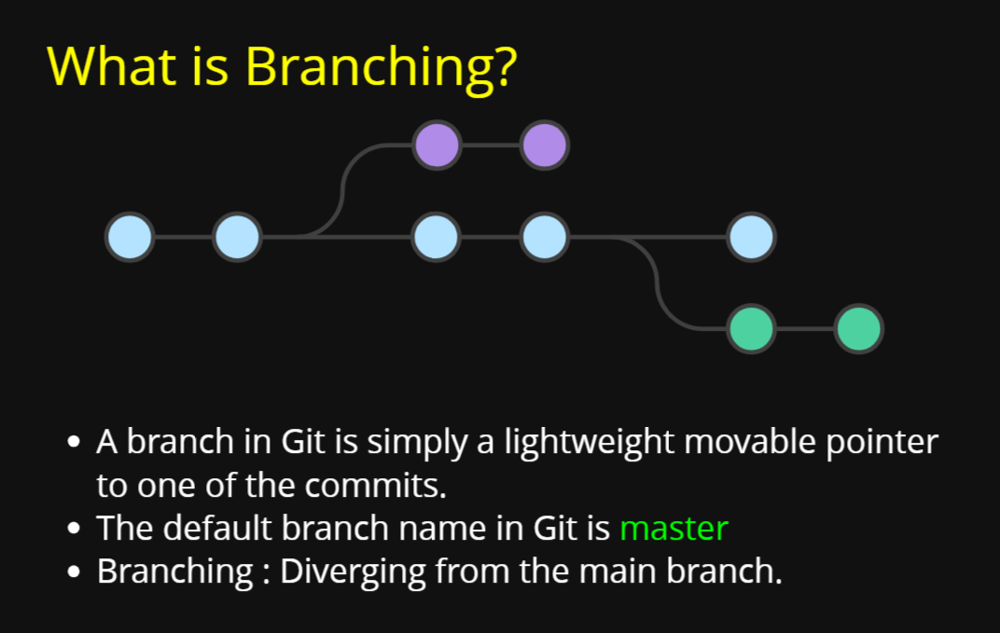
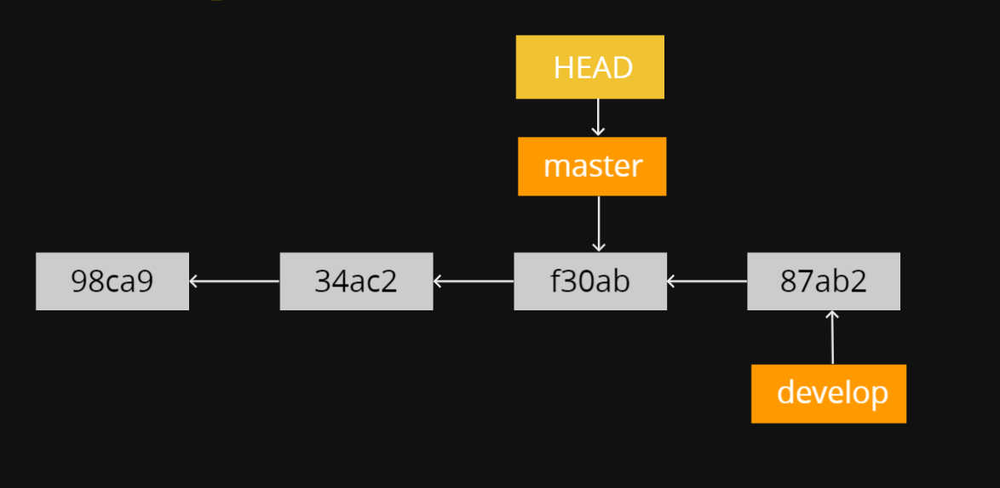

## Notes

Let us suppose we created a brnach devlop from master

 we move to devlop branch

and then make a commit

now we move to master

and make a commit

### Merge

Let us suppose from here

we create a branch impfix from master and created a commit on that

now one more commit on devlop branch

see above on master we have another commit

### Merge vs Rebase

