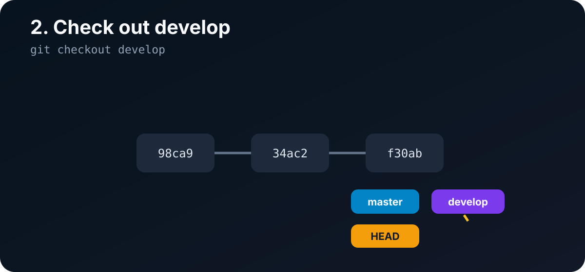
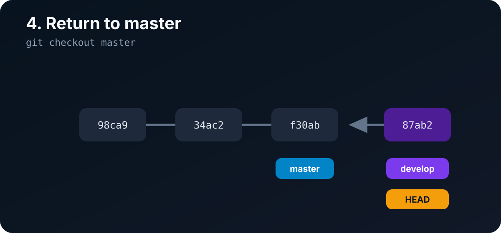
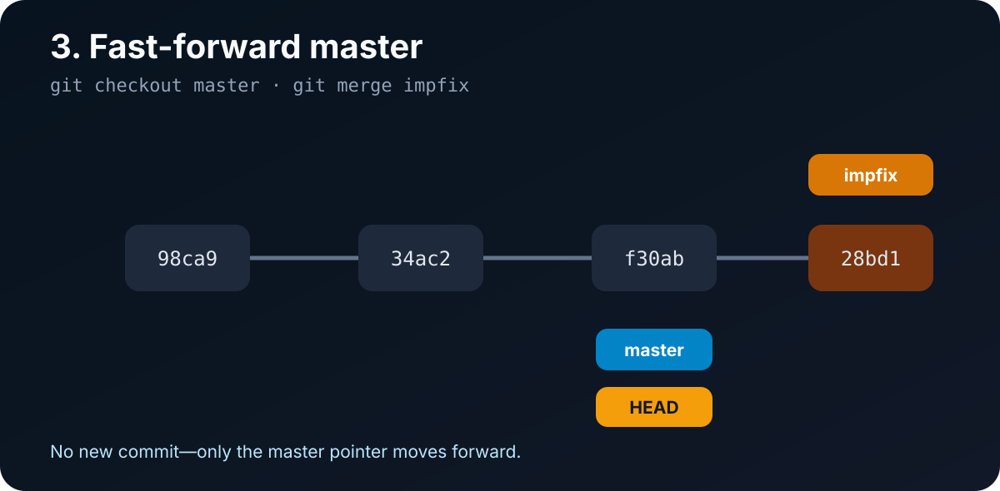
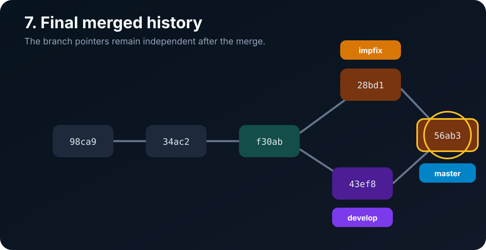
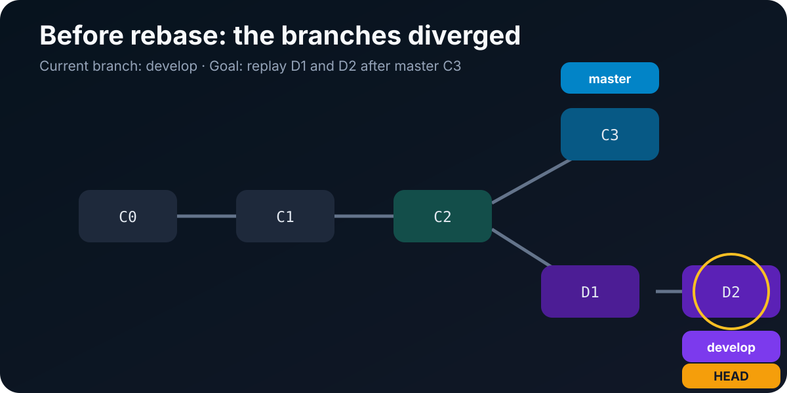
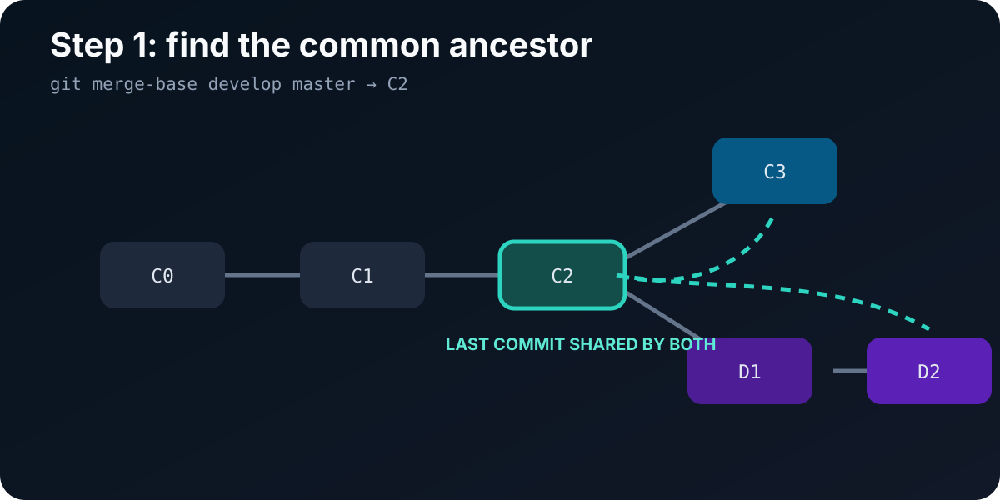
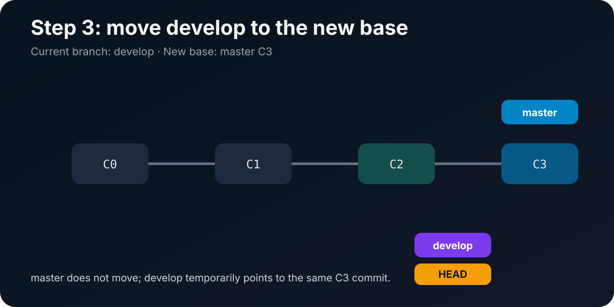
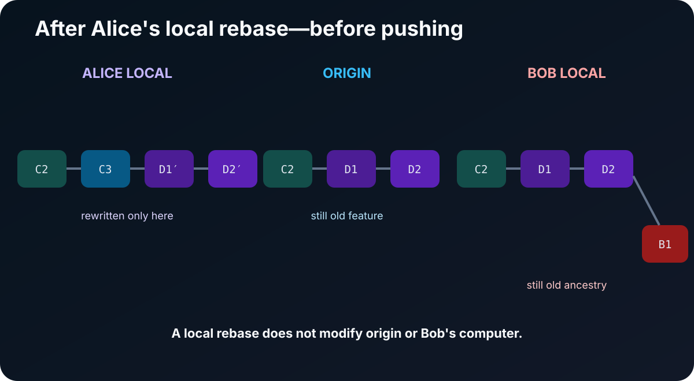
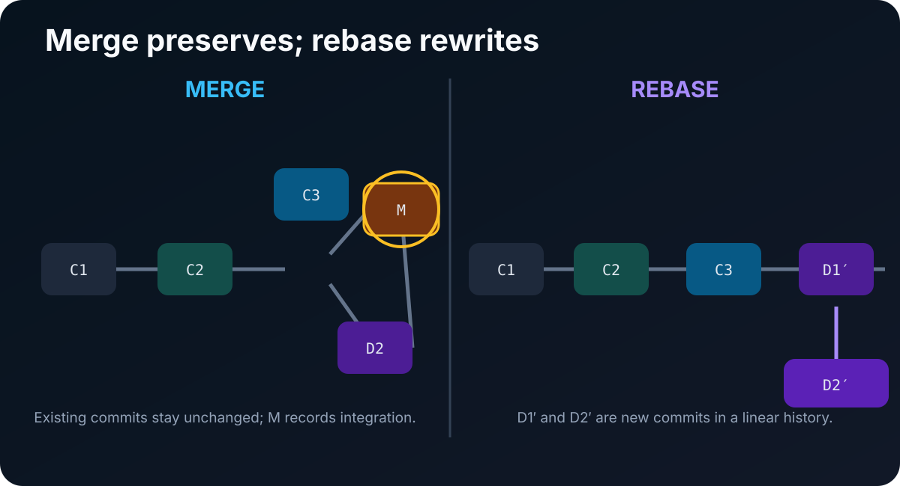

# Git Branching — Animated Version



## What is Branching?

- A branch in Git is simply a lightweight movable pointer to one of the commits.
- The default branch name in Git is `master`.
- Branching means diverging from the main branch.

Branching in other VCS is expensive as they copy whole chnanges to new branch but in git it only cpies chnages !! here creating ,moving from brnach to other is very easy!!

We have a head pointer which points to current branch!!

## Creating new branches

Get all the branches in your project:

```bash
git branch
git branch -v
```

Creating a new branch:

```bash
git branch branchname
```

`git branch -v`--> tells last commit of all branches!!

## Moving between branches

Checkout an existing branch:

```bash
git checkout branchname
```

Create and checkout a new branch:

```bash
git checkout -b branchname
```

Renaming a branch

```console
root@educative:/test_project# git branch
* master
  new_branch
root@educative:/test_project# git checkout new_branch
Switched to branch 'new_branch'
root@educative:/test_project# git branch -m authentication_feature
root@educative:/test_project# git branch
* authentication_feature
  master
```

Renaming a branch without going to it

```console
root@educative:/test_project# git branch
* master
  new_branch
root@educative:/test_project# git branch -m new_branch authentication_feature
root@educative:/test_project# git branch
  authentication_feature
* master
```

deleting a branch

```console
root@educative:/test_project# git branch
* master
  new_branch
root@educative:/test_project# git branch -d new_branch
Deleted branch new_branch (was 62aa179).
root@educative:/test_project# git branch
* master
```

Let us suppose we created a brnach devlop from master



 we move to devlop branch



and then make a commit



now we move to master



and make a commit



`git log`--> tells commit history (canot see logs of diverging branch), can see brnaches which are a part of current brnach

`git log --oneline`--> tells in oneline

`git log --oneline --graph`--> tells in oneline in graph

`git log --oneline --graph --all`--> tells in oneline in graph in all brnaches

### Deleting branches

Deleting a merged branch:

```bash
git branch -d branchname
```

Deleting a non-merged branch:

```bash
git branch -D branchname
```

### Merge

Let us suppose from here



we create a branch impfix from master and created a commit on that



we commited to infix!! we want master to point to impfix!!

we want impfix to be merged with master!! so we need to move master so for that do checkout master first!!

Now we do `git merge impfix` on master branch



This is fast-forward merge!!we just changed the pointer so this is called as fast-forwarding!!

we have merged impfix now we can delete that branch!!

now on devlop if we do `git merge master` it will put all chnages of master to devlop but our main branch is master we do not want other branch chnages in master without testing!!

now one more commit on devlop branch



now we want two chnages of develop branch to master branch !!

we first need to go to master as we need to merge develop to master!!

after going to master we do `git merge devlop`

it ask for commit message !! give it

you see merge make but recursive strategy!!



see how master is updated!!

- first git find common ancestor as on that commit both brnaches have same changes

- after that git reads devlop branch and see all changes made by both branches and git will merge them in a new commit

- this is called as 3-way merge!!

- the new commit we made is called as merge commit!!



see above on master we have another commit

if we had impfix here it still be poiniting to 28bd1!!



## Merge Conflicts

Changes in a file made by 2 different branches, trying to get merge results in a **Merge Conflict**.

## Merge Conflicts in a Project

```bash
git branch --merged
git branch --no-merged
```

To display merged & non merged branches only.

### Merge vs Rebase

Rebase becomes much easier to understand when we keep the **current branch**, the **base branch**, and the **goal** explicit.

### Example used throughout this section

- **Current shared branch:** `master`
- **Our private working branch:** `develop`
- **Current branch before rebasing:** `develop`
- **What happened:** `master` received commit `C3`, while `develop` independently received commits `D1` and `D2`.
- **What we want:** put `D1` and `D2` after `C3`, producing a clean linear history.
- **What must not move during this operation:** the `master` pointer.



With the `rebase` command, you can take all the changes that were committed on one branch and replay them on a different branch.

The command has this meaning:

```bash
git rebase <new-base>
```

Git rewrites the commits belonging only to the **currently checked-out branch** and places their changes after `<new-base>`.

For our example, first confirm the branch and history:

```bash
git status
git branch --show-current
git log --oneline --graph --decorate --all
```

Expected current branch:

```text
develop
```

Now run:

```bash
git switch develop
git rebase master
```

Read `git rebase master` as:

> “I am currently on `develop`. Take the commits unique to `develop`, move `develop` to the tip of `master`, and replay those changes there.”

Do **not** check out `master` and run `git rebase develop` for this goal. That reverses the direction and rewrites the wrong branch.

## How Git performs rebase?

1. Pointer goes to the common ancestor of the two branches *(the one you're on and the one you're rebasing onto)*.
2. Gets the diff introduced by each commit of the branch you're on.
3. Saves those diffs to temporary files.
4. Resets the current branch to the same commit as the branch you are rebasing onto.
5. Finally applies each change in turn.

### Step 1 — Find the common ancestor

- **We are on:** `develop`
- **We are rebasing onto:** `master`
- **Git finds:** `C2`, the last commit contained in both branches.



You can inspect the same commit yourself:

```bash
git merge-base develop master
```

### Step 2 — Save the changes introduced by `develop`

- `D1` and `D2` exist only on `develop`.
- Git calculates the patch introduced by each commit.
- Conceptually, Git temporarily puts those patches aside in their original order.



Git is preserving the **changes**, not the old commit identities. This is why the replayed commits later receive new hashes.

### Step 3 — Move `develop` to the new base

- **Current branch remains:** `develop`
- Git temporarily moves `develop` from `D2` to `master` commit `C3`.
- The `master` branch itself does not move.



This resembles resetting `develop` to `master`, but Git has already saved the `D1` and `D2` changes for replay.

### Step 4 — Replay the first commit

Git applies the saved changes from `D1` after `C3`. Because the parent is now different, Git creates a new commit named `D1′` in the diagram.



`D1′` contains equivalent changes to `D1`, but it is a different commit with a different hash.

### Step 5 — Replay the remaining commits

Git next applies the changes from `D2` after `D1′`, creating `D2′`.



After completion:

- `master` still points to `C3`.
- `develop` points to `D2′`.
- The visible history is now `C0 → C1 → C2 → C3 → D1′ → D2′`.
- The old `D1` and `D2` commits are no longer part of the `develop` branch history.

Verify the result:

```bash
git status
git log --oneline --graph --decorate --all
```

### What if a conflict occurs?

Rebase pauses at the exact replayed commit that conflicts.

```bash
git status
```

Open the conflicted files, choose the correct content, and then run:

```bash
git add <resolved-file>
git rebase --continue
```

Repeat until Git finishes. If you decide the rebase should not continue:

```bash
git rebase --abort
```

This restores the branch to its state before the rebase started.

### Optional fast-forward after the rebase

If `develop` is tested and should now become `master`:

```bash
git switch master
git merge develop
```

Because `develop` is directly ahead of `master`, this is normally a fast-forward merge. It moves `master` to `D2′` without creating a merge commit.

## Key Points on Rebasing

No difference in the end product of the integration, but rebasing makes for a cleaner history.

The log history looks like a linear history: it appears that all the work happened in series, even when it originally happened in parallel.

Often, you'll do this to make sure your commits apply cleanly on a remote branch.

- Rebase changes commit hashes because it creates new commits with new parents.
- Rebase does not normally change the final project files; it changes how the history is arranged.
- Rebase is most useful for cleaning up your own private feature branch before integration.
- Always check the current branch before running the command: `git branch --show-current`.

## When you should not use Rebase

**Do not rebase commits that exist outside your repository and that people may have based work on.**

When you rebase stuff, you're abandoning existing commits and creating new ones that are similar but different.

If teammates already based work on your published commits, rewriting those commits makes their history disagree with yours. Prefer merging in that situation.

### What does “commits that exist outside your repository” mean?

It means another copy of those commits exists somewhere that you do not control alone. For example:

- You pushed the branch to GitHub, GitLab, or another remote.
- A teammate fetched or pulled the branch into their local repository.
- A teammate created new work using one of your commits as a parent.
- A build or release branch already refers to those commit hashes.

It does **not** mean a different folder on your computer. The danger begins when another person or system relies on the existing commit hashes.

### Concrete example with Alice and Bob

In this example, `origin` is the shared GitHub repository. Alice and Bob each have separate local clones.

#### State 0 — Alice creates two feature commits locally

Alice starts from `master` commit `C2`:

```bash
git switch master
git pull --ff-only origin master
git switch -c feature

# Alice changes files for the first part of the feature
git add .
git commit -m "Alice: feature part 1"   # creates D1

# Alice changes files for the second part
git add .
git commit -m "Alice: feature part 2"   # creates D2
```

State after Alice's commands:

| Repository | `master` | `feature` | `bob-work` |
|---|---|---|---|
| Alice's local clone | `C2` | `C2 → D1 → D2` | does not exist |
| Shared remote `origin` | `C2` | does not exist yet | does not exist |
| Bob's local clone | `C2` | does not exist yet | does not exist |

Assume Alice created and pushed this branch:

```text
C2 → D1 → D2   feature
```

Alice publishes it:

```bash
git switch feature
git push -u origin feature
```



State after `git push`:

| Repository | `master` | `feature` | Meaning |
|---|---|---|---|
| Alice | `C2` | `D2` | Alice has the branch locally. |
| `origin` | `C2` | `D2` | The commits are now public/shared. |
| Bob | `C2` | not fetched yet | Bob has not seen the branch yet. |

The remote repository and Bob's clone both know the exact hashes of `D1` and `D2`. Bob then starts his work from `D2`:

```text
C2 → D1 → D2 → B1   bob-work
```

#### State 1 — Bob fetches the shared feature and adds his work

Bob runs these commands in **Bob's clone**:

```bash
git fetch origin
git switch -c bob-work origin/feature

# Bob changes files
git add .
git commit -m "Bob: add validation"     # creates B1
```



State after Bob's commit:

| Repository | `feature` | `bob-work` | Important fact |
|---|---|---|---|
| Alice | `D2` | does not exist | Alice does not have Bob's `B1`. |
| `origin` | `D2` | does not exist unless Bob pushes it | The shared feature still ends at `D2`. |
| Bob | remote-tracking `origin/feature` is `D2` | `D2 → B1` | `B1` has the original `D2` as its parent. |

Bob's work is now **based on** Alice's published commit `D2`. This parent relationship is stored permanently inside commit `B1`.

#### State 2 — `master` receives a new commit `C3`

Suppose another developer pushes `C3` to `master`. Alice updates her remote information and local `master`:

```bash
git fetch origin
git switch master
git pull --ff-only origin master
```

State now:

```text
master:  C2 → C3
feature: C2 → D1 → D2
bob-work:C2 → D1 → D2 → B1
```

| Repository | `master` | `feature` | `bob-work` |
|---|---|---|---|
| Alice | `C3` | old `D2` | does not exist |
| `origin` | `C3` | old `D2` | does not exist unless pushed by Bob |
| Bob | may still show `C2` until he fetches | old `D2` | `B1` based on old `D2` |

#### State 3 — Alice rebases only her local `feature`

Now Alice rebases `feature` onto the newer `master` commit `C3`:

```bash
git switch feature
git rebase master
```

Alice is on `feature`; therefore **Alice's `feature` commits are the commits being rewritten**. `master` is only the new base and does not move.

Rebase does not move the original `D1` and `D2`. It copies their changes into new commits with new parents and therefore new hashes:

```text
C2 → C3 → D1′ → D2′   feature
```



State immediately after Alice's local rebase, **before she pushes**:

| Repository | `master` | `feature` | `bob-work` |
|---|---|---|---|
| Alice | `C3` | new `C3 → D1′ → D2′` | does not exist |
| `origin` | `C3` | still old `C2 → D1 → D2` | does not exist |
| Bob | whatever he last fetched | still knows old `D2` | old `D2 → B1` |

Only Alice's local branch changed. The remote and Bob have not magically changed.



Even if the file contents of `D1` and `D1′` are similar, Git treats them as completely different commits:

```text
D1  !=  D1′
D2  !=  D2′
```

Alice's rewritten `feature` now ends at `D2′`, but Bob's `bob-work` still has the original `D1 → D2 → B1` ancestry. Bob cannot automatically change the parents of his existing commits just because Alice changed her branch.

#### State 4 — Alice replaces the shared remote history

If Alice force-pushes the rewritten branch, the shared remote changes from the old history to the new history:

```bash
git push --force-with-lease
```

State after Alice's force-push:

| Repository | `feature` | `bob-work` | What changed? |
|---|---|---|---|
| Alice | new `C3 → D1′ → D2′` | does not exist | Already rewritten locally. |
| `origin` | new `C3 → D1′ → D2′` | does not exist | Old public `feature` pointer was replaced. |
| Bob | still has old `D1 → D2` until he fetches | old `D1 → D2 → B1` | Nothing in Bob's clone changed yet. |

Alice's push changes a branch pointer on `origin`; it does not reach into Bob's computer and rewrite Bob's commits.

#### State 5 — Bob fetches and sees both histories

Bob runs:

```bash
git fetch origin
git log --oneline --graph --decorate --all
```

After `git fetch`, Bob has references to both histories:

```text
new remote feature: C2 → C3 → D1′ → D2′        origin/feature

Bob's old work:     C2 → D1 → D2 → B1          bob-work
```

| Pointer in Bob's clone | Points to |
|---|---|
| `origin/feature` | new `D2′` fetched from the remote |
| `bob-work` | old `B1`, whose parent is old `D2` |
| old `D1` and `D2` | still reachable through `bob-work` |

`git fetch` updates `origin/feature`, but it deliberately does **not** rewrite Bob's local `bob-work` branch.

Bob may then see divergent history, duplicate-looking commits, rejected pushes, or conflicts when he pulls and tries to combine his old ancestry with Alice's rewritten ancestry.

#### State 6 — How Bob safely moves only `B1` to the new history

Bob should first create a backup:

```bash
git switch bob-work
git branch backup/bob-work-before-recovery
git log --oneline --graph --decorate --all
```

Bob identifies the hash of the **old `D2`**, which is the parent boundary before Bob's own commits. Then he rebases only the commits after old `D2` onto the new remote feature:

```bash
git rebase --onto origin/feature <old-D2-hash> bob-work
```

Read this command as:

> “Take commits on `bob-work` that come after old `D2`—only `B1` in this example—and replay them onto the new `origin/feature`.”

Git creates `B1′` because its new parent is `D2′`:

```text
C2 → C3 → D1′ → D2′ → B1′   bob-work
```



State after Bob's recovery:

| Repository | `feature` | `bob-work` |
|---|---|---|
| Alice | `D2′` | does not exist |
| `origin` | `D2′` | does not exist until Bob pushes |
| Bob | `origin/feature` points to `D2′` | new `D2′ → B1′` |

Bob verifies and pushes his recovered branch:

```bash
git status
git log --oneline --graph --decorate --all
git push -u origin bob-work
```

If Bob had already published the old `bob-work`, replacing that published branch would itself require coordination and:

```bash
git push --force-with-lease origin bob-work
```

#### Simpler recovery using cherry-pick

When Bob has only one or a few commits, he can create a clean branch from Alice's new history and cherry-pick only his commits:

```bash
git fetch origin
git switch -c bob-work-recovered origin/feature
git cherry-pick <B1-hash>
```

This also produces a new `B1′` after `D2′`. Bob should test it, then push the recovered branch.

### Why merging is safer for shared work

Instead of deleting the shared history, merge keeps `D1` and `D2` unchanged and adds a new merge commit:

```bash
git switch feature     # We are on the shared feature branch
git merge master       # Bring the latest master changes into feature
git push
```

The result records both histories without changing the hashes Bob already uses:

```text
             C3
            /  \
C2 → D1 → D2 → M   feature
              \
               B1   bob-work
```

Bob's commits still have the parents he originally used, so Git can safely understand how the histories relate.

### When is rebase safe?

Rebase is normally safe when all of these are true:

- The commits are only in your local private branch.
- You have not pushed them, or nobody else has fetched or based work on them.
- You are deliberately cleaning your own branch before sharing it.

If a published branch must be rebased, first coordinate with everyone using it. They will need to stop work temporarily and deliberately move or rebase their commits onto the new history.

> **Golden rule: rebase your private commits; merge shared commits.**

If the branch is yours alone but was already pushed, update it only when you understand the impact:

```bash
git push --force-with-lease
```

`--force-with-lease` is safer than `--force` because it refuses to overwrite unexpected remote work.

## Merge Vs. Rebase

One point of view is: commit history is a **record of what actually happened**.

The opposing point is: the commit history is the **story of how your project was made**.



| Question | Merge | Rebase |
|---|---|---|
| What happens to existing commits? | They remain unchanged. | Commits on the current branch are recreated. |
| Is a merge commit possible? | Yes, for diverging histories. | No merge commit is required for the rebase itself. |
| What does history show? | The real branch divergence and integration. | A clean linear sequence. |
| Best use | Shared/public branches and preserving history. | Cleaning a private feature branch before integration. |
| Main risk | Extra merge commits can make history noisy. | Rewriting commits that other people already use. |

### Command direction comparison

To merge `develop` **into** `master` while preserving the branch history:

```bash
git switch master       # We are now on the destination branch
git merge develop       # Bring develop into the current master branch
```

To rebase `develop` **onto** `master` for a linear history:

```bash
git switch develop      # We are now on the branch that will be rewritten
git rebase master       # Replay develop commits after master
```

The short rule is:

> **Merge into the branch you are currently on. Rebase the branch you are currently on onto the named base.**
