## Notes

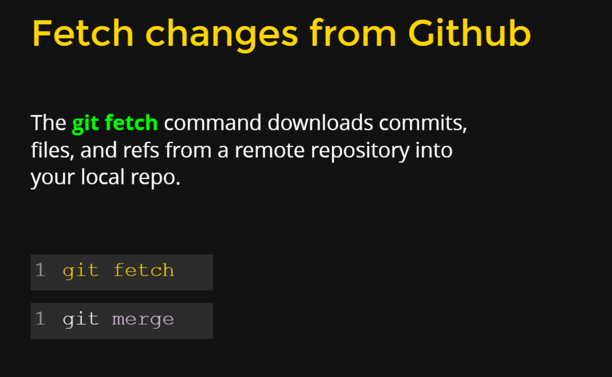

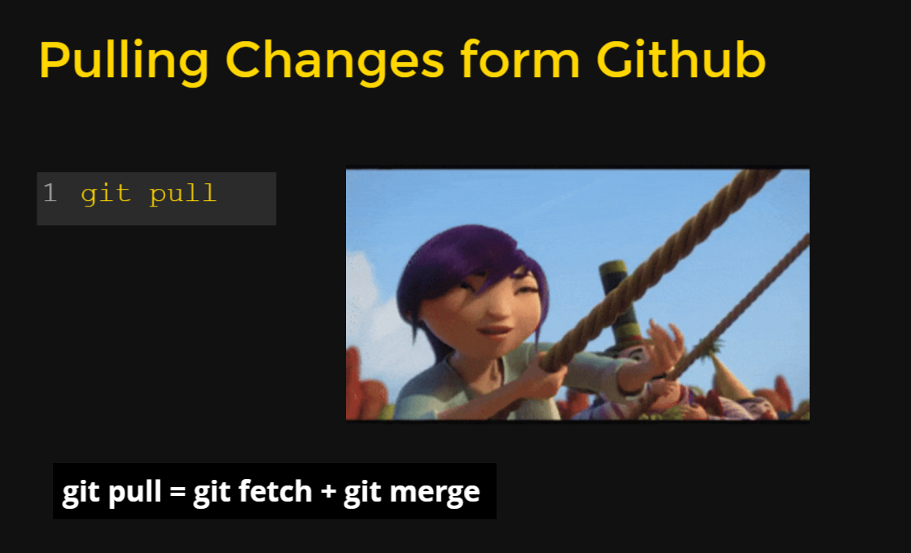

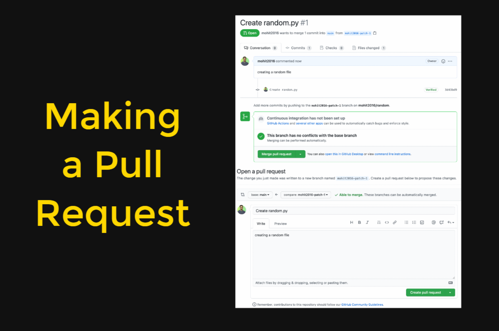

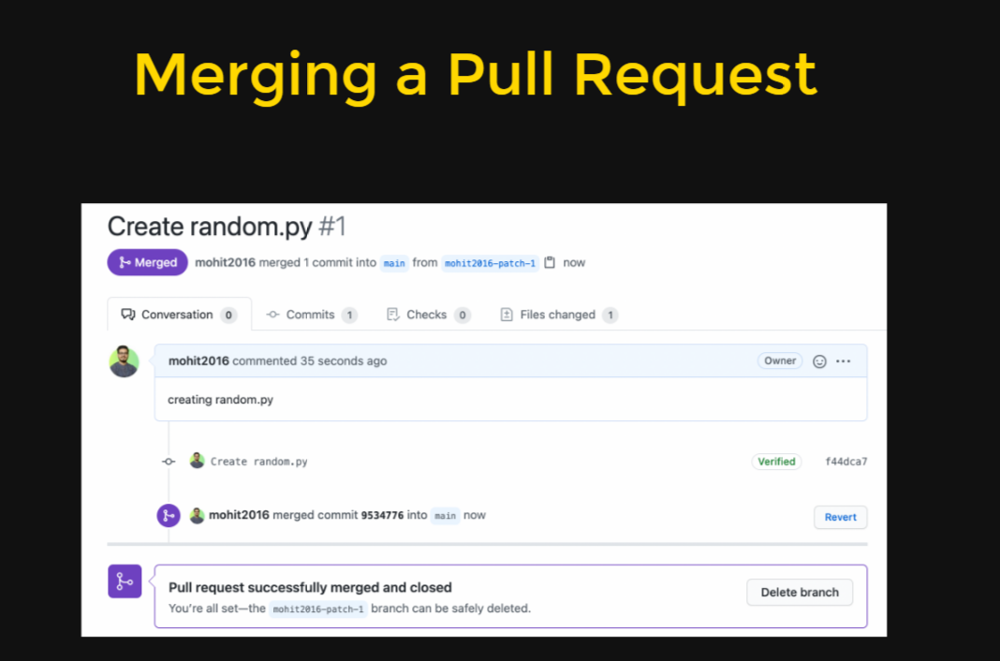

### extra commands

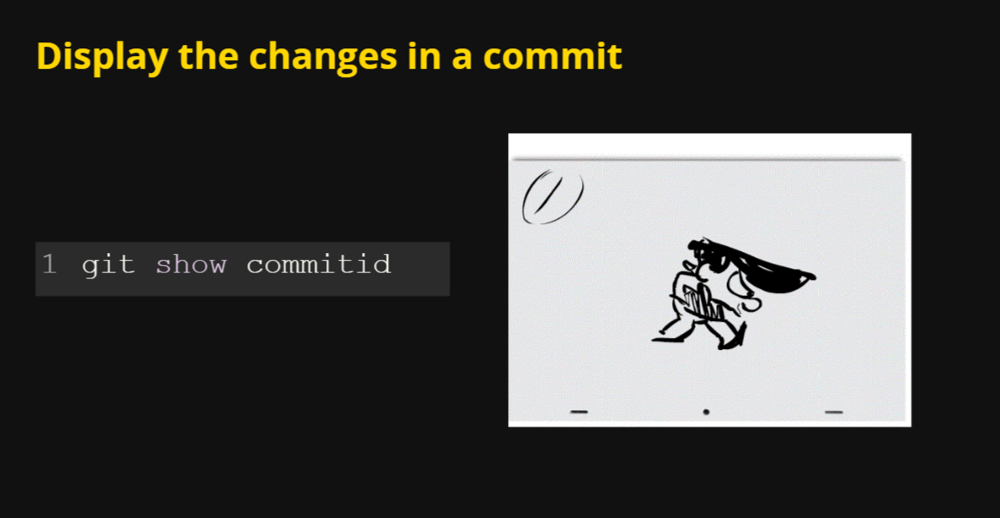

Often when you are working, you want to return to a previous state but you don’t want to lose the work you have done so far. Traditionally, with other source control tools, you’ve copied files that have changed locally aside, then updated your repository, and then diffed and re-applied the changed files.

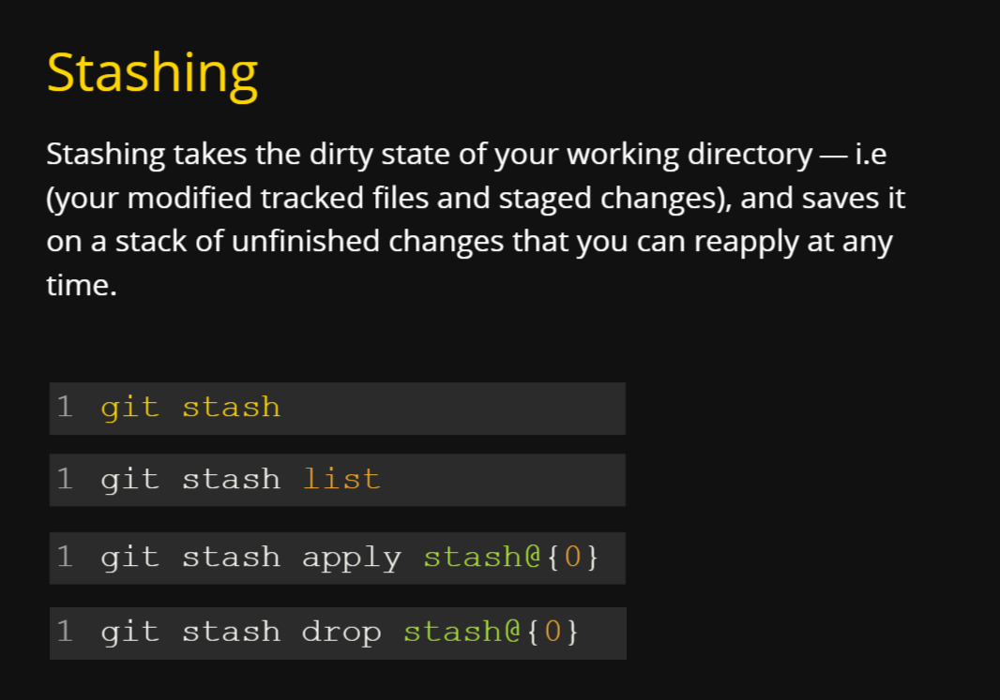

The stash branch is a special one that is kept local to your repository. The “commit” message WIP on master and index on master is added automatically for you.

` git stash show stash@{ID}`--> gives info about stash

`git stash show --patch stash@{ID}`-->detail info

### When to use it

Let’s say you are currently working on a branch called new_branch and you made some changes to the file1.txt. You can verify which branch you are on by using the command git branch and check which files have changed using the command git status.

Now, for some other task, you are required to move to the master branch. However, the changes to file1.txt aren’t ready to be committed yet, but you also don’t want to lose the changes.

Ideally, you want to switch to the master branch where the changes you have made to file1.txt do not exist. Once you are done working with the master branch, you want to go back to new_branch and continue working on the changes you had started

Here is what you will need to do:

- Enter the command git stash while you are still on new_branch.
- Enter the command git checkout master to switch to the master branch.
- After you have done whatever you needed to do on the master branch, you will, once more, enter git checkout new_branch to switch back again.
- You want your changes to be present once again, so you will enter the command git stash apply.
- Enter git status to verify if your changes are back or not.

And there you have it. The uncommitted changes you had made are all back again in your working directory, and you will be able to continue with your work uninterrupted once more. You didn’t have to commit your unfinished work, and you were able to switch branches and still keep your changes! A win-win situation.

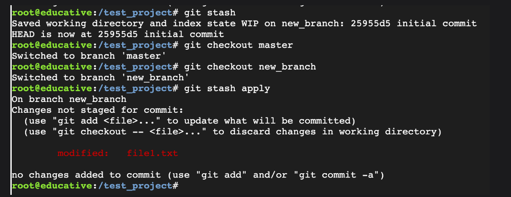

Had you decided not to use git stash, Git would have prevented you from switching over to any other branch if the other branch had changes that would be overwritten with the new uncommitted changes (since the changes in the other branch would be out of context). You would have to do one of the following:

- Commit your unfinished work, switch branches, do your work, switch back to new_branch, and revert the most recent commit.
- Completely get rid of the changes you had made, switch branches, do your work, switch back to new_branch, and start all over again.

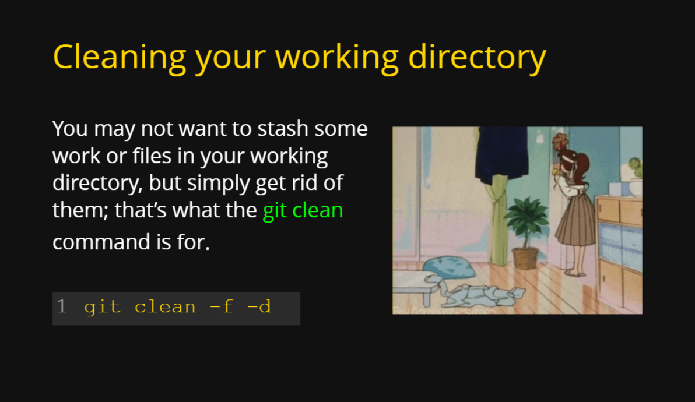

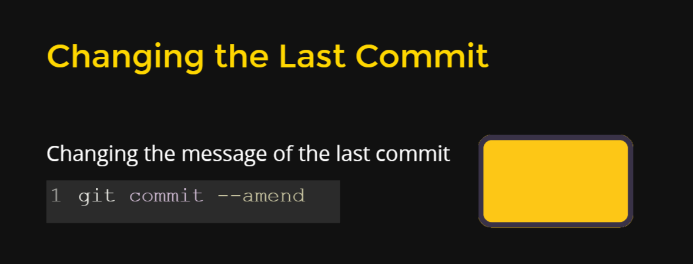

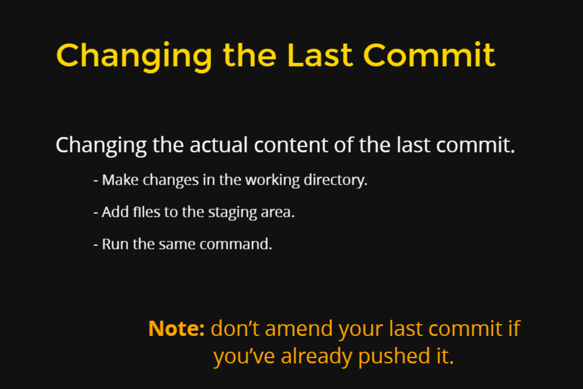

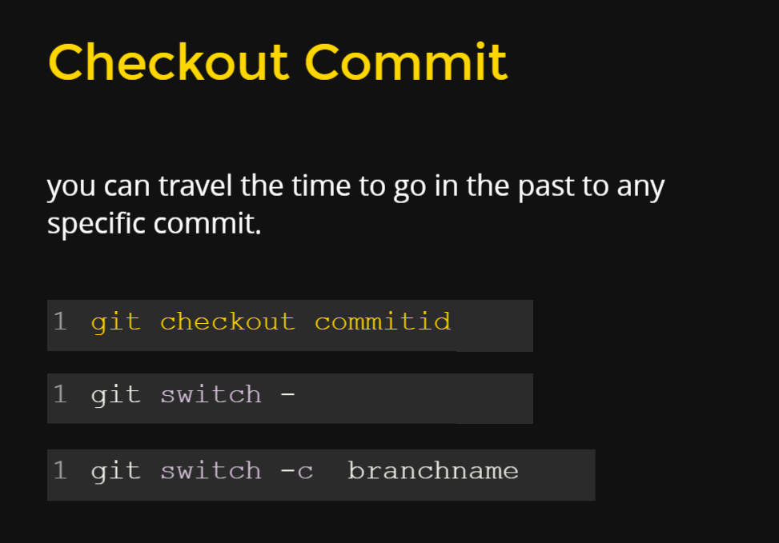

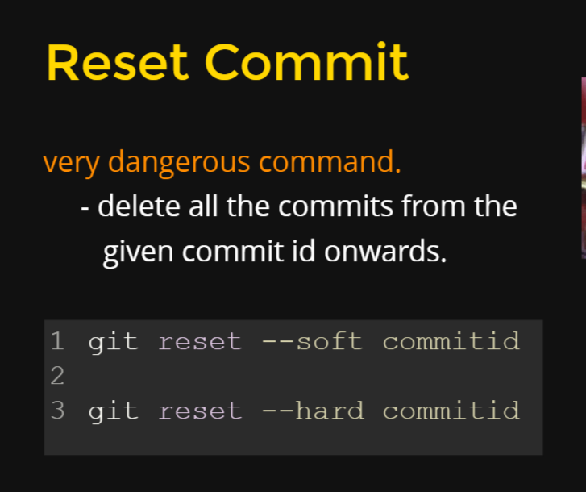

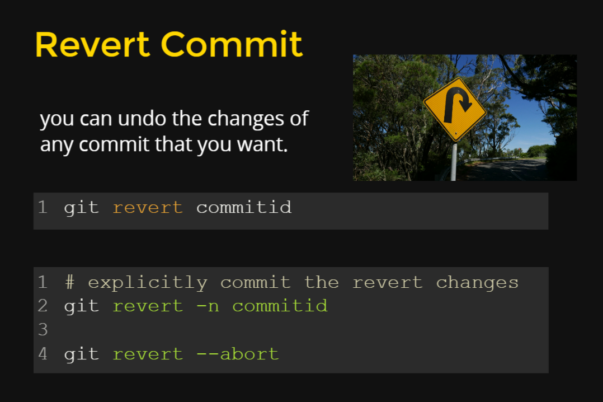

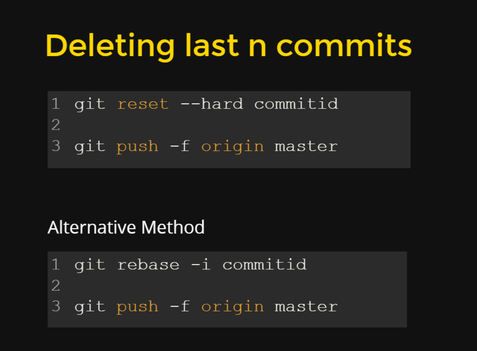

### Cherrypicking

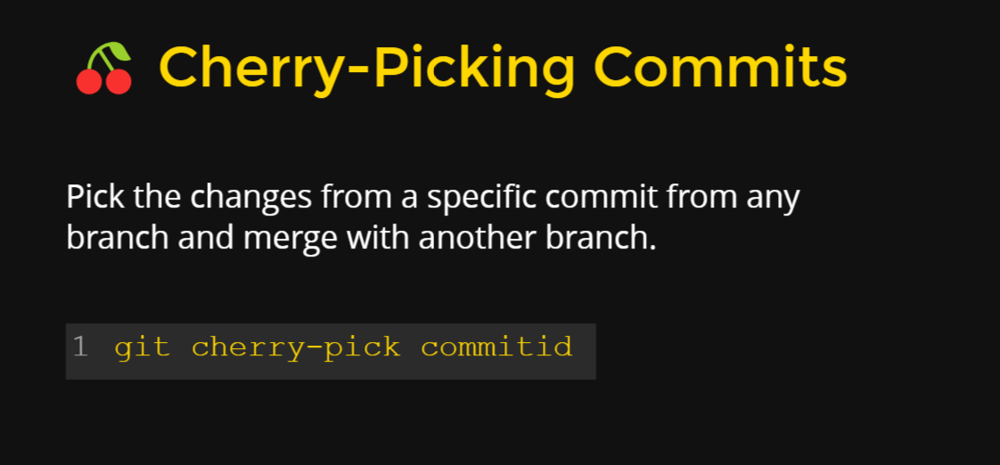