## Notes

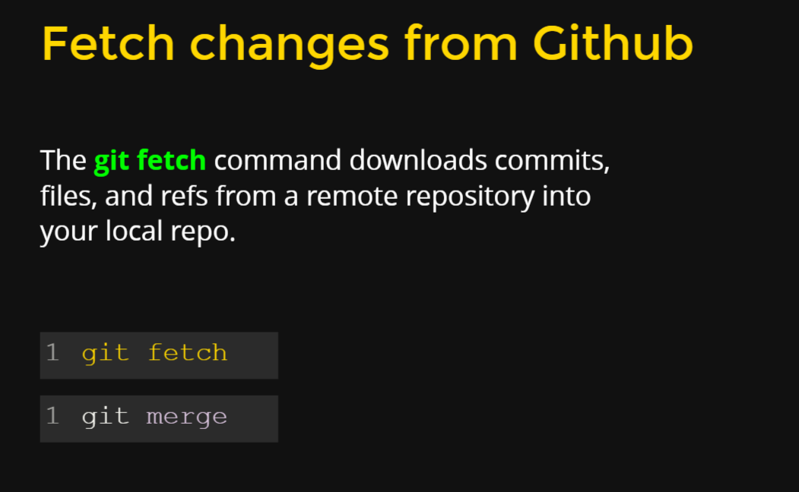

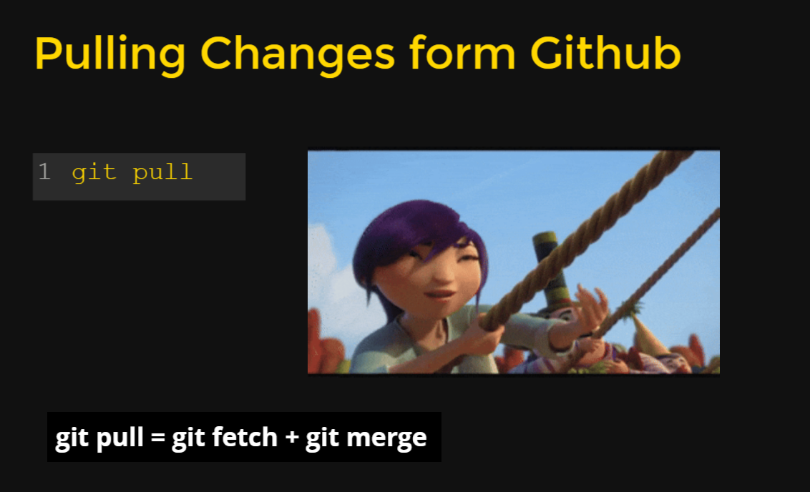

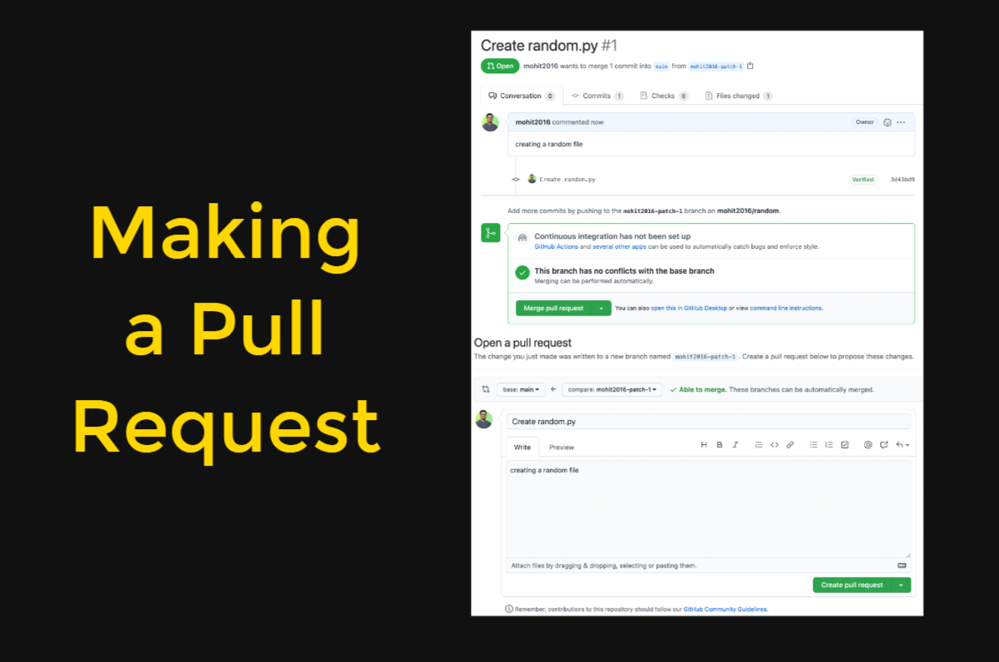

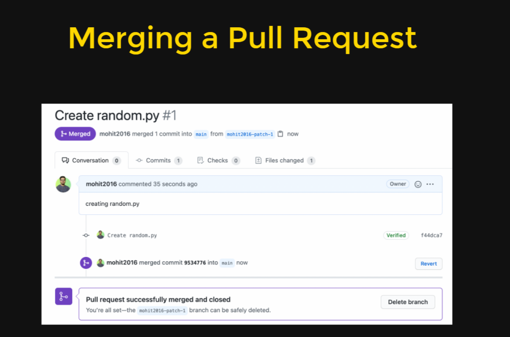

### extra commands

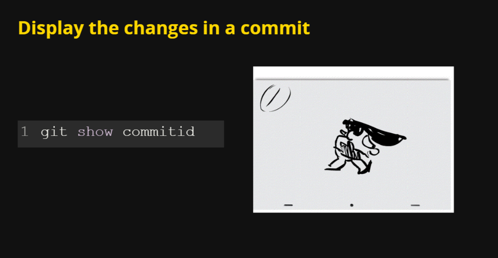

Often when you are working, you want to return to a previous state but you don’t want to lose the work you have done so far. Traditionally, with other source control tools, you’ve copied files that have changed locally aside, then updated your repository, and then diffed and re-applied the changed files.

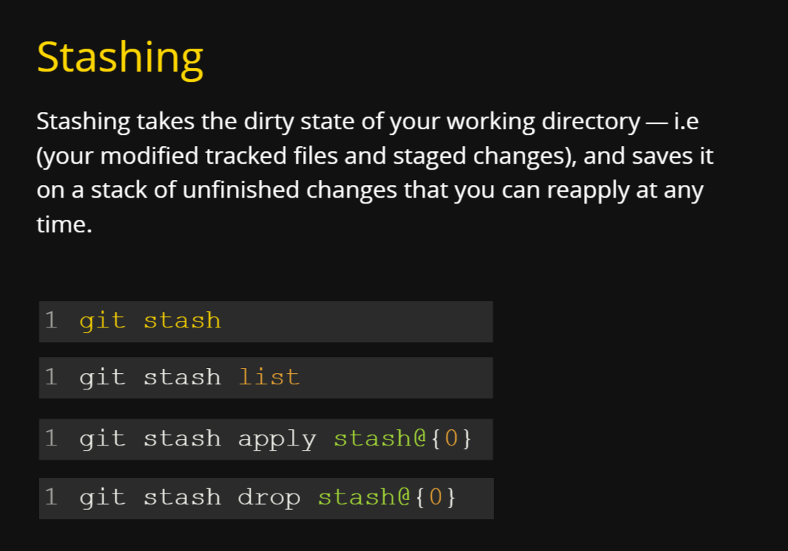

The stash branch is a special one that is kept local to your repository. The “commit” message WIP on master and index on master is added automatically for you.

` git stash show stash@{ID}`--> gives info about stash

`git stash show --patch stash@{ID}`-->detail info

### When to use it

Let’s say you are currently working on a branch called new_branch and you made some changes to the file1.txt. You can verify which branch you are on by using the command git branch and check which files have changed using the command git status.

Now, for some other task, you are required to move to the master branch. However, the changes to file1.txt aren’t ready to be committed yet, but you also don’t want to lose the changes.

Ideally, you want to switch to the master branch where the changes you have made to file1.txt do not exist. Once you are done working with the master branch, you want to go back to new_branch and continue working on the changes you had started

Here is what you will need to do:

- Enter the command git stash while you are still on new_branch.
- Enter the command git checkout master to switch to the master branch.
- After you have done whatever you needed to do on the master branch, you will, once more, enter git checkout new_branch to switch back again.
- You want your changes to be present once again, so you will enter the command git stash apply.
- Enter git status to verify if your changes are back or not.

And there you have it. The uncommitted changes you had made are all back again in your working directory, and you will be able to continue with your work uninterrupted once more. You didn’t have to commit your unfinished work, and you were able to switch branches and still keep your changes! A win-win situation.

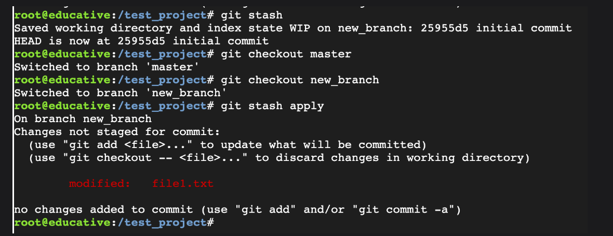

Had you decided not to use git stash, Git would have prevented you from switching over to any other branch if the other branch had changes that would be overwritten with the new uncommitted changes (since the changes in the other branch would be out of context). You would have to do one of the following:

- Commit your unfinished work, switch branches, do your work, switch back to new_branch, and revert the most recent commit.
- Completely get rid of the changes you had made, switch branches, do your work, switch back to new_branch, and start all over again.

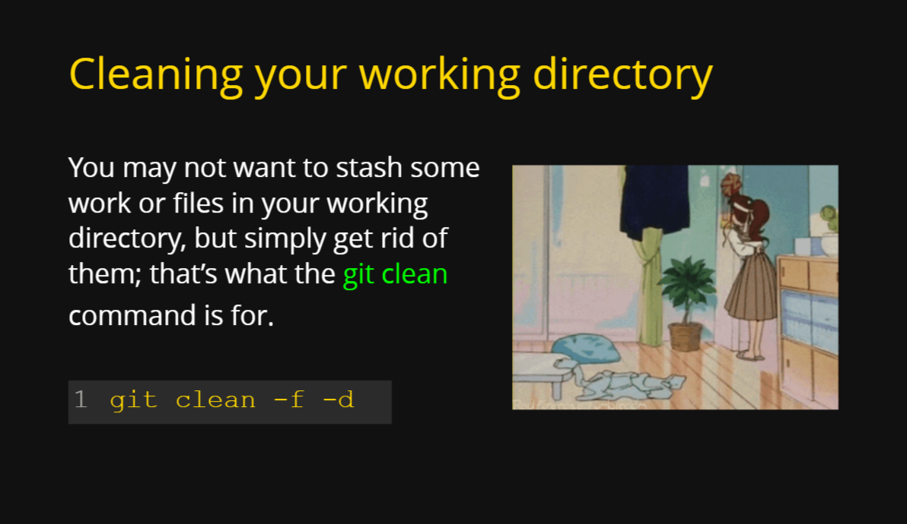

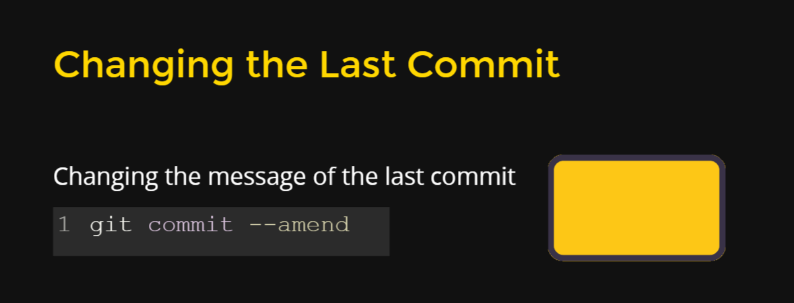

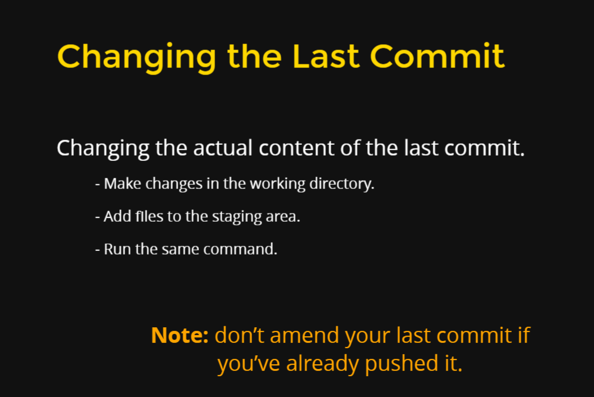

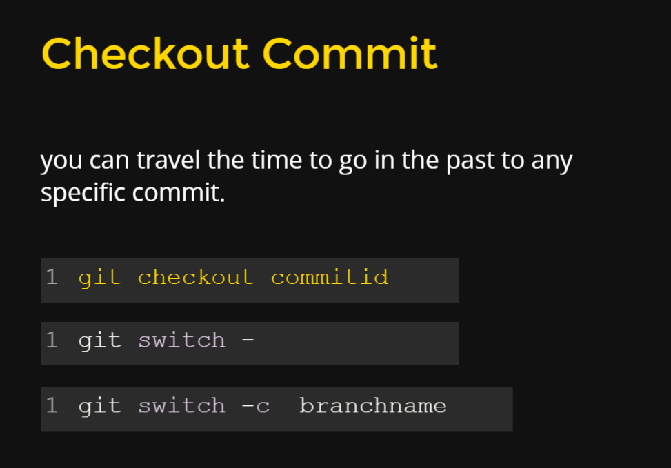

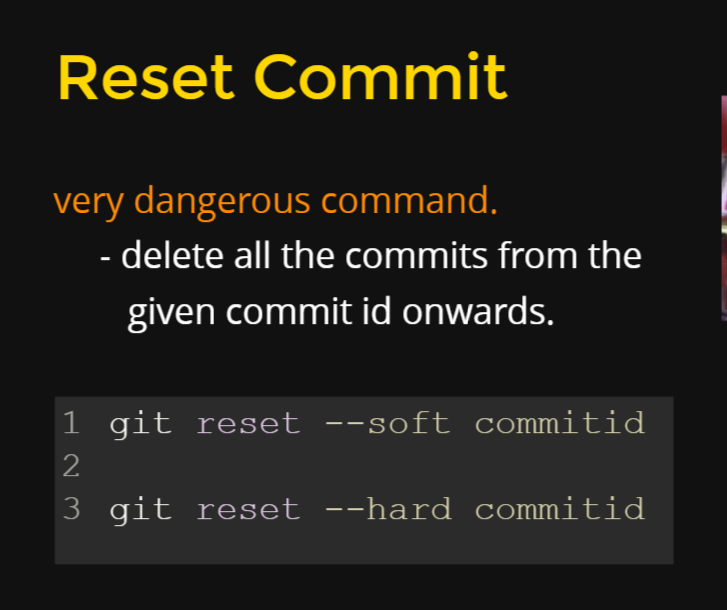

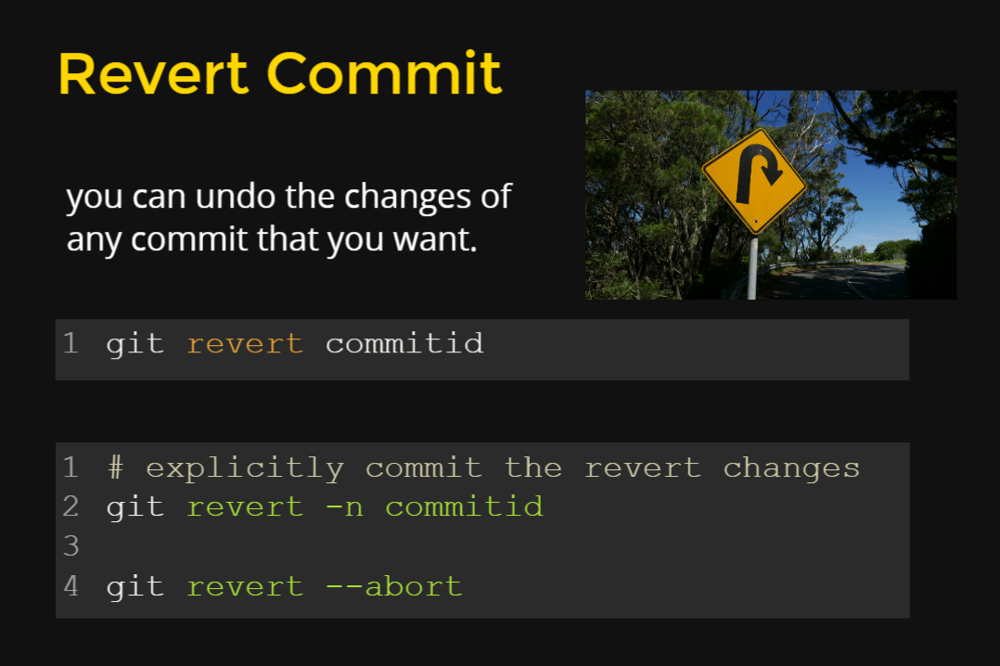

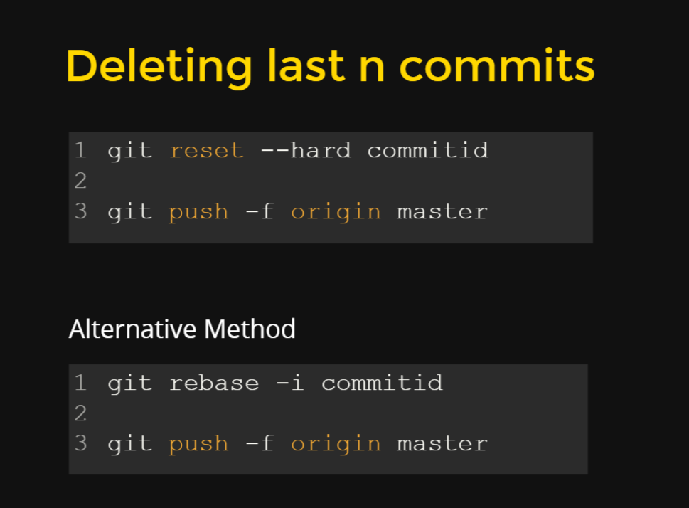

### Cherrypicking

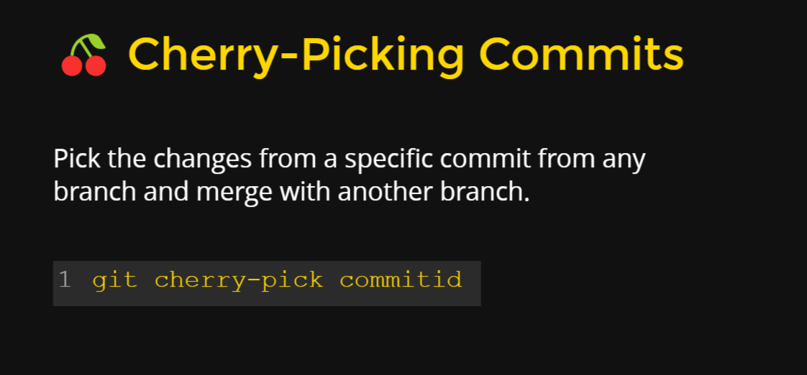

Cherry-picking means taking the **changes introduced by one specific commit** and applying those changes to the branch you are currently on.

```bash
git cherry-pick <commit-hash>
```

Git does not move the original commit from one branch to another. It creates a **new commit** on the current branch. The new commit normally has the same changes and commit message, but a different parent and therefore a different hash.

## Clear example: copy one bug fix from `feature` to `master`

Assume the repository currently looks like this:

```text
              F1 → F2   feature
             /
C0 → C1 → M1            master
```

- `F1` contains unfinished feature work.
- `F2` contains an urgent bug fix that `master` needs now.
- We do **not** want to merge all of `feature`, because that would also bring `F1`.
- We want to copy only the changes introduced by `F2`.
- The source branch is `feature`.
- The destination branch is `master`.
- Before running `git cherry-pick`, we must be on the **destination branch**, `master`.

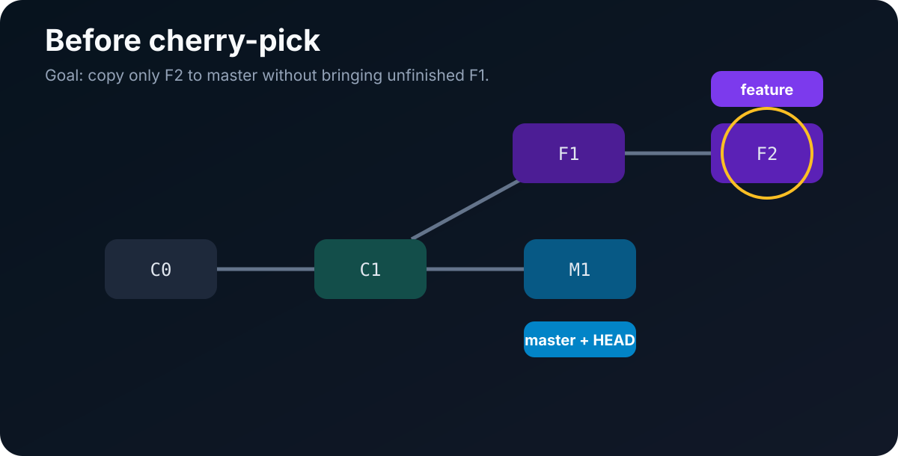

### Step 1 — Find and inspect the commit

The commit can remain on another branch while we inspect it:

```bash
git log feature --oneline
```

Example output:

```text
f2a9c71 Fix payment validation       # F2: commit we want
61bc408 Start payment redesign       # F1: unfinished work we do not want
```

Before applying it, inspect exactly what the commit changes:

```bash
git show f2a9c71
```

State after these read-only commands:

- Current branch has not changed.
- No files or branch pointers have moved.
- We have identified `f2a9c71` as the commit to copy.



### Step 2 — Switch to the destination branch

We want the new commit to appear on `master`, so switch to `master` first:

```bash
git switch master
git pull --ff-only origin master
git branch --show-current
```

Expected result:

```text
master
```

The rule is:

> **Check out the branch that should receive the changes, then cherry-pick the source commit.**

### Step 3 — Cherry-pick the selected commit

We are now on `master` and want to apply the changes from `F2`:

```bash
git cherry-pick f2a9c71
```

Git reads the difference introduced by `F2`, applies that difference after `M1`, and creates a new commit `P1` on `master`:

```text
              F1 → F2                  feature remains unchanged
             /
C0 → C1 → M1 → P1                     master
```



Important results:

- `feature` still points to the original `F2`.
- `master` now points to the new commit `P1`.
- `P1` contains the selected changes from `F2`.
- `F1` was not copied.
- `P1` and `F2` have different hashes because they have different parents.

```text
F2 != P1
```

Verify and publish the result:

```bash
git status
git log --oneline --graph --decorate --all
git push origin master
```

## What happens internally?

For `git cherry-pick f2a9c71`, Git conceptually does this:

1. Finds the parent of `F2`.
2. Calculates the difference between that parent and `F2`.
3. Applies that difference to the current `master` working tree.
4. Creates a new commit on `master` using the applied changes.

Cherry-pick copies a commit's **change**, not its identity or original position in history.

## What if cherry-pick produces a conflict?

A conflict occurs when the selected commit and the destination branch changed the same lines incompatibly.

Git pauses the cherry-pick. Check the state:

```bash
git status
```

Open every conflicted file, choose the correct final content, and remove the conflict markers. Then run:

```bash
git add <resolved-file>
git cherry-pick --continue
```

If more commits are being cherry-picked, Git continues with the next one.

To cancel the entire operation and restore the state from before cherry-pick:

```bash
git cherry-pick --abort
```

To ignore the currently conflicting commit and continue with the next commit:

```bash
git cherry-pick --skip
```

Use `--skip` carefully because the skipped commit's changes will not be applied.



## Cherry-picking multiple commits

### Pick specific commits in the order written

```bash
git cherry-pick <hash-A> <hash-B> <hash-C>
```

Git applies `A`, then `B`, then `C`. The order can matter when later commits depend on earlier ones.

### Pick a consecutive inclusive range

```bash
git cherry-pick <oldest-hash>^..<newest-hash>
```

The `^` includes the oldest commit. For example:

```bash
git cherry-pick A^..C
```

This applies `A`, `B`, and `C`. In comparison, `A..C` excludes `A`.

### Apply changes without committing immediately

```bash
git cherry-pick --no-commit <commit-hash>
```

Short form:

```bash
git cherry-pick -n <commit-hash>
```

The changes are placed in the working tree and staging area, allowing you to review, modify, or combine them before creating your own commit:

```bash
git status
git diff --cached
git commit -m "Apply selected fix"
```

## Useful cherry-pick cases

- Copy an urgent bug fix from a feature or release branch to `master`.
- Backport a fix from a newer release branch to an older supported release.
- Recover a useful commit from a branch that was closed or deleted.
- Apply one teammate's completed commit without merging their unfinished branch.

## When not to use cherry-pick

- Do not cherry-pick an entire long branch commit by commit; use merge or rebase.
- Do not repeatedly cherry-pick the same changes between permanent branches without tracking what was copied; this creates duplicate commits and can complicate future merges.
- Do not cherry-pick a commit without checking its dependencies. `F2` may fail if it requires code introduced by `F1`.
- Do not use cherry-pick merely to hide the real relationship between branches.

## Cherry-pick vs Merge vs Rebase

| Operation | What it brings | What happens to history |
|---|---|---|
| Cherry-pick | One or selected commits | Creates new copies of those commits on the current branch. |
| Merge | All reachable changes from another branch | Preserves both histories and may create a merge commit. |
| Rebase | Commits unique to the current branch | Recreates those commits on a different base. |

> **Short rule: cherry-pick when you need selected commits, merge when you need the whole branch, and rebase when you need to reposition your own branch history.**


